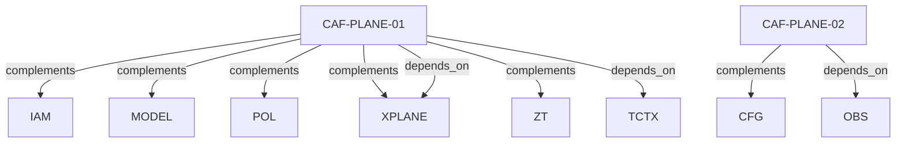

# Pattern graph: PLANE (v1)

Source: `graphs/pattern_graph_PLANE_v1.mmd`

Family: **PLANE**.
Edges to outside families are collapsed to family nodes.

## Links

- [CAF-PLANE-01](../../architecture_library/patterns/caf_v1/definitions_v1/CAF-PLANE-01.yaml) — Tri-Plane Separation (Control/Application/Data)
- [CAF-PLANE-02](../../architecture_library/patterns/caf_v1/definitions_v1/CAF-PLANE-02.yaml) — Plane Runtime Shape Declaration
