# Pattern graph: POL (v1)

Source: `graphs/pattern_graph_POL_v1.mmd`

Family: **POL**.
Edges to outside families are collapsed to family nodes.

```mermaid
%% Auto-generated by tools/caf-meta/build_pattern_docs_v1.mjs
graph TD
  P_CAF_POL_01["CAF-POL-01"]
  P_CAF_POL_02["CAF-POL-02"]
  P_CAF_POL_03["CAF-POL-03"]
  P_CAF_POL_S05["CAF-POL-S05"]
  P_CAF_POL_S06["CAF-POL-S06"]
  P_CAF_POL_S07["CAF-POL-S07"]
  P_CAF_POL_S08["CAF-POL-S08"]
  P_CAF_POL_S09["CAF-POL-S09"]
  P_CAF_POL_S10["CAF-POL-S10"]
  P_CAF_POL_S11["CAF-POL-S11"]
  P_CAF_POL_S12["CAF-POL-S12"]
  P_CAF_POL_S13["CAF-POL-S13"]
  P_CAF_POL_S14["CAF-POL-S14"]
  P_CAF_POL_S15["CAF-POL-S15"]
  P_POL_01["POL-01"]
  F_AI["AI"]
  F_AID["AID"]
  F_CMP["CMP"]
  F_COH["COH"]
  F_COMP["COMP"]
  F_CTX["CTX"]
  F_EDGE["EDGE"]
  F_EXT["EXT"]
  F_IAM["IAM"]
  F_MODEL["MODEL"]
  F_MRAD["MRAD"]
  F_MTEN["MTEN"]
  F_OBS["OBS"]
  F_PLANE["PLANE"]
  F_RES["RES"]
  F_SAFE["SAFE"]
  F_SVC["SVC"]
  F_TCTX["TCTX"]
  F_TEL["TEL"]
  F_VAL["VAL"]
  F_VER["VER"]
  F_WF["WF"]
  F_XPLANE["XPLANE"]
  F_ZT["ZT"]
  P_CAF_POL_01 -->|complements| F_AI
  P_CAF_POL_01 -->|complements| F_AID
  P_CAF_POL_01 -->|complements| F_EDGE
  P_CAF_POL_01 -->|complements| F_MODEL
  P_CAF_POL_01 -->|complements| F_MTEN
  P_CAF_POL_01 -->|complements| F_RES
  P_CAF_POL_01 -->|complements| F_SAFE
  P_CAF_POL_01 -->|complements| F_XPLANE
  P_CAF_POL_01 -->|complements| F_ZT
  P_CAF_POL_01 -->|depends_on| F_OBS
  P_CAF_POL_01 -->|depends_on| F_TCTX
  P_CAF_POL_02 -->|complements| F_AID
  P_CAF_POL_02 -->|complements| F_IAM
  P_CAF_POL_02 -->|complements| F_MODEL
  P_CAF_POL_02 -->|complements| F_PLANE
  P_CAF_POL_02 -->|complements| F_XPLANE
  P_CAF_POL_02 -->|complements| F_ZT
  P_CAF_POL_02 -->|depends_on 2| F_IAM
  P_CAF_POL_02 -->|depends_on| F_TCTX
  P_CAF_POL_03 -->|complements| F_AI
  P_CAF_POL_03 -->|complements| F_ZT
  P_CAF_POL_03 -->|depends_on| F_IAM
  P_CAF_POL_03 -->|depends_on| F_OBS
  P_CAF_POL_S05 -->|depends_on| F_CTX
  P_CAF_POL_S05 -->|depends_on| F_OBS
  P_CAF_POL_S06 -->|depends_on| F_CTX
  P_CAF_POL_S06 -->|depends_on| F_OBS
  P_CAF_POL_S07 -->|depends_on| F_CTX
  P_CAF_POL_S07 -->|depends_on| F_OBS
  P_CAF_POL_S08 -->|depends_on| F_CTX
  P_CAF_POL_S08 -->|depends_on| F_OBS
  P_CAF_POL_S09 -->|depends_on| F_CTX
  P_CAF_POL_S09 -->|depends_on| F_OBS
  P_CAF_POL_S10 -->|depends_on| F_CTX
  P_CAF_POL_S10 -->|depends_on| F_OBS
  P_CAF_POL_S11 -->|depends_on| F_CTX
  P_CAF_POL_S11 -->|depends_on| F_OBS
  P_CAF_POL_S12 -->|depends_on| F_CTX
  P_CAF_POL_S12 -->|depends_on| F_OBS
  P_CAF_POL_S13 -->|depends_on| F_CTX
  P_CAF_POL_S13 -->|depends_on| F_OBS
  P_CAF_POL_S14 -->|depends_on| F_CTX
  P_CAF_POL_S14 -->|depends_on| F_OBS
  P_CAF_POL_S15 -->|depends_on| F_CTX
  P_CAF_POL_S15 -->|depends_on| F_OBS
  P_POL_01 -->|complements| F_CMP
  P_POL_01 -->|complements 2| F_COH
  P_POL_01 -->|complements 2| F_COMP
  P_POL_01 -->|complements 62| F_EXT
  P_POL_01 -->|complements| F_MODEL
  P_POL_01 -->|complements| F_MRAD
  P_POL_01 -->|complements 12| F_MTEN
  P_POL_01 -->|complements 2| F_SAFE
  P_POL_01 -->|complements| F_SVC
  P_POL_01 -->|complements 3| F_TEL
  P_POL_01 -->|complements| F_VAL
  P_POL_01 -->|complements| F_VER
  P_POL_01 -->|complements 3| F_WF
  P_CAF_POL_01 -->|complements| P_CAF_POL_02
  P_CAF_POL_02 -->|complements| P_CAF_POL_03
  P_CAF_POL_02 -->|depends_on| P_CAF_POL_01
  P_CAF_POL_03 -->|depends_on| P_CAF_POL_02
  P_CAF_POL_S05 -->|depends_on| P_POL_01
  P_CAF_POL_S06 -->|depends_on| P_POL_01
  P_CAF_POL_S07 -->|depends_on| P_POL_01
  P_CAF_POL_S08 -->|depends_on| P_POL_01
  P_CAF_POL_S09 -->|depends_on| P_POL_01
  P_CAF_POL_S10 -->|depends_on| P_POL_01
  P_CAF_POL_S11 -->|depends_on| P_POL_01
  P_CAF_POL_S12 -->|depends_on| P_POL_01
  P_CAF_POL_S13 -->|depends_on| P_POL_01
  P_CAF_POL_S14 -->|depends_on| P_POL_01
  P_CAF_POL_S15 -->|depends_on| P_POL_01
```

## Links

- [CAF-POL-01](../../architecture_library/patterns/caf_v1/definitions_v1/CAF-POL-01.yaml) — Policy as a First-Class System Artifact
- [CAF-POL-02](../../architecture_library/patterns/caf_v1/definitions_v1/CAF-POL-02.yaml) — Policy Responsibilities Across Planes
- [CAF-POL-03](../../architecture_library/patterns/caf_v1/definitions_v1/CAF-POL-03.yaml) — Policy Decision Telemetry and Audit
- [CAF-POL-S05](../../architecture_library/patterns/caf_v1/definitions_v1/CAF-POL-S05.yaml) — Policy Types and Domains
- [CAF-POL-S06](../../architecture_library/patterns/caf_v1/definitions_v1/CAF-POL-S06.yaml) — Policy Lifecycle and Versioning
- [CAF-POL-S07](../../architecture_library/patterns/caf_v1/definitions_v1/CAF-POL-S07.yaml) — Design-Time Policy (ADR Integration)
- [CAF-POL-S08](../../architecture_library/patterns/caf_v1/definitions_v1/CAF-POL-S08.yaml) — Runtime Policy Evaluation
- [CAF-POL-S09](../../architecture_library/patterns/caf_v1/definitions_v1/CAF-POL-S09.yaml) — Policy Enforcement Patterns
- [CAF-POL-S10](../../architecture_library/patterns/caf_v1/definitions_v1/CAF-POL-S10.yaml) — Integration with AI Safety Gates
- [CAF-POL-S11](../../architecture_library/patterns/caf_v1/definitions_v1/CAF-POL-S11.yaml) — Integration with Compliance Automation
- [CAF-POL-S12](../../architecture_library/patterns/caf_v1/definitions_v1/CAF-POL-S12.yaml) — Integration with Cost Governance
- [CAF-POL-S13](../../architecture_library/patterns/caf_v1/definitions_v1/CAF-POL-S13.yaml) — Policy Observability, Evidence, and Drift
- [CAF-POL-S14](../../architecture_library/patterns/caf_v1/definitions_v1/CAF-POL-S14.yaml) — Failure Modes & Anti-Patterns
- [CAF-POL-S15](../../architecture_library/patterns/caf_v1/definitions_v1/CAF-POL-S15.yaml) — Evolution and Backward Compatibility
- [POL-01](../../architecture_library/patterns/core_v1/definitions_v1/POL-01.yaml) — Policy Enforcement Boundary
