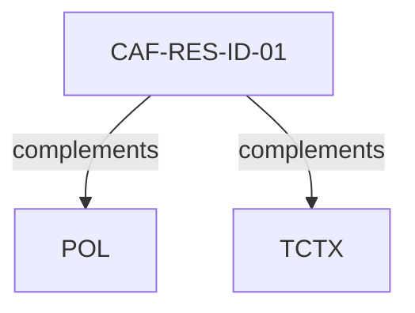

# Pattern graph: RES (v1)

Source: `graphs/pattern_graph_RES_v1.mmd`

Family: **RES**.
Edges to outside families are collapsed to family nodes.

## Links

- [CAF-RES-ID-01](../../architecture_library/patterns/caf_v1/definitions_v1/CAF-RES-ID-01.yaml) — Resource Identifier Strategy (Opaque vs Natural Key)
