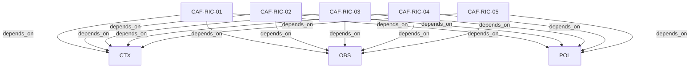

# Pattern graph: RIC (v1)

Source: `graphs/pattern_graph_RIC_v1.mmd`

Family: **RIC**.
Edges to outside families are collapsed to family nodes.

## Links

- [CAF-RIC-01](../../architecture_library/patterns/caf_v1/definitions_v1/CAF-RIC-01.yaml) — Derivation Contract for Phase 7
- [CAF-RIC-02](../../architecture_library/patterns/caf_v1/definitions_v1/CAF-RIC-02.yaml) — Canonical Phase 7 Directory Structure
- [CAF-RIC-03](../../architecture_library/patterns/caf_v1/definitions_v1/CAF-RIC-03.yaml) — Template Declaration Requirement
- [CAF-RIC-04](../../architecture_library/patterns/caf_v1/definitions_v1/CAF-RIC-04.yaml) — Explicit Parameter Pinning
- [CAF-RIC-05](../../architecture_library/patterns/caf_v1/definitions_v1/CAF-RIC-05.yaml) — No Architectural Invention
