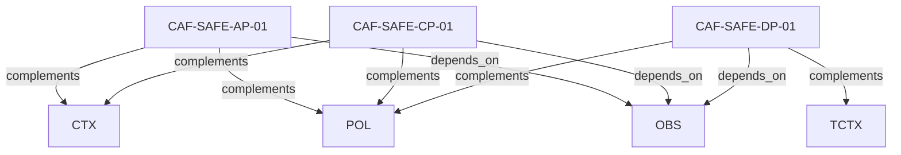

# Pattern graph: SAFE (v1)

Source: `graphs/pattern_graph_SAFE_v1.mmd`

Family: **SAFE**.
Edges to outside families are collapsed to family nodes.

## Links

- [CAF-SAFE-AP-01](../../architecture_library/patterns/caf_v1/definitions_v1/CAF-SAFE-AP-01.yaml) — Application Plane Responsibilities (Safety & Guardrails)
- [CAF-SAFE-CP-01](../../architecture_library/patterns/caf_v1/definitions_v1/CAF-SAFE-CP-01.yaml) — Control Plane Responsibilities (Safety & Guardrails)
- [CAF-SAFE-DP-01](../../architecture_library/patterns/caf_v1/definitions_v1/CAF-SAFE-DP-01.yaml) — Data Plane Responsibilities (Safety & Guardrails)
