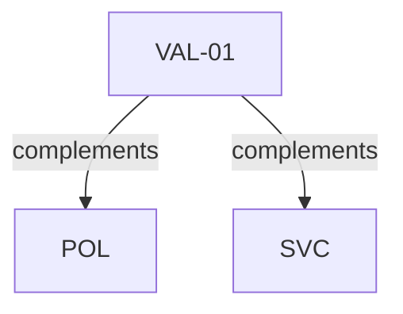

# Pattern graph: VAL (v1)

Source: `graphs/pattern_graph_VAL_v1.mmd`

Family: **VAL**.
Edges to outside families are collapsed to family nodes.

## Links

- [VAL-01](../../architecture_library/patterns/core_v1/definitions_v1/VAL-01.yaml) — Validation and Error Handling Boundary
