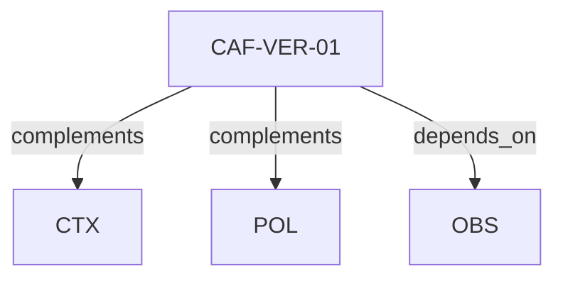

# Pattern graph: VER (v1)

Source: `graphs/pattern_graph_VER_v1.mmd`

Family: **VER**.
Edges to outside families are collapsed to family nodes.

## Links

- [CAF-VER-01](../../architecture_library/patterns/caf_v1/definitions_v1/CAF-VER-01.yaml) — Versioning Expectations
