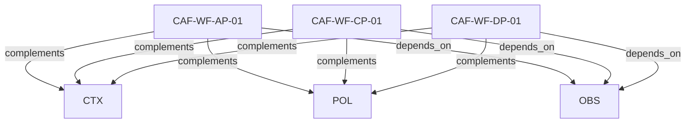

# Pattern graph: WF (v1)

Source: `graphs/pattern_graph_WF_v1.mmd`

Family: **WF**.
Edges to outside families are collapsed to family nodes.

## Links

- [CAF-WF-AP-01](../../architecture_library/patterns/caf_v1/definitions_v1/CAF-WF-AP-01.yaml) — Application Plane: Tenant Workflow Orchestration + Internal Choreography
- [CAF-WF-CP-01](../../architecture_library/patterns/caf_v1/definitions_v1/CAF-WF-CP-01.yaml) — Control Plane: Orchestration Only
- [CAF-WF-DP-01](../../architecture_library/patterns/caf_v1/definitions_v1/CAF-WF-DP-01.yaml) — Data Plane: No Orchestration of Governance
