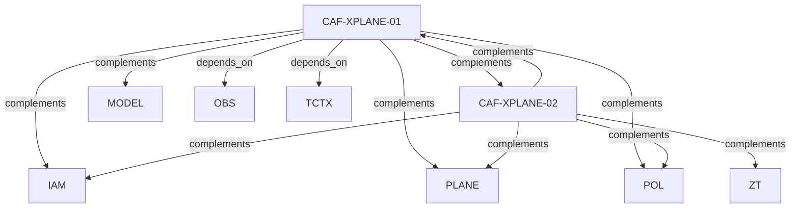

# Pattern graph: XPLANE (v1)

Source: `graphs/pattern_graph_XPLANE_v1.mmd`

Family: **XPLANE**.
Edges to outside families are collapsed to family nodes.

## Links

- [CAF-XPLANE-01](../../architecture_library/patterns/caf_v1/definitions_v1/CAF-XPLANE-01.yaml) — Allowed Cross-Plane Interaction Patterns
- [CAF-XPLANE-02](../../architecture_library/patterns/caf_v1/definitions_v1/CAF-XPLANE-02.yaml) — Prohibited Cross-Plane Interaction Anti-Patterns
