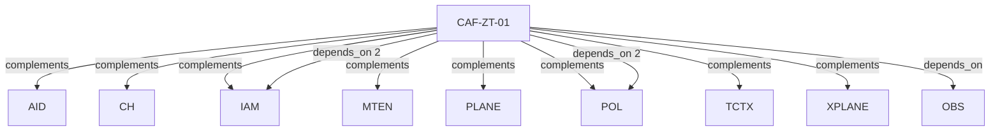

# Pattern graph: ZT (v1)

Source: `graphs/pattern_graph_ZT_v1.mmd`

Family: **ZT**.
Edges to outside families are collapsed to family nodes.

## Links

- [CAF-ZT-01](../../architecture_library/patterns/caf_v1/definitions_v1/CAF-ZT-01.yaml) — Zero Trust Norms Across Planes
