# Pattern families graph (v1)

Source: `graphs/pattern_graph_families_v1.mmd`

Major family codes are derived from pattern IDs (CAF-*, EXT-*, and core prefixes).
GitHub Mermaid click-hotspots are unreliable; use the link list below.

```mermaid
%% Auto-generated by tools/caf-meta/build_pattern_docs_v1.mjs
graph TD
  F_AI["AI"]
  F_AID["AID"]
  F_AIOBS["AIOBS"]
  F_AISG["AISG"]
  F_CFG["CFG"]
  F_CH["CH"]
  F_CMP["CMP"]
  F_COH["COH"]
  F_COMP["COMP"]
  F_COST["COST"]
  F_CTX["CTX"]
  F_DG["DG"]
  F_EDGE["EDGE"]
  F_EXE["EXE"]
  F_EXT["EXT"]
  F_IAM["IAM"]
  F_INC["INC"]
  F_INT["INT"]
  F_MODEL["MODEL"]
  F_MRAD["MRAD"]
  F_MTEN["MTEN"]
  F_OBS["OBS"]
  F_PLANE["PLANE"]
  F_POL["POL"]
  F_PST["PST"]
  F_RES["RES"]
  F_RIC["RIC"]
  F_SAFE["SAFE"]
  F_SVC["SVC"]
  F_TCTX["TCTX"]
  F_TEL["TEL"]
  F_VAL["VAL"]
  F_VER["VER"]
  F_WF["WF"]
  F_XPLANE["XPLANE"]
  F_ZT["ZT"]
  F_AI -->|depends_on 1| F_OBS
  F_AI -->|depends_on 2| F_POL
  F_AID -->|depends_on 1| F_IAM
  F_AID -->|depends_on 1| F_OBS
  F_AID -->|depends_on 2| F_POL
  F_AIOBS -->|depends_on 5| F_CTX
  F_AIOBS -->|depends_on 5| F_OBS
  F_AIOBS -->|depends_on 5| F_POL
  F_AISG -->|depends_on 6| F_CTX
  F_AISG -->|depends_on 6| F_OBS
  F_AISG -->|depends_on 6| F_POL
  F_CFG -->|depends_on 1| F_OBS
  F_CH -->|depends_on 1| F_ZT
  F_CMP -->|depends_on 1| F_OBS
  F_COH -->|depends_on 2| F_OBS
  F_COMP -->|depends_on 2| F_OBS
  F_COST -->|depends_on 4| F_CTX
  F_COST -->|depends_on 4| F_OBS
  F_COST -->|depends_on 4| F_POL
  F_DG -->|depends_on 16| F_CTX
  F_DG -->|depends_on 16| F_OBS
  F_DG -->|depends_on 16| F_POL
  F_EXE -->|depends_on 5| F_CTX
  F_EXE -->|depends_on 5| F_OBS
  F_EXE -->|depends_on 5| F_POL
  F_EXT -->|depends_on 62| F_OBS
  F_IAM -->|depends_on 27| F_CTX
  F_IAM -->|depends_on 29| F_OBS
  F_IAM -->|depends_on 27| F_POL
  F_INC -->|depends_on 4| F_CTX
  F_INC -->|depends_on 4| F_OBS
  F_INC -->|depends_on 4| F_POL
  F_MRAD -->|depends_on 1| F_EXT
  F_MRAD -->|depends_on 1| F_OBS
  F_MTEN -->|depends_on 64| F_CTX
  F_MTEN -->|depends_on 1| F_OBS
  F_MTEN -->|depends_on 64| F_POL
  F_MTEN -->|depends_on 1| F_TCTX
  F_PLANE -->|depends_on 1| F_OBS
  F_PLANE -->|depends_on 1| F_TCTX
  F_PLANE -->|depends_on 1| F_XPLANE
  F_POL -->|depends_on 11| F_CTX
  F_POL -->|depends_on 3| F_IAM
  F_POL -->|depends_on 13| F_OBS
  F_POL -->|depends_on 2| F_TCTX
  F_PST -->|depends_on 1| F_OBS
  F_RIC -->|depends_on 5| F_CTX
  F_RIC -->|depends_on 5| F_OBS
  F_RIC -->|depends_on 5| F_POL
  F_SAFE -->|depends_on 3| F_OBS
  F_SVC -->|depends_on 1| F_OBS
  F_TEL -->|depends_on 3| F_OBS
  F_VER -->|depends_on 1| F_OBS
  F_WF -->|depends_on 3| F_OBS
  F_XPLANE -->|depends_on 1| F_OBS
  F_XPLANE -->|depends_on 1| F_TCTX
  F_ZT -->|depends_on 2| F_IAM
  F_ZT -->|depends_on 1| F_OBS
  F_ZT -->|depends_on 2| F_POL
  F_AI ---|complements 2| F_AID
  F_AI ---|complements 3| F_POL
  F_AID ---|complements 1| F_IAM
  F_AID ---|complements 2| F_POL
  F_AID ---|complements 2| F_ZT
  F_CFG ---|complements 2| F_CTX
  F_CFG ---|complements 108| F_EXT
  F_CFG ---|complements 2| F_PLANE
  F_CFG ---|complements 2| F_PST
  F_CH ---|complements 8| F_MRAD
  F_CH ---|complements 1| F_ZT
  F_CMP ---|complements 2| F_CTX
  F_CMP ---|complements 2| F_POL
  F_COH ---|complements 4| F_CTX
  F_COH ---|complements 4| F_POL
  F_COMP ---|complements 4| F_CTX
  F_COMP ---|complements 4| F_POL
  F_CTX ---|complements 124| F_EXT
  F_CTX ---|complements 2| F_MODEL
  F_CTX ---|complements 2| F_MRAD
  F_CTX ---|complements 24| F_MTEN
  F_CTX ---|complements 4| F_SAFE
  F_CTX ---|complements 2| F_SVC
  F_CTX ---|complements 6| F_TEL
  F_CTX ---|complements 2| F_VER
  F_CTX ---|complements 6| F_WF
  F_EDGE ---|complements 2| F_POL
  F_EDGE ---|complements 2| F_TCTX
  F_EXT ---|complements 17| F_MRAD
  F_EXT ---|complements 124| F_POL
  F_IAM ---|complements 2| F_MODEL
  F_IAM ---|complements 2| F_MTEN
  F_IAM ---|complements 2| F_PLANE
  F_IAM ---|complements 5| F_POL
  F_IAM ---|complements 2| F_TCTX
  F_IAM ---|complements 4| F_XPLANE
  F_IAM ---|complements 4| F_ZT
  F_INT ---|complements 2| F_PST
  F_INT ---|complements 2| F_SVC
  F_MODEL ---|complements 2| F_PLANE
  F_MODEL ---|complements 6| F_POL
  F_MODEL ---|complements 2| F_PST
  F_MODEL ---|complements 2| F_SVC
  F_MODEL ---|complements 2| F_TCTX
  F_MODEL ---|complements 2| F_XPLANE
  F_MRAD ---|complements 2| F_POL
  F_MTEN ---|complements 26| F_POL
  F_MTEN ---|complements 154| F_PST
  F_MTEN ---|complements 1| F_TCTX
  F_MTEN ---|complements 2| F_ZT
  F_PLANE ---|complements 2| F_POL
  F_PLANE ---|complements 1| F_TCTX
  F_PLANE ---|complements 3| F_XPLANE
  F_PLANE ---|complements 2| F_ZT
  F_POL ---|complements 2| F_RES
  F_POL ---|complements 6| F_SAFE
  F_POL ---|complements 2| F_SVC
  F_POL ---|complements 2| F_TCTX
  F_POL ---|complements 6| F_TEL
  F_POL ---|complements 2| F_VAL
  F_POL ---|complements 2| F_VER
  F_POL ---|complements 6| F_WF
  F_POL ---|complements 4| F_XPLANE
  F_POL ---|complements 4| F_ZT
  F_PST ---|complements 2| F_TCTX
  F_RES ---|complements 2| F_TCTX
  F_SAFE ---|complements 2| F_TCTX
  F_SVC ---|complements 2| F_VAL
  F_TCTX ---|complements 1| F_XPLANE
  F_TCTX ---|complements 2| F_ZT
  F_XPLANE ---|complements 2| F_ZT
```

## Links

- [AI](pattern_graph_AI_v1.md)
- [AID](pattern_graph_AID_v1.md)
- [AIOBS](pattern_graph_AIOBS_v1.md)
- [AISG](pattern_graph_AISG_v1.md)
- [CFG](pattern_graph_CFG_v1.md)
- [CH](pattern_graph_CH_v1.md)
- [CMP](pattern_graph_CMP_v1.md)
- [COH](pattern_graph_COH_v1.md)
- [COMP](pattern_graph_COMP_v1.md)
- [COST](pattern_graph_COST_v1.md)
- [CTX](pattern_graph_CTX_v1.md)
- [DG](pattern_graph_DG_v1.md)
- [EDGE](pattern_graph_EDGE_v1.md)
- [EXE](pattern_graph_EXE_v1.md)
- [EXT](pattern_graph_EXT_v1.md)
- [IAM](pattern_graph_IAM_v1.md)
- [INC](pattern_graph_INC_v1.md)
- [INT](pattern_graph_INT_v1.md)
- [MODEL](pattern_graph_MODEL_v1.md)
- [MRAD](pattern_graph_MRAD_v1.md)
- [MTEN](pattern_graph_MTEN_v1.md)
- [OBS](pattern_graph_OBS_v1.md)
- [PLANE](pattern_graph_PLANE_v1.md)
- [POL](pattern_graph_POL_v1.md)
- [PST](pattern_graph_PST_v1.md)
- [RES](pattern_graph_RES_v1.md)
- [RIC](pattern_graph_RIC_v1.md)
- [SAFE](pattern_graph_SAFE_v1.md)
- [SVC](pattern_graph_SVC_v1.md)
- [TCTX](pattern_graph_TCTX_v1.md)
- [TEL](pattern_graph_TEL_v1.md)
- [VAL](pattern_graph_VAL_v1.md)
- [VER](pattern_graph_VER_v1.md)
- [WF](pattern_graph_WF_v1.md)
- [XPLANE](pattern_graph_XPLANE_v1.md)
- [ZT](pattern_graph_ZT_v1.md)
