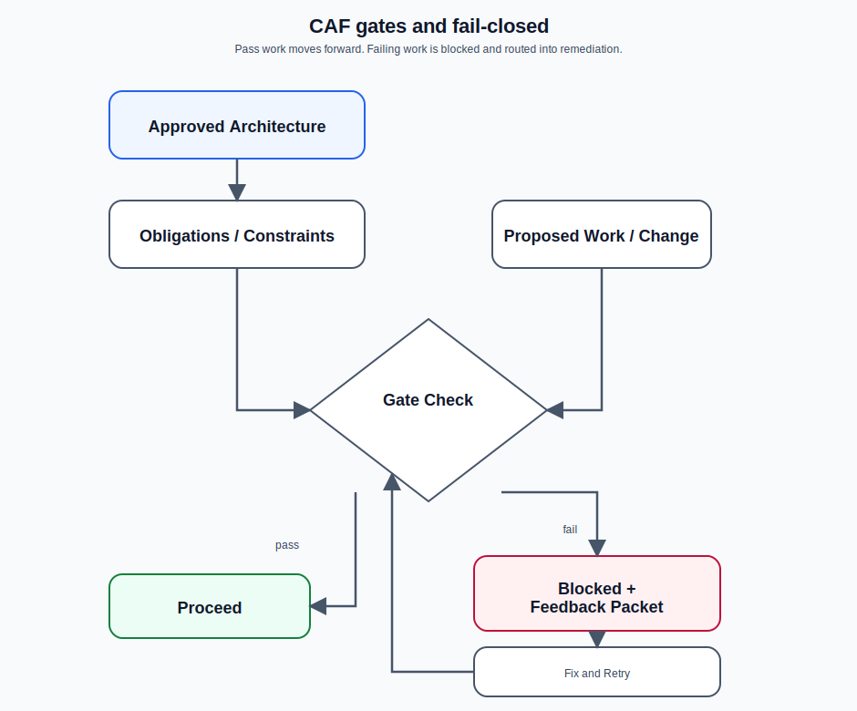

# Feedback packets and debugging

CAF emits feedback packets instead of guessing.



*Feedback packets are part of CAF’s fail-closed contract: when a gate cannot prove the state is sound, CAF stops and tells you what to fix next.*

Feedback packets are written under:

```text
reference_architectures/<instance>/feedback_packets/
```

Typical workflow:

1. Read the packet and its cited evidence.
2. Follow the operator guidance section that matches you:
   - Autonomous agent guidance: repair deterministically and continue.
   - Human operator guidance: reset to the most recent safe checkpoint, then rerun the exact CAF command named by the packet.
3. Re-run the step only when the packet tells you to.

Tips:

- Prefer fixing the *root contract* over patching downstream artifacts.
- Treat advisory packets as signals, but keep fail-closed behavior for correctness.
- When a packet names an exact `node tools/caf/...` command, copy that command verbatim. Do not guess helper names and do not drop required flags such as `--profile=...`.
- `/caf arch` and `/caf plan` are not general-purpose overwrite commands. If a packet tells you to reset first, run the exact reset helper before rerunning the CAF command:
  - architecture scaffolding reset: `node tools/caf/architecture_scaffolding_reset_v1.mjs <instance> overwrite`
  - implementation/design reset: `node tools/caf/implementation_reset_v1.mjs <instance> overwrite`
  - planning reset: `node tools/caf/planning_reset_v1.mjs <instance> overwrite`

## Common packet causes

- Missing required pinned inputs (unknown enum values, incomplete profile parameters)
- Contract violations in derived YAML/MD blocks
- Gate failures (required artifacts missing for the current phase)

## Guidance split

CAF feedback packets are moving toward a two-audience protocol:

- `## Autonomous agent guidance`
  - for agents that can edit files deterministically and continue the current workflow step.
- `## Human operator guidance`
  - for people operating CAF manually.
  - for blocker packets in non-idempotent phases, expect reset-first guidance.
  - for advisory packets, expect exact debug/report commands.

Do not treat report/mindmap regeneration as a universal fix. Some blockers, such as retrieval pin-coverage failures, can only be cleared by fixing the underlying artifact and then resetting/rerunning the owning CAF step.

Where a gate can deterministically prove a condition is fixed, CAF should mark the matching packet `resolved` automatically. Manual status edits are not the preferred operator workflow.

## Example: README was not generated

Symptom:

- the companion repository still shows the scaffold `README.md`, or
- no `caf/task_reports/TG-92-tech-writer-readme.md` was produced during build.

What this usually means:

- planning never emitted the README obligation/task, so build had nothing to dispatch for `worker-tech-writer`.

What to inspect:

- `reference_architectures/<instance>/design/playbook/pattern_obligations_v1.yaml`
  - must contain `OBL-REPO-README`
- `reference_architectures/<instance>/design/playbook/task_graph_v1.yaml`
  - must contain `TG-92-tech-writer-readme`
  - `required_capabilities` must include `repo_documentation`
  - `trace_anchors` must include `pattern_obligation_id:OBL-REPO-README`

Correct response:

- do **not** add or run a helper that invents the missing task after planning.
- fix the planner output and rerun the owning CAF step so the README task is planned explicitly.
