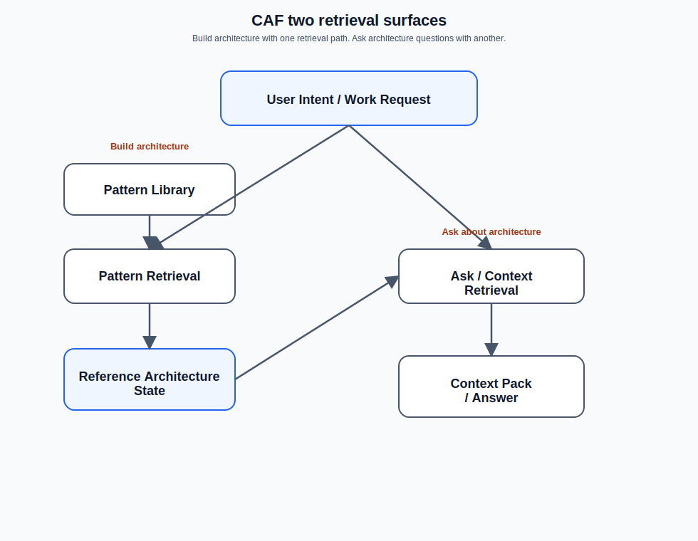

# Answering questions with CAF (ask-first)

CAF is designed so your assistant can answer stakeholder questions **without guessing**.

Use one UX surface:



*CAF uses two retrieval surfaces: one to build architecture, one to query it.*

```text
/caf ask <question...>
```

You can write the question naturally. **No backticks required.**

If you don’t mention an instance name, CAF should default to the canonical public sample instance (`codex-saas`, if present).

---

## Quick start

```text
/caf ask Summarize the main features of the codex-saas reference architecture.
```

More examples:

- `/caf ask Which patterns were selected for codex-saas, and which pins drove them?`
- `/caf ask For pin CP-4, what work is implied?`
- `/caf ask If we change code/ap/widgets/service.py, what intent/work is most likely impacted?`

---

## Make sure the artifacts exist

`/caf ask` builds a minimal context pack from the instance artifacts that already exist.

Minimum for most questions about your own instance:

```text
/caf saas <instance>
/caf prd <instance>
/caf arch <instance>
/caf next <instance> apply
/caf arch <instance>
```

For the canonical public sample (`codex-saas`), these artifacts may already exist in a release bundle or release asset.

For **work visibility** (tasks, obligations, backlog):

```text
/caf plan <instance>
```

For stronger **file-level** impact discussion (by inspecting generated candidate code):

```text
/caf build <instance>
```

If required artifacts are missing, `/caf ask` should fail closed and tell you which high-level CAF step to run next.

---

## What `/caf ask` is optimized to answer

CAF is strongest at **intent → work** traceability:

- pins → patterns → obligations → tasks

That supports three core question families:

1) **Decision visibility** (what/why)
   - “What decisions did we make, and why?”
   - “What patterns were adopted, and what pins drove them?”

2) **Work visibility** (scope/cost)
   - “For this intent/pin, how big is the work?”
   - “What are the major work streams and dependencies?”

3) **Impact / risk** (change → what’s affected)
   - “If we change X, what intent/work is most likely impacted?”

Notes:
- File → feature impact becomes much stronger after `/caf build`, when the companion workspace exists.
- CAF remains fail closed: ambiguity should produce a feedback packet rather than speculation.
