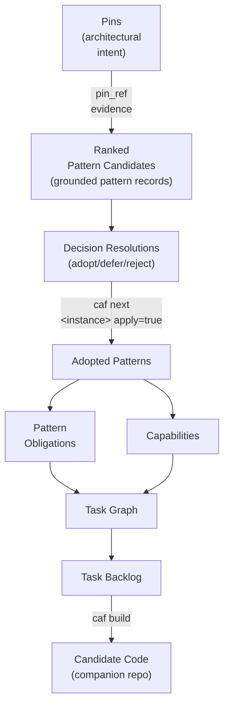

# How does CAF work?

CAF works like a tiny **architecture compiler**:

- You declare architectural intent as **pins** (small, explicit inputs).
- CAF retrieves candidate **patterns** (named architecture decisions), and you adopt/defer/reject.
- Adopted patterns emit **obligations** (non-optional deliverables).
- A **planner** compiles obligations into a **task graph** (and backlog).
- Specialized **workers** generate **candidate code** in a companion workspace.

Along the way, deterministic **gates** check invariants so models can’t hand-wave past missing artifacts.

CAF is designed for *iteration* and *guardrailed autonomy*: models can propose decisions and code **within rails**, and CAF validates outputs deterministically.

CAF supports Claude Code, Codex, and Antigravity coding agents and provides a single command surface (`/caf ...`).

> Planning is optional. If you want *work visibility* and *candidate code*, run `/caf plan` and `/caf build`.

## Traceability

CAF is designed so you can answer: **“Why is this code here?”** without guessing.

### End-to-end traceability path

1. **Pins (expressed architectural intent)**
   - Where: instance playbook pins (e.g., `spec/playbook/architecture_shape_parameters.yaml`).
   - What: the human-declared constraints and priorities ("architectural intent").

2. **Patterns (resolved architectural decisions)**
   - Where: architecture retrieval + decision resolution blocks in the instance spec, then adopted via `caf next <instance> apply=true`.
   - What: a curated set of architecture patterns selected *because* they match pins and rails.
   - Evidence hooks:
     - `pin_ref:` links patterns back to the specific pins that drove them.
     - `rail_ref:` links patterns back to enforceable rails / guardrails.

3. **Capabilities (what must exist in the design/build output)**
   - Where: derived design artifacts (capability declarations used to structure the task graph and backlog).
   - What: stable “things the system must be able to do / provide” that bridge patterns → work.

4. **Obligations (non-optional requirements implied by patterns)**
   - Where: `design/playbook/pattern_obligations_v1.yaml`.
   - What: concrete obligations emitted when patterns are adopted (e.g., runtime wiring, policy boundaries, observability hooks).

5. **Tasks (work items that cover obligations and implement capabilities)**
   - Where: `design/playbook/task_graph_v1.yaml` and `design/playbook/task_backlog_v1.md`.
   - What: a deterministic, inspectable decomposition from obligations/capabilities into buildable work.

6. **Candidate code (generated from the backlog build process)**
   - Where: `companion_repositories/<instance>/...` (candidate-only workspace).
   - What: code produced by processing the task backlog; each task is expected to map to a concrete set of file changes.

### How CAF ensures traceability

### Traceability example

A reference architecture instance includes a CAF-managed **traceability mindmap** that demonstrates the full chain:

It shows (among others) **Pin → Pattern → Obligation → Capability → Task** edges, e.g.:

- Pin `AI-2` (“Policy-Derived Authority”) → Pattern `CAF-POL-01` (“Policy as a First-Class System Artifact”)
- Obligation `OBL-RUNTIME-WIRING` → Capability `runtime_wiring` → Task `TG-01-runtime-wiring`

This is the intended audit trail: **intent → decisions → requirements → work → code**.

---

## How CAF stays stable while using LLMs

CAF separates **deterministic guardrails** from **model decision-making**:

Deterministic (CAF-owned):

- stage/phase/profile gating
- allowed write paths / forbidden actions
- required artifact classes and contract forms
- structural validators + evidence hooks
- state receipts + drift fingerprints

Model-owned (bounded):

- selecting among allowed options (decision points)
- decomposing intent into a task graph
- implementing code inside declared outputs
- repairing failures using feedback evidence

## Docs

- User docs (public): [`docs/user/README.md`](docs/user/README.md)
- Pattern browsing: [`docs/patterns/README.md`](docs/patterns/README.md)
