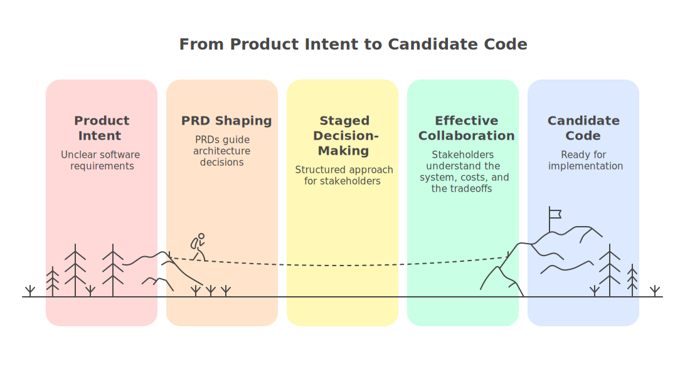

# CAF user documentation

CAF turns PRDs into architecture, project plans, and candidate code through orchestrated, governed AI generation.

CAF is used via a single command surface (`/caf ...`) inside a supported agent runner. CAF supports Claude Code, Codex, and Antigravity coding agents.



*CAF keeps product intent, architecture decisions, implementation architecture decisions, planning, and candidate code connected through explicit checkpoints.*

## Choose your path (by role)

- Product managers: [Product manager view](11_product_manager_view.md)
- Architects / software engineers: [Architect documentation](../architect/README.md)

## Quickstart - Ask CAF questions (assistant-friendly)

CAF is designed so you can answer stakeholder questions with a single UX surface: `/caf ask <question...>`.

Start here: [Answering questions with CAF](14_answering_questions_with_caf.md)

The canonical public sample instance is `codex-saas`.

## Quickstart - create your own CAF SaaS reference implementation

## Preferred runner launchers

From the repo root, prefer the direct Node entrypoints for the packaged runner helpers:

```powershell
node .\tools\caf\cli\codex\run_caf_flow_v1.mjs codex-saas
node .\tools\caf\cli\claude\run_caf_flow_v1.mjs codex-saas
```

Use the matching `.cmd`, `.sh`, or `.ps1` wrapper only when that fits your shell or workstation policy better.

Replace `<instance>` with your own instance name. `/caf saas` also accepts an optional second argument for a starter profile template id; the default remains the plain boring SaaS starter, and `governed_agentic_review_v1` is available when you want the governed agentic review starter path.

```text
/caf saas <instance>
/caf prd <instance>           # default next step: promote a lifecycle-ready shape
/caf arch <instance>
/caf next <instance> apply
/caf arch <instance>
/caf plan <instance>
/caf build <instance>
```

## Read by goal

- **Understand CAF quickly** — Start with [What is CAF?](01_what_is_caf.md), then follow [Quickstart](03_quickstart.md), [Core concepts](04_core_concepts.md), and [Instances, phases, and state](05_instances_phases_and_state.md) for the shortest path to the CAF mental model. That page also documents how to invalidate and restart from a routed step, including `build`, `ux`, and `ux build` examples.
- **Start from PRD and move through the default lifecycle** — Read [PRD → Architecture Shape](12_prd_workflow.md) and [PRD-first lifecycle](15_prd_first_lifecycle.md) to see how `/caf prd` now feeds the default progression before planning and build.
- **Answer stakeholder questions with CAF** — Start with [Answering questions with CAF](14_answering_questions_with_caf.md), then use [Feedback packets and debugging](08_feedback_packets_and_debugging.md) if the ask surface fails closed or returns weak context.
- **Customize what CAF generates** — Use [Customization and extension](09_customization_and_extension.md), [Profile parameters configuration](13_profile_parameters_configuration.md), and [Architecture library](06_architecture_library.md) when you need to shape outputs rather than only consume them.

## Recommended reading order

1. [What is CAF?](01_what_is_caf.md)
2. [Product manager view](11_product_manager_view.md)
3. [Installation](02_installation.md)
4. [Quickstart](03_quickstart.md)
5. [PRD → Architecture Shape](12_prd_workflow.md)
6. [PRD-first lifecycle](15_prd_first_lifecycle.md)
7. [Core concepts](04_core_concepts.md)
8. [Instances, phases, and state](05_instances_phases_and_state.md)
9. [Answering questions with CAF](14_answering_questions_with_caf.md)
10. [Architecture library](06_architecture_library.md)
11. [Pattern browser](10_pattern_browser.md)
12. [Skills, runners, and command surface](07_skills_runners_and_command_surface.md)
13. [Feedback packets and debugging](08_feedback_packets_and_debugging.md)
14. [Customization and extension](09_customization_and_extension.md)
15. [Profile parameters configuration](13_profile_parameters_configuration.md)
    - includes the supported-values quick reference derived from the canonical Phase 8 template
16. [Samples](90_samples.md)

## Pattern browser (direct links)

- Taxonomy + graphs: [`docs/patterns/pattern_taxonomy_v1.md`](../patterns/pattern_taxonomy_v1.md)

## Find out more

[What is CAF?](01_what_is_caf.md) — Start with the shortest explanation of what CAF does before you choose a deeper path.

## You might also be interested in

- [Quickstart](03_quickstart.md) — Run the default command flow on your own instance.
- [PRD-first lifecycle](15_prd_first_lifecycle.md) — See how CAF moves from product intent into architecture, planning, and build.
- [Answering questions with CAF](14_answering_questions_with_caf.md) — Use `/caf ask` as the fastest proof path for the bundled sample.
