<!-- Generated by CAF v0.2.0 -->
# Spec traceability mindmap (v3, CAF-managed; scripted)

```mermaid
%%{init: {"flowchart": {"rankSpacing": 220, "nodeSpacing": 44}} }%%
flowchart TD

  ROOT["codex-saas<br/>CAF spec traceability mindmap"]

  P["Pins<br/>(architectural<br/>intent)"]
  R["Ranked<br/>Pattern Candidates<br/>(grounded pattern records)"]
  D["Decision Resolutions<br/>(adopt/defer/reject)"]
  A["Adopted Patterns"]

  ROOT --> P
  P --> R
  R --> D
  D --> A

  subgraph PINS_LIST["Pins (architecture_shape_parameters.yaml)"]
    direction TB
    PIN_AI_1_Single_Principal_Agent_Identity["AI-1<br/>Single-Principal Agent Identity"]
    PIN_AI_2_Policy_Derived_Authority["AI-2<br/>Policy-Derived Authority"]
    PIN_AI_3_Pre_Invocation_Evaluation_Only["AI-3<br/>Pre-Invocation Evaluation Only"]
    PIN_AI_4_Session_Scoped_Context_Only["AI-4<br/>Session-Scoped Context Only"]
    PIN_AI_5_Pre_Action_Safety_Gates["AI-5<br/>Pre-Action Safety Gates"]
    PIN_AI_6_Synchronous_Evidence_Emission["AI-6<br/>Synchronous Evidence Emission"]
    PIN_AP_1_Ingress_Bound_Context["AP-1<br/>Ingress-Bound Context"]
    PIN_AP_2_Inline_Enforcement["AP-2<br/>Inline Enforcement"]
    PIN_AP_3_Pre_Execution_Evaluation["AP-3<br/>Pre-Execution Evaluation"]
    PIN_AP_4_Pre_Invocation_Safety_Gates["AP-4<br/>Pre-Invocation Safety Gates"]
    PIN_AP_5_Agent_Invocation_Only["AP-5<br/>Agent Invocation Only"]
    PIN_AP_6_Synchronous_Emission["AP-6<br/>Synchronous Emission"]
    PIN_CP_1_Declarative_Evaluative["CP-1<br/>Declarative + Evaluative"]
    PIN_CP_2_Authoritative_Lifecycle_Owner["CP-2<br/>Authoritative Lifecycle Owner"]
    PIN_CP_3_Human_Service_and_Agent_Identity_Governance["CP-3<br/>Human, Service, and Agent Identity Governance"]
    PIN_CP_4_Centralized_Policy_Authoring["CP-4<br/>Centralized Policy Authoring"]
    PIN_CP_5_Centralized_Safety_Gate_Orchestration["CP-5<br/>Centralized Safety Gate Orchestration"]
    PIN_CP_6_Unified_Governance_Integration["CP-6<br/>Unified Governance Integration"]
    PIN_DP_1_Logical_Isolation_Enforced["DP-1<br/>Logical Isolation (Enforced)"]
    PIN_DP_2_Data_Access_Layer_Enforcement["DP-2<br/>Data-Access-Layer Enforcement"]
    PIN_DP_3_Access_Retention_Lineage_Enforcement["DP-3<br/>Access + Retention + Lineage Enforcement"]
    PIN_DP_4_Data_Plane_Hosts_Inputs_Outputs_Only["DP-4<br/>Data Plane Hosts Inputs/Outputs Only"]
    PIN_DP_5_Inline_Evidence_Emission["DP-5<br/>Inline Evidence Emission"]
    PIN_ST_1_Shared_Storage_with_Logical_Isolation["ST-1<br/>Shared Storage with Logical Isolation"]
    PIN_ST_2_Tenant_Keyed_Primary_Addressing["ST-2<br/>Tenant-Keyed Primary Addressing"]
    PIN_ST_3_Tenant_Partitioned_Placement["ST-3<br/>Tenant-Partitioned Placement"]
    PIN_ST_4_Retention_Hard_Deletion["ST-4<br/>Retention + Hard Deletion"]
    PIN_ST_5_Tenant_Scoped_Backup_and_Restore["ST-5<br/>Tenant-Scoped Backup and Restore"]
    PIN_ST_6_Inline_Evidence_Emission["ST-6<br/>Inline Evidence Emission"]
  end

  subgraph ATOMS_LIST["Resolved atoms (profile_parameters_resolved.yaml)"]
    direction TB
    ATOM_runtime_language_python["runtime.language=python"]
    ATOM_runtime_framework_fastapi["runtime.framework=fastapi"]
    ATOM_database_engine_postgresql["database.engine=postgresql"]
    ATOM_deployment_mode_docker_compose["deployment.mode=docker_compose"]
    ATOM_deployment_stack_name_codex_saas["deployment.stack_name=codex-saas"]
    ATOM_plane_runtime_shape_api_service_http["plane.runtime_shape=api_service_http"]
    ATOM_refusal_posture_fail_closed["refusal_posture=fail_closed"]
    ATOM_planes_cp_runtime_shape_api_service_http["planes.cp.runtime_shape=api_service_http"]
    ATOM_planes_ap_runtime_shape_api_service_http["planes.ap.runtime_shape=api_service_http"]
  end

  subgraph CANDIDATES_LIST["Ranked Pattern Candidates (grounded pattern records)"]
    direction TB
    CAND_NONE["(none)"]
  end

  subgraph DECISIONS_LIST["Decision Resolutions (decision_resolutions_v1)"]
    direction TB
    ADOPTED["ADOPTED"]
    DEFERRED["DEFERRED"]
    REJECTED["REJECTED"]
  end

  subgraph PATTERN_NODES["Patterns"]
    direction TB
    PAT_CAF_TCTX_01["CAF-TCTX-01<br/>Tenant Context Propagation (Normative)"]
    PAT_CAF_MTEN_01["CAF-MTEN-01<br/>Multi-Tenancy as First-Class Architectural Concern"]
    PAT_CAF_IAM_01["CAF-IAM-01<br/>Identity Principal Taxonomy (Platform/Tenant/Service/Agent)"]
    PAT_CAF_POL_01["CAF-POL-01<br/>Policy as a First-Class System Artifact"]
    PAT_CAF_AI_01["CAF-AI-01<br/>AI Safety and Governance Separation Across Planes"]
    PAT_CAF_PLANE_01["CAF-PLANE-01<br/>Tri-Plane Separation (Control/Application/Data)"]
    PAT_CAF_XPLANE_01["CAF-XPLANE-01<br/>Allowed Cross-Plane Interaction Patterns"]
    PAT_CAF_AIOBS_01["CAF-AIOBS-01<br/>AI Observability Hooks"]
    PAT_CAF_IAM_GOV_04["CAF-IAM-GOV-04<br/>Policy Intent Definition"]
    PAT_CAF_COMP_02["CAF-COMP-02<br/>Failure Modes & Anti-Patterns"]
    PAT_CAF_COH_02["CAF-COH-02<br/>Plane Responsibility Integrity"]
    PAT_CAF_MTEN_AGOBS_01["CAF-MTEN-AGOBS-01<br/>Observability for Agents and Autonomous Execution"]
    PAT_CAF_COMP_01["CAF-COMP-01<br/>Evidence Generation & Traceability"]
    PAT_PST_01["PST-01<br/>Persistence Boundary via Repositories"]
    PAT_CTX_01["CTX-01<br/>Request Context and Propagation"]
  end

  P --> PIN_AI_1_Single_Principal_Agent_Identity
  R --> CAND_NONE
  D --> ADOPTED
  A --> ADOPTED

  ADOPTED --> PAT_CAF_TCTX_01
  ADOPTED --> PAT_CAF_MTEN_01
  ADOPTED --> PAT_CAF_IAM_01
  ADOPTED --> PAT_CAF_POL_01
  ADOPTED --> PAT_CAF_AI_01
  ADOPTED --> PAT_CAF_PLANE_01
  ADOPTED --> PAT_CAF_XPLANE_01
  ADOPTED --> PAT_CAF_AIOBS_01
  ADOPTED --> PAT_CAF_IAM_GOV_04
  ADOPTED --> PAT_CAF_COMP_02
  ADOPTED --> PAT_CAF_COH_02
  ADOPTED --> PAT_CAF_MTEN_AGOBS_01
  ADOPTED --> PAT_CAF_COMP_01
  ADOPTED --> PAT_PST_01
  ADOPTED --> PAT_CTX_01

  %% Evidence-grounded pin/atom relationships
  PIN_AI_1_Single_Principal_Agent_Identity --> PAT_CAF_IAM_01
  PIN_AI_1_Single_Principal_Agent_Identity --> PAT_CTX_01
  PIN_AI_2_Policy_Derived_Authority --> PAT_CAF_IAM_GOV_04
  PIN_AI_2_Policy_Derived_Authority --> PAT_CAF_POL_01
  PIN_AI_3_Pre_Invocation_Evaluation_Only --> PAT_CAF_AI_01
  PIN_AI_4_Session_Scoped_Context_Only --> PAT_CAF_TCTX_01
  PIN_AI_5_Pre_Action_Safety_Gates --> PAT_CAF_AI_01
  PIN_AI_6_Synchronous_Evidence_Emission --> PAT_CAF_AIOBS_01
  PIN_AP_1_Ingress_Bound_Context --> PAT_CAF_TCTX_01
  PIN_AP_1_Ingress_Bound_Context --> PAT_CTX_01
  PIN_AP_2_Inline_Enforcement --> PAT_CAF_POL_01
  PIN_AP_3_Pre_Execution_Evaluation --> PAT_CAF_POL_01
  PIN_AP_4_Pre_Invocation_Safety_Gates --> PAT_CAF_AI_01
  PIN_AP_5_Agent_Invocation_Only --> PAT_CAF_AI_01
  PIN_AP_6_Synchronous_Emission --> PAT_CAF_AIOBS_01
  PIN_AP_6_Synchronous_Emission --> PAT_CAF_COMP_01
  PIN_CP_1_Declarative_Evaluative --> PAT_CAF_COH_02
  PIN_CP_1_Declarative_Evaluative --> PAT_CAF_POL_01
  PIN_CP_2_Authoritative_Lifecycle_Owner --> PAT_CAF_PLANE_01
  PIN_CP_3_Human_Service_and_Agent_Identity_Governance --> PAT_CAF_IAM_01
  PIN_CP_3_Human_Service_and_Agent_Identity_Governance --> PAT_CAF_IAM_GOV_04
  PIN_CP_4_Centralized_Policy_Authoring --> PAT_CAF_POL_01
  PIN_CP_5_Centralized_Safety_Gate_Orchestration --> PAT_CAF_AI_01
  PIN_CP_6_Unified_Governance_Integration --> PAT_CAF_PLANE_01
  PIN_CP_6_Unified_Governance_Integration --> PAT_CAF_XPLANE_01
  PIN_DP_1_Logical_Isolation_Enforced --> PAT_CAF_MTEN_01
  PIN_DP_2_Data_Access_Layer_Enforcement --> PAT_PST_01
  PIN_DP_3_Access_Retention_Lineage_Enforcement --> PAT_CAF_COMP_01
  PIN_DP_4_Data_Plane_Hosts_Inputs_Outputs_Only --> PAT_CAF_PLANE_01
  PIN_DP_4_Data_Plane_Hosts_Inputs_Outputs_Only --> PAT_CAF_XPLANE_01
  PIN_DP_5_Inline_Evidence_Emission --> PAT_CAF_COMP_01
  PIN_DP_5_Inline_Evidence_Emission --> PAT_CAF_MTEN_AGOBS_01
  PIN_ST_1_Shared_Storage_with_Logical_Isolation --> PAT_CAF_MTEN_01
  PIN_ST_2_Tenant_Keyed_Primary_Addressing --> PAT_CAF_MTEN_01
  PIN_ST_3_Tenant_Partitioned_Placement --> PAT_CAF_MTEN_01
  PIN_ST_4_Retention_Hard_Deletion --> PAT_CAF_COMP_01
  PIN_ST_4_Retention_Hard_Deletion --> PAT_CAF_COMP_02
  PIN_ST_5_Tenant_Scoped_Backup_and_Restore --> PAT_CAF_COMP_02
  PIN_ST_5_Tenant_Scoped_Backup_and_Restore --> PAT_CAF_MTEN_01
  PIN_ST_6_Inline_Evidence_Emission --> PAT_CAF_MTEN_AGOBS_01

  %% Pattern relationships omitted (see docs/user/10_pattern_browser.md)
```

## Notes

- Pin→pattern edges are derived from `[pinned_input]` candidate evidence lines that explicitly mention pin ids (machine_ref `pin_ref:` or inline mentions; no inference).
- Atom→pattern edges are derived from candidate evidence lines with `rail_ref:` (no inference).
- Pattern relationships are intentionally omitted from this traceability view. See: `docs/user/10_pattern_browser.md`.
- Pattern nodes are two-line: `pattern-id` then `pattern-title`.

- `CANDIDATES (decision patterns)` and `SUPPORTING (non-decision)` are pattern ids present in `caf_decision_pattern_candidates_v1` blocks but not yet resolved under `decision_resolutions_v1` (adopt/defer/reject).
- Candidate decision-pattern readiness (auto-adopt safe): 0/0 candidate(s) are decision_pattern with option_sets + human_questions + default_option_id for each option set.
