# CAF ask context (v1)

## Query
- instance: `codex-saas`
- intent: `decision_visibility`
- phase: `design`
- generated_utc: `2026-03-06T11:01:14.444Z`

### Question

```text
For codex-saas, what architecture decisions did we make, and why?
```

## Sources included
- reference_architectures\codex-saas\design\caf_meta\plan_traceability_mindmap_v3.md
- reference_architectures\codex-saas\design\caf_meta\pattern_candidate_selection_report_solution_architecture_v1.md
- reference_architectures\codex-saas\spec\playbook\application_spec_v1.md
- reference_architectures\codex-saas\spec\playbook\system_spec_v1.md

## Source: reference_architectures\codex-saas\design\caf_meta\plan_traceability_mindmap_v3.md

```text
<!-- Generated by CAF v0.1.0 -->
# Plan traceability mindmap (v3, CAF-managed; scripted)

```mermaid
%%{init: {"flowchart": {"rankSpacing": 220, "nodeSpacing": 44}} }%%
flowchart TD

  ROOT["codex-saas<br/>CAF plan traceability mindmap"]

  P["Pins<br/>(architectural<br/>intent)"]
  R["Ranked<br/>Pattern Candidates<br/>(grounded pattern records)"]
  D["Decision Resolutions<br/>(adopt/defer/reject)"]
  A["Adopted Patterns"]
  O["Pattern<br/>Obligations"]
  C["Capabilities"]
  T["Task Graph"]

  ROOT --> P
  P --> R
  R --> D
  D --> A
  A --> O
  A --> C
  O --> T
  C --> T

  subgraph PINS_LIST["Pins (architecture_shape_parameters.yaml)"]
    direction TB
    PIN_AI_1_Single_Principal_Agent_Identity["AI-1<br/>Single-Principal Agent Identity"]
    PIN_AI_2_Policy_Derived_Authority["AI-2<br/>Policy-Derived Authority"]
    PIN_AI_3_Pre_Invocation_Evaluation_Only["AI-3<br/>Pre-Invocation Evaluation Only"]
    PIN_AI_4_Session_Scoped_Context_Only["AI-4<br/>Session-Scoped Context Only"]
    PIN_AI_5_Pre_Action_Safety_Gates["AI-5<br/>Pre-Action Safety Gates"]
    PIN_AI_6_Synchronous_Evidence_Emission["AI-6<br/>Synchronous Evidence Emission"]
    PIN_AP_1_Ingress_Bound_Context["AP-1<br/>Ingress-Bound Context"]
    PIN_AP_2_Inline_Enforcement["AP-2<br/>Inline Enforcement"]
    PIN_AP_3_Pre_Execution_Evaluation["AP-3<br/>Pre-Execution Evaluation"]
    PIN_AP_4_Pre_Invocation_Safety_Gates["AP-4<br/>Pre-Invocation Safety Gates"]
    PIN_AP_5_Agent_Invocation_Only["AP-5<br/>Agent Invocation Only"]
    PIN_AP_6_Synchronous_Emission["AP-6<br/>Synchronous Emission"]
    PIN_CP_1_Declarative_Evaluative["CP-1<br/>Declarative + Evaluative"]
    PIN_CP_2_Authoritative_Lifecycle_Owner["CP-2<br/>Authoritative Lifecycle Owner"]
    PIN_CP_3_Human_Service_and_Agent_Identity_Governance["CP-3<br/>Human, Service, and Agent Identity Governance"]
    PIN_CP_4_Centralized_Policy_Authoring["CP-4<br/>Centralized Policy Authoring"]
    PIN_CP_5_Centralized_Safety_Gate_Orchestration["CP-5<br/>Centralized Safety Gate Orchestration"]
    PIN_CP_6_Unified_Governance_Integration["CP-6<br/>Unified Governance Integration"]
    PIN_DP_1_Logical_Isolation_Enforced["DP-1<br/>Logical Isolation (Enforced)"]
    PIN_DP_2_Data_Access_Layer_Enforcement["DP-2<br/>Data-Access-Layer Enforcement"]
    PIN_DP_3_Access_Retention_Lineage_Enforcement["DP-3<br/>Access + Retention + Lineage Enforcement"]
    PIN_DP_4_Data_Plane_Hosts_Inputs_Outputs_Only["DP-4<br/>Data Plane Hosts Inputs/Outputs Only"]
    PIN_DP_5_Inline_Evidence_Emission["DP-5<br/>Inline Evidence Emission"]
    PIN_ST_1_Shared_Storage_with_Logical_Isolation["ST-1<br/>Shared Storage with Logical Isolation"]
    PIN_ST_2_Tenant_Keyed_Primary_Addressing["ST-2<br/>Tenant-Keyed Primary Addressing"]
    PIN_ST_3_Tenant_Partitioned_Placement["ST-3<br/>Tenant-Partitioned Placement"]
    PIN_ST_4_Retention_Hard_Deletion["ST-4<br/>Retention + Hard Deletion"]
    PIN_ST_5_Tenant_Scoped_Backup_and_Restore["ST-5<br/>Tenant-Scoped Backup and Restore"]
    PIN_ST_6_Inline_Evidence_Emission["ST-6<br/>Inline Evidence Emission"]
  end

  subgraph ATOMS_LIST["Resolved atoms (profile_parameters_resolved.yaml)"]
    direction TB
    ATOM_runtime_language_python["runtime.language=python"]
    ATOM_runtime_framework_fastapi["runtime.framework=fastapi"]
    ATOM_database_engine_postgresql["database.engine=postgresql"]
    ATOM_deployment_mode_docker_compose["deployment.mode=docker_compose"]
    ATOM_plane_runtime_shape_api_service_http["plane.runtime_shape=api_service_http"]
    ATOM_refusal_posture_fail_closed["refusal_posture=fail_closed"]
    ATOM_planes_cp_runtime_shape_api_service_http["planes.cp.runtime_shape=api_service_http"]
    ATOM_planes_ap_runtime_shape_api_service_http["planes.ap.runtime_shape=api_service_http"]
  end

  subgraph CANDIDATES_LIST["Ranked Pattern Candidates (grounded pattern records)"]
    direction TB
    CAND_NONE["(none)"]
  end

  subgraph DECISIONS_LIST["Decision Resolutions (decision_resolutions_v1)"]
    direction TB
    ADOPTED["ADOPTED"]
    DEFERRED["DEFERRED"]
    REJECTED["REJECTED"]
  end

  subgraph PATTERN_NODES["Patterns"]
    direction TB
    PAT_CAF_PLANE_01["CAF-PLANE-01<br/>Tri-Plane Separation (Control/Application/Data)"]
    PAT_CAF_TCTX_01["CAF-TCTX-01<br/>Tenant Context Propagation (Normative)"]
    PAT_CAF_MTEN_01["CAF-MTEN-01<br/>Multi-Tenancy as First-Class Architectural Concern"]
    PAT_CAF_AI_01["CAF-AI-01<br/>AI Safety and Governance Separation Across Planes"]
    PAT_CAF_IAM_02["CAF-IAM-02<br/>Identity and Context Propagation"]
    PAT_POL_01["POL-01<br/>Policy Enforcement Boundary"]
    PAT_OBS_01["OBS-01<br/>Observability Boundary"]
    PAT_VAL_01["VAL-01<br/>Validation and Error Handling Boundary"]
    PAT_CAF_EDGE_01["CAF-EDGE-01<br/>Backend-for-Frontend (BFF) / API Composition Boundary"]
    PAT_CAF_IAM_01["CAF-IAM-01<br/>Identity Principal Taxonomy (Platform/Tenant/Service/Agent)"]
    PAT_CAF_XPLANE_01["CAF-XPLANE-01<br/>Allowed Cross-Plane Interaction Patterns"]
    PAT_CAF_MTEN_ANTI_01["CAF-MTEN-ANTI-01<br/>Implicit Tenancy"]
    PAT_CAF_MTEN_AGOBS_01["CAF-MTEN-AGOBS-01<br/>Observability for Agents and Autonomous Execution"]
    PAT_PST_01["PST-01<br/>Persistence Boundary via Repositories"]
    PAT_CTX_01["CTX-01<br/>Request Context and Propagation"]
    PAT_EXT_BACKEND_FOR_FRONTEND_BFF["EXT-BACKEND_FOR_FRONTEND_BFF<br/>Backend-for-Frontend (BFF)"]
    PAT_EXT_API_COMPOSITION_AGGREGATOR["EXT-API_COMPOSITION_AGGREGATOR<br/>API Composition / Aggregator"]
    PAT_EXT_API_GATEWAY["EXT-API_GATEWAY<br/>API Gateway"]
    PAT_EXT_AUDITABILITY["EXT-AUDITABILITY<br/>Auditability"]
  end

  P --> PIN_AI_1_Single_Principal_Agent_Identity
  R --> CAND_NONE
  D --> ADOPTED
  A --> ADOPTED

  ADOPTED --> PAT_CAF_PLANE_01
  ADOPTED --> PAT_CAF_TCTX_01
  ADOPTED --> PAT_CAF_MTEN_01
  ADOPTED --> PAT_CAF_AI_01
  ADOPTED --> PAT_CAF_IAM_02
  ADOPTED --> PAT_POL_01
  ADOPTED --> PAT_OBS_01
  ADOPTED --> PAT_VAL_01
  ADOPTED --> PAT_CAF_EDGE_01
  ADOPTED --> PAT_CAF_IAM_01
  ADOPTED --> PAT_CAF_XPLANE_01
  ADOPTED --> PAT_CAF_MTEN_ANTI_01
  ADOPTED --> PAT_CAF_MTEN_AGOBS_01
  ADOPTED --> PAT_PST_01
  ADOPTED --> PAT_CTX_01
  ADOPTED --> PAT_EXT_BACKEND_FOR_FRONTEND_BFF
  ADOPTED --> PAT_EXT_API_COMPOSITION_AGGREGATOR
  ADOPTED --> PAT_EXT_API_GATEWAY
  ADOPTED --> PAT_EXT_AUDITABILITY

  subgraph OBLIGATIONS["Obligations (pattern_obligations_v1.yaml)"]
    direction TB
    OBL_NONE["(missing or empty)"]
  end

  subgraph CAPABILITIES["Capabilities"]
    direction TB
    CAP_api_boundary_implementation["api_boundary_implementation"]
    CAP_contract_scaffolding["contract_scaffolding"]
    CAP_persistence_implementation["persistence_implementation"]
    CAP_plane_runtime_scaffolding["plane_runtime_scaffolding"]
    CAP_policy_enforcement["policy_enforcement"]
    CAP_postgres_persistence_wiring["postgres_persistence_wiring"]
    CAP_python_package_markers_materialization["python_package_markers_materialization"]
    CAP_repo_documentation["repo_documentation"]
    CAP_runtime_wiring["runtime_wiring"]
    CAP_service_facade_implementation["service_facade_implementation"]
    CAP_structural_validation["structural_validation"]
    CAP_ui_frontend_scaffolding["ui_frontend_scaffolding"]
    CAP_unit_test_scaffolding["unit_test_scaffolding"]
  end

  subgraph TASKS["Tasks (task_graph_v1.yaml)"]
    direction TB
    TASK_TG_00_CP_runtime_scaffold["TG-00-CP-runtime-scaffold<br/>Scaffold Control Plane runtime"]
    TASK_TG_00_AP_runtime_scaffold["TG-00-AP-runtime-scaffold<br/>Scaffold Application Plane runtime"]
    TASK_TG_00_contract_BND_CP_AP_01["TG-00-contract-BND-CP-AP-01<br/>Scaffold CP-AP material contract boundary"]
    TASK_TG_00_AP_policy_enforcement["TG-00-AP-policy-enforcement<br/>Implement AP policy/auth/context enforcement"]
    TASK_TG_30_service_facade_widget["TG-30-service-facade-widget<br/>Implement widget service facade"]
    TASK_TG_20_api_boundary_widget["TG-20-api-boundary-widget<br/>Implement widget API boundary"]
    TASK_TG_40_persistence_widget["TG-40-persistence-widget<br/>Implement widget persistence boundary"]
    TASK_TG_15_ui_shell["TG-15-ui-shell<br/>Scaffold UI shell and widget page"]
    TASK_TG_90_runtime_wiring["TG-90-runtime-wiring<br/>Wire runtime and compose surfaces"]
    TASK_TG_TBP_TBP_PG_01_postgres_persistence_wiring["TG-TBP-TBP-PG-01-postgres_persistence_wiring<br/>Materialize postgres TBP wiring obligations"]
    TASK_TG_TBP_TBP_PY_01_python_package_markers_materialization["TG-TBP-TBP-PY-01-python_package_markers_materialization<br/>Materialize python package marker obligations"]
    TASK_TG_90_unit_tests["TG-90-unit-tests<br/>Scaffold unit tests for candidate bar"]
    TASK_TG_92_tech_writer_readme["TG-92-tech-writer-readme<br/>Produce operator README"]
    TASK_TG_95_VALIDATE_ADOPTED_PATTERNS["TG-95-VALIDATE-ADOPTED-PATTERNS<br/>Validate all adopted pattern structural obligations"]
  end

  O --> OBL_NONE
  C --> CAP_api_boundary_implementation
  T --> TASK_TG_00_CP_runtime_scaffold

  TASK_TG_00_CP_runtime_scaffold -->|requires| CAP_plane_runtime_scaffolding
  TASK_TG_00_AP_runtime_scaffold -->|requires| CAP_plane_runtime_scaffolding
  TASK_TG_00_contract_BND_CP_AP_01 -->|requires| CAP_contract_scaffolding
  TASK_TG_00_AP_policy_enforcement -->|requires| CAP_policy_enforcement
  TASK_TG_30_service_facade_widget -->|requires| CAP_service_facade_implementation
  TASK_TG_20_api_boundary_widget -->|requires| CAP_api_boundary_implementation
  TASK_TG_40_persistence_widget -->|requires| CAP_persistence_implementation
  TASK_TG_15_ui_shell -->|requires| CAP_ui_frontend_scaffolding
  TASK_TG_90_runtime_wiring -->|requires| CAP_runtime_wiring
  TASK_TG_TBP_TBP_PG_01_postgres_persistence_wiring -->|requires| CAP_postgres_persistence_wiring
  TASK_TG_TBP_TBP_PY_01_python_package_markers_materialization -->|requires| CAP_python_package_markers_materialization
  TASK_TG_90_unit_tests -->|requires| CAP_unit_test_scaffolding
  TASK_TG_92_tech_writer_readme -->|requires| CAP_repo_documentation
  TASK_TG_95_VALIDATE_ADOPTED_PATTERNS -->|requires| CAP_structural_validation

  %% Evidence-grounded pin/atom relationships
  PIN_AI_1_Single_Principal_Agent_Identity --> PAT_CAF_IAM_02
  PIN_AI_2_Policy_Derived_Authority --> PAT_CAF_IAM_02
  PIN_AI_3_Pre_Invocation_Evaluation_Only --> PAT_CAF_AI_01
  PIN_AI_3_Pre_Invocation_Evaluation_Only --> PAT_VAL_01
  PIN_AI_4_Session_Scoped_Context_Only --> PAT_CAF_TCTX_01
  PIN_AI_6_Synchronous_Evidence_Emission --> PAT_EXT_AUDITABILITY
  PIN_AI_6_Synchronous_Evidence_Emission --> PAT_OBS_01
  PIN_AP_1_Ingress_Bound_Context --> PAT_CAF_TCTX_01
  PIN_AP_1_Ingress_Bound_Context --> PAT_CTX_01
  PIN_AP_2_Inline_Enforcement --> PAT_CAF_IAM_01
  PIN_AP_2_Inline_Enforcement --> PAT_CAF_XPLANE_01
  PIN_AP_2_Inline_Enforcement --> PAT_VAL_01
  PIN_AP_3_Pre_Execution_Evaluation --> PAT_POL_01
  PIN_AP_4_Pre_Invocation_Safety_Gates --> PAT_CAF_AI_01
  PIN_AP_5_Agent_Invocation_Only --> PAT_EXT_BACKEND_FOR_FRONTEND_BFF
  PIN_AP_6_Synchronous_Emission --> PAT_CAF_MTEN_AGOBS_01
  PIN_AP_6_Synchronous_Emission --> PAT_OBS_01
  PIN_CP_1_Declarative_Evaluative --> PAT_CTX_01
  PIN_CP_2_Authoritative_Lifecycle_Owner --> PAT_CTX_01
  PIN_CP_3_Human_Service_and_Agent_Identity_Governance --> PAT_CAF_IAM_01
  PIN_CP_3_Human_Service_and_Agent_Identity_Governance --> PAT_CAF_IAM_02
  PIN_CP_4_Centralized_Policy_Authoring --> PAT_EXT_API_GATEWAY
  PIN_CP_4_Centralized_Policy_Authoring --> PAT_POL_01
  PIN_CP_5_Centralized_Safety_Gate_Orchestration --> PAT_CAF_AI_01
  PIN_CP_6_Unified_Governance_Integration --> PAT_CAF_PLANE_01
  PIN_CP_6_Unified_Governance_Integration --> PAT_CAF_XPLANE_01
  PIN_CP_6_Unified_Governance_Integration --> PAT_EXT_API_COMPOSITION_AGGREGATOR
  PIN_DP_1_Logical_Isolation_Enforced --> PAT_CAF_MTEN_01
  PIN_DP_2_Data_Access_Layer_Enforcement --> PAT_CAF_TCTX_01
  PIN_DP_2_Data_Access_Layer_Enforcement --> PAT_PST_01
  PIN_DP_3_Access_Retention_Lineage_Enforcement --> PAT_EXT_AUDITABILITY
  PIN_DP_4_Data_Plane_Hosts_Inputs_Outputs_Only --> PAT_CAF_PLANE_01
  PIN_DP_4_Data_Plane_Hosts_Inputs_Outputs_Only --> PAT_CAF_XPLANE_01
  PIN_DP_5_Inline_Evidence_Emission --> PAT_OBS_01
  PIN_ST_2_Tenant_Keyed_Primary_Addressing --> PAT_CAF_MTEN_01
  PIN_ST_2_Tenant_Keyed_Primary_Addressing --> PAT_PST_01
  PIN_ST_3_Tenant_Partitioned_Placement --> PAT_CAF_MTEN_01
  PIN_ST_4_Retention_Hard_Deletion --> PAT_CAF_MTEN_ANTI_01
  PIN_ST_5_Tenant_Scoped_Backup_and_Restore --> PAT_CAF_MTEN_ANTI_01
  PIN_ST_6_Inline_Evidence_Emission --> PAT_CAF_MTEN_AGOBS_01

  %% Pattern relationships omitted (see docs/user/10_pattern_browser.md)
```



## Notes

- Pin→pattern edges are derived from `[pinned_input]` candidate evidence lines that explicitly mention pin ids (machine_ref `pin_ref:` or inline mentions; no inference).
- Atom→pattern edges are derived from candidate evidence lines with `rail_ref:` (no inference).
- Pattern relationships are intentionally omitted from this traceability view. See: `docs/user/10_pattern_browser.md`.
- Pattern nodes are two-line: `pattern-id` then `pattern-title`.

- `CANDIDATES (decision patterns)` and `SUPPORTING (non-decision)` are pattern ids present in `caf_decision_pattern_candidates_v1` blocks but not yet resolved under `decision_resolutions_v1` (adopt/defer/reject).
- Candidate decision-pattern readiness (auto-adopt safe): 0/0 candidate(s) are decision_pattern with option_sets + human_questions + default_option_id for each option set.
```

## Source: reference_architectures\codex-saas\design\caf_meta\pattern_candidate_selection_report_solution_architecture_v1.md

```text
# Pattern candidate selection report (v1, CAF-managed; scripted)

- Instance: `codex-saas`
- Profile: `solution_architecture`
- View profile: max_candidates=30; reserve_slots=4

## Summary

- Selected candidates (system+app): **19** (HIGH=10, MEDIUM=9, LOW=0)
- Prefilter semantic subset size: **30**
- Graph open list size: **16** (graph-only=13)
- Integrated graph-only candidates: **2**

## Final Candidate Set (authoritative grounding from spec)

| pattern_id | grounding | source |
|---|---|---|
| CAF-AI-01 | HIGH | unknown |
| CAF-IAM-02 | HIGH | retrieval |
| CAF-MTEN-01 | HIGH | retrieval |
| CAF-PLANE-01 | HIGH | retrieval |
| CAF-TCTX-01 | HIGH | retrieval |
| CAF-XPLANE-01 | HIGH | retrieval |
| CTX-01 | HIGH | retrieval |
| OBS-01 | HIGH | retrieval |
| POL-01 | HIGH | retrieval |
| VAL-01 | HIGH | retrieval |
| CAF-EDGE-01 | MEDIUM | unknown |
| CAF-IAM-01 | MEDIUM | retrieval |
| CAF-MTEN-AGOBS-01 | MEDIUM | unknown |
| CAF-MTEN-ANTI-01 | MEDIUM | unknown |
| EXT-API_COMPOSITION_AGGREGATOR | MEDIUM | graph |
| EXT-API_GATEWAY | MEDIUM | retrieval+graph |
| EXT-AUDITABILITY | MEDIUM | graph |
| EXT-BACKEND_FOR_FRONTEND_BFF | MEDIUM | retrieval+graph |
| PST-01 | MEDIUM | retrieval |

## Graph Expansion Open List

- EXT-ANTI_CORRUPTION_LAYER - - not integrated
- EXT-API_COMPOSITION_AGGREGATOR - ✅ integrated
- EXT-AUDITABILITY - ✅ integrated
- EXT-BACKUP_PITR - - not integrated
- EXT-BLUE_GREEN_DEPLOY - - not integrated
- EXT-BULKHEAD_ISOLATION - - not integrated
- EXT-CACHE_ASIDE - - not integrated
- EXT-CANARY_RELEASE - - not integrated
- EXT-CHOREOGRAPHY - - not integrated
- EXT-CHUNKING_METADATA_ENRICHMENT - - not integrated
- EXT-COMPETING_CONSUMERS - - not integrated
- EXT-CONFIG_EXTERNALIZATION - - not integrated
- EXT-COST_ALLOCATION_CHARGEBACK - - not integrated
```

## Source: reference_architectures\codex-saas\spec\playbook\application_spec_v1.md

```text
# Application Specification (v1)

<!-- CAF_MANAGED_BLOCK: intent_derived_app_plane_constraints_v1 START -->
## Intent-derived app-plane constraints (CAF-managed)

### Multi-tenancy

- Required: yes; AP requests must carry tenant context resolved at ingress.
- Tenant isolation: enforce tenant-scoped access checks inline before agent invocation and data operations.
- Required identity attribute: principal identity plus tenant membership must be present for authorization decisions.

### Identity (core)

- Required: yes; execution is bound to a single principal identity per session.
- Notes: AuthN/Z mechanism is intentionally unspecified at this stage unless pinned elsewhere.
<!-- CAF_MANAGED_BLOCK: intent_derived_app_plane_constraints_v1 END -->

<!-- ARCHITECT_EDIT_BLOCK: ui_requirements_v1 START -->
## User interface requirements (architect-edit; marketing-default)

(YAML. This section is used to ground UI-driven pattern candidates such as BFF/API composition.)

```yaml
ui:
  present: true
  kind: web_spa
  framework_preference: react
  deployment_preference: separate_ui_service  # options: separate_ui_service | served_by_application_plane
  notes: "Marketing demo default: include a React SPA UI."
```
<!-- ARCHITECT_EDIT_BLOCK: ui_requirements_v1 END -->

<!-- CAF_MANAGED_BLOCK: caf_decision_pattern_candidates_v1 START -->

### H-1: CAF-PLANE-01 - Tri-Plane Separation (Control/Application/Data) (confidence: high)
**Plane:** both
**Evidence:**
- E1 [pinned_input] CP and AP are both pinned to api_service_http while DP responsibilities remain distinct (pin_ref: CP-6=Unified Governance Integration; cite: reference_architectures/codex-saas/spec/playbook/architecture_shape_parameters.yaml)
- E2 [pinned_input] DP is pinned to host inputs/outputs while AP is pinned to agent invocation responsibilities (pin_ref: DP-4=Data Plane Hosts Inputs/Outputs Only; cite: reference_architectures/codex-saas/spec/playbook/architecture_shape_parameters.yaml)
- E3 [derived_rails_or_posture] Generation phase remains implementation_scaffolding with no architecture-shape mutation allowed (rail_ref: lifecycle.generation_phase=implementation_scaffolding; cite: reference_architectures/codex-saas/spec/guardrails/profile_parameters_resolved.yaml)
**Rationale:** The active pins enforce explicit separation of CP/AP/DP ownership.

### H-2: CAF-TCTX-01 - Tenant Context Propagation (Normative) (confidence: high)
**Plane:** both
**Evidence:**
- E1 [pinned_input] Tenant context is established at ingress and immutable through AP execution (pin_ref: AP-1=Ingress-Bound Context; cite: reference_architectures/codex-saas/spec/playbook/architecture_shape_parameters.yaml)
- E2 [pinned_input] Agent context is constrained to session-scoped retrieval and tenant-scoped data (pin_ref: AI-4=Session-Scoped Context Only; cite: reference_architectures/codex-saas/spec/playbook/architecture_shape_parameters.yaml)
- E3 [pinned_input] Data access must enforce tenant scope at the access boundary (pin_ref: DP-2=Data-Access-Layer Enforcement; cite: reference_architectures/codex-saas/spec/playbook/architecture_shape_parameters.yaml)
**Rationale:** Tenant context propagation is mandatory across AP, AI, and DP boundaries.

### H-3: CAF-MTEN-01 - Multi-Tenancy as First-Class Architectural Concern (confidence: high)
**Plane:** both
**Evidence:**
- E1 [pinned_input] Isolation model is logical and fail-closed for tenant access (pin_ref: DP-1=Logical Isolation (Enforced); cite: reference_architectures/codex-saas/spec/playbook/architecture_shape_parameters.yaml)
- E2 [pinned_input] Storage is tenant-keyed and tenant-partitioned by default (pin_ref: ST-2=Tenant-Keyed Primary Addressing; cite: reference_architectures/codex-saas/spec/playbook/architecture_shape_parameters.yaml)
- E3 [pinned_input] Storage placement explicitly partitions by tenant identity (pin_ref: ST-3=Tenant-Partitioned Placement; cite: reference_architectures/codex-saas/spec/playbook/architecture_shape_parameters.yaml)
**Rationale:** Multi-tenancy must be explicit in contracts and persistence boundaries.

### H-4: CAF-AI-01 - AI Safety and Governance Separation Across Planes (confidence: high)
**Plane:** both
**Evidence:**
- E1 [pinned_input] Tool invocation requires pre-invocation evaluation and safety gates (pin_ref: AI-3=Pre-Invocation Evaluation Only; cite: reference_architectures/codex-saas/spec/playbook/architecture_shape_parameters.yaml)
- E2 [pinned_input] Safety gate definitions and escalation are centrally orchestrated by CP (pin_ref: CP-5=Centralized Safety Gate Orchestration; cite: reference_architectures/codex-saas/spec/playbook/architecture_shape_parameters.yaml)
- E3 [pinned_input] AP enforces safety checks before invocation at runtime boundaries (pin_ref: AP-4=Pre-Invocation Safety Gates; cite: reference_architectures/codex-saas/spec/playbook/architecture_shape_parameters.yaml)
**Rationale:** Governance and runtime enforcement responsibilities are intentionally split across planes.

### H-5: CAF-IAM-02 - Identity and Context Propagation (confidence: high)
**Plane:** both
**Evidence:**
- E1 [pinned_input] Agent identity is single-principal per execution session (pin_ref: AI-1=Single-Principal Agent Identity; cite: reference_architectures/codex-saas/spec/playbook/architecture_shape_parameters.yaml)
- E2 [pinned_input] Authority is policy-derived from identity and tenant context (pin_ref: AI-2=Policy-Derived Authority; cite: reference_architectures/codex-saas/spec/playbook/architecture_shape_parameters.yaml)
- E3 [pinned_input] CP governs identity lifecycle for human, service, and agent principals (pin_ref: CP-3=Human, Service, and Agent Identity Governance; cite: reference_architectures/codex-saas/spec/playbook/architecture_shape_parameters.yaml)
**Rationale:** Identity and context fields must remain explicit at cross-plane boundaries.

### H-6: POL-01 - Policy Enforcement Boundary (confidence: high)
**Plane:** control
**Evidence:**
- E1 [pinned_input] Policy authoring/versioning is centralized in CP (pin_ref: CP-4=Centralized Policy Authoring; cite: reference_architectures/codex-saas/spec/playbook/architecture_shape_parameters.yaml)
- E2 [pinned_input] AP evaluates policy before execution starts (pin_ref: AP-3=Pre-Execution Evaluation; cite: reference_architectures/codex-saas/spec/playbook/architecture_shape_parameters.yaml)
- E3 [derived_rails_or_posture] Refusal posture is fail_closed and forbids bypassing safety/policy gates (rail_ref: refusal_posture=fail_closed; cite: reference_architectures/codex-saas/spec/guardrails/profile_parameters_resolved.yaml)
**Rationale:** Policy intent ownership and enforcement points must be explicit and auditable.

### H-7: OBS-01 - Observability Boundary (confidence: high)
**Plane:** control
**Evidence:**
- E1 [pinned_input] AI decisions and actions require synchronous evidence emission (pin_ref: AI-6=Synchronous Evidence Emission; cite: reference_architectures/codex-saas/spec/playbook/architecture_shape_parameters.yaml)
- E2 [pinned_input] AP emits telemetry and evidence inline with execution flow (pin_ref: AP-6=Synchronous Emission; cite: reference_architectures/codex-saas/spec/playbook/architecture_shape_parameters.yaml)
- E3 [pinned_input] DP and storage access events are also synchronously auditable (pin_ref: DP-5=Inline Evidence Emission; cite: reference_architectures/codex-saas/spec/playbook/architecture_shape_parameters.yaml)
**Rationale:** Cross-plane operations require a shared observability envelope and correlation semantics.

### H-8: CAF-XPLANE-01 - Allowed Cross-Plane Interaction Patterns (confidence: high)
**Plane:** both
**Evidence:**
- E1 [pinned_input] CP governance integration requires controlled interaction contracts into AP and DP surfaces (pin_ref: CP-6=Unified Governance Integration; cite: reference_architectures/codex-saas/spec/playbook/architecture_shape_parameters.yaml)
- E2 [pinned_input] DP is constrained to data responsibilities while AP handles invocation flows (pin_ref: DP-4=Data Plane Hosts Inputs/Outputs Only; cite: reference_architectures/codex-saas/spec/playbook/architecture_shape_parameters.yaml)
- E3 [pinned_input] AP enforces inline authorization for all request/workflow execution (pin_ref: AP-2=Inline Enforcement; cite: reference_architectures/codex-saas/spec/playbook/architecture_shape_parameters.yaml)
**Rationale:** Cross-plane interaction modes must be explicit, bounded, and deny unsupported crossings.

### H-9: CTX-01 - Request Context and Propagation (confidence: high)
**Plane:** both
**Evidence:**
- E1 [pinned_input] Ingress establishes immutable tenant context for each AP request (pin_ref: AP-1=Ingress-Bound Context; cite: reference_architectures/codex-saas/spec/playbook/architecture_shape_parameters.yaml)
- E2 [pinned_input] CP lifecycle authority requires context carriers that support auditable transitions (pin_ref: CP-2=Authoritative Lifecycle Owner; cite: reference_architectures/codex-saas/spec/playbook/architecture_shape_parameters.yaml)
- E3 [pinned_input] Policy/evaluation model in CP requires stable context metadata across boundaries (pin_ref: CP-1=Declarative + Evaluative; cite: reference_architectures/codex-saas/spec/playbook/architecture_shape_parameters.yaml)
**Rationale:** Request context propagation is foundational for tenancy, policy, and traceability.

### H-10: VAL-01 - Validation and Error Handling Boundary (confidence: high)
**Plane:** both
**Evidence:**
- E1 [pinned_input] AP inline enforcement requires deterministic validation before side effects (pin_ref: AP-2=Inline Enforcement; cite: reference_architectures/codex-saas/spec/playbook/architecture_shape_parameters.yaml)
- E2 [pinned_input] AI invocations require pre-invocation checks and fail-closed rejection behavior (pin_ref: AI-3=Pre-Invocation Evaluation Only; cite: reference_architectures/codex-saas/spec/playbook/architecture_shape_parameters.yaml)
- E3 [derived_rails_or_posture] Placeholder leakage is disallowed under fail_closed guardrails (rail_ref: refusal_posture=fail_closed; cite: reference_architectures/codex-saas/spec/guardrails/profile_parameters_resolved.yaml)
**Rationale:** Validation and error contracts must be explicit at ingress and cross-plane boundaries.

### M-11: PST-01 - Persistence Boundary via Repositories (confidence: medium)
**Plane:** application
**Evidence:**
- E1 [pinned_input] Tenant scope must be enforced at data access boundaries (pin_ref: DP-2=Data-Access-Layer Enforcement; cite: reference_architectures/codex-saas/spec/playbook/architecture_shape_parameters.yaml)
- E2 [pinned_input] Tenant-keyed addressing is required for persisted objects (pin_ref: ST-2=Tenant-Keyed Primary Addressing; cite: reference_architectures/codex-saas/spec/playbook/architecture_shape_parameters.yaml)
- E3 [derived_rails_or_posture] Runtime pins are Python/FastAPI with Postgres for implementation scaffolding (rail_ref: runtime.framework=fastapi; cite: reference_architectures/codex-saas/spec/guardrails/profile_parameters_resolved.yaml)
**Rationale:** Repository boundaries isolate persistence concerns while preserving tenant guarantees.

### M-12: CAF-EDGE-01 - Backend-for-Frontend (BFF) / API Composition Boundary (confidence: medium)
**Plane:** both
**Evidence:**
- E1 [spec_excerpt] UI requirements specify `web_spa` with `separate_ui_service`, signaling a dedicated UI-facing boundary (ref: ui_requirements_v1; cite: reference_architectures/codex-saas/spec/playbook/application_spec_v1.md)
- E2 [pinned_input] AP runtime shape is api_service_http, compatible with API composition at the UI edge (pin_ref: planes.ap.runtime_shape=api_service_http; cite: reference_architectures/codex-saas/spec/guardrails/profile_parameters_resolved.yaml)
**Rationale:** A BFF/API composition boundary stabilizes UI contracts without changing plane authority.

### M-13: CAF-IAM-01 - Identity Principal Taxonomy (Platform/Tenant/Service/Agent) (confidence: medium)
**Plane:** control
**Evidence:**
- E1 [pinned_input] CP governs identities for human, service, and agent principals (pin_ref: CP-3=Human, Service, and Agent Identity Governance; cite: reference_architectures/codex-saas/spec/playbook/architecture_shape_parameters.yaml)
- E2 [pinned_input] AP authorization depends on explicit principal and tenant membership context (pin_ref: AP-2=Inline Enforcement; cite: reference_architectures/codex-saas/spec/playbook/architecture_shape_parameters.yaml)
**Rationale:** Principal taxonomy should be explicit to keep policy and audit behavior deterministic.

### M-14: CAF-MTEN-ANTI-01 - Multi-Tenant Isolation Anti-Patterns to Avoid (confidence: medium)
**Plane:** both
**Evidence:**
- E1 [pinned_input] Tenant-scoped backup/restore is required and cannot leak cross-tenant state (pin_ref: ST-5=Tenant-Scoped Backup and Restore; cite: reference_architectures/codex-saas/spec/playbook/architecture_shape_parameters.yaml)
- E2 [pinned_input] Retention and hard deletion obligations require tenant-specific lifecycle enforcement (pin_ref: ST-4=Retention + Hard Deletion; cite: reference_architectures/codex-saas/spec/playbook/architecture_shape_parameters.yaml)
**Rationale:** Explicit anti-pattern guidance prevents accidental cross-tenant operations.

### M-15: CAF-MTEN-AGOBS-01 - Multi-Tenant Agent Observability Boundaries (confidence: medium)
**Plane:** both
**Evidence:**
- E1 [pinned_input] AP and AI both require synchronous telemetry/evidence emission (pin_ref: AP-6=Synchronous Emission; cite: reference_architectures/codex-saas/spec/playbook/architecture_shape_parameters.yaml)
- E2 [pinned_input] DP and storage evidence signals must remain tenant-scoped (pin_ref: ST-6=Inline Evidence Emission; cite: reference_architectures/codex-saas/spec/playbook/architecture_shape_parameters.yaml)
**Rationale:** Observability boundaries must enforce tenant-safe audit and correlation behavior.

### M-16: EXT-BACKEND_FOR_FRONTEND_BFF - Backend-for-Frontend (BFF) (confidence: medium)
**Plane:** application
**Evidence:**
- E1 [spec_excerpt] UI signal explicitly calls for a React web SPA with separate UI deployment, which maps to a UI-specific facade pattern (ref: ui_requirements_v1; cite: reference_architectures/codex-saas/spec/playbook/application_spec_v1.md)
- E2 [pinned_input] AP runtime shape is HTTP service and supports a separate BFF boundary in implementation scaffolding (pin_ref: AP-5=Agent Invocation Only; cite: reference_architectures/codex-saas/spec/playbook/architecture_shape_parameters.yaml)
**Rationale:** The instance has direct UI signals requiring a dedicated frontend-oriented API facade.

### M-17: EXT-API_COMPOSITION_AGGREGATOR - API Composition / Aggregator (confidence: medium)
**Plane:** application
**Evidence:**
- E1 [spec_excerpt] The UI is deployed as a separate service, which benefits from composition of CP/AP data into UI-facing contracts (ref: ui_requirements_v1; cite: reference_architectures/codex-saas/spec/playbook/application_spec_v1.md)
- E2 [pinned_input] CP/AP split plus synchronous API surfaces imply explicit composition at boundary edges (pin_ref: CP-6=Unified Governance Integration; cite: reference_architectures/codex-saas/spec/playbook/architecture_shape_parameters.yaml)
**Rationale:** API composition is needed to prevent UI coupling to internal plane contracts.

### M-18: EXT-API_GATEWAY - API Gateway (confidence: medium)
**Plane:** control
**Evidence:**
- E1 [pinned_input] CP centrally authors policy and governs safety orchestration, which requires a stable ingress policy boundary (pin_ref: CP-4=Centralized Policy Authoring; cite: reference_architectures/codex-saas/spec/playbook/architecture_shape_parameters.yaml)
- E2 [spec_excerpt] Tenant context is required at ingress for AP requests, favoring an ingress gateway that validates/request-shapes context (ref: intent_derived_app_plane_constraints_v1; cite: reference_architectures/codex-saas/spec/playbook/application_spec_v1.md)
**Rationale:** An API gateway pattern grounds ingress policy/context enforcement without changing pinned runtime.

### M-19: EXT-AUDITABILITY - Auditability (confidence: medium)
**Plane:** both
**Evidence:**
- E1 [pinned_input] Synchronous evidence emission is required across AI/AP/DP/ST paths (pin_ref: AI-6=Synchronous Evidence Emission; cite: reference_architectures/codex-saas/spec/playbook/architecture_shape_parameters.yaml)
- E2 [pinned_input] DP governance includes lineage and retention constraints, requiring durable audit trails (pin_ref: DP-3=Access + Retention + Lineage Enforcement; cite: reference_architectures/codex-saas/spec/playbook/architecture_shape_parameters.yaml)
**Rationale:** Auditability is directly required by the pinned evidence and lineage obligations.

<!-- CAF_MANAGED_BLOCK: caf_decision_pattern_candidates_v1 END -->

<!-- ARCHITECT_EDIT_BLOCK: decision_resolutions_v1 START -->
## Decision resolutions (architect-edit; optional)

(YAML. Optional local approvals for application-plane decisions. System spec is canonical if conflicts exist.)

```yaml
schema_version: decision_resolutions_v1
decisions:
  - evidence_hook_id: H-1
    pattern_id: CAF-PLANE-01
    status: adopt
    anchors:
      - anchor_type: caf_pattern_requirement
        anchor_id: CAF-PLANE-01
        anchor_path: "architecture_library/patterns/caf_v1/definitions_v1/CAF-PLANE-01.yaml"
      - anchor_type: guardrail_ref
        anchor_id: ""
        anchor_path: "reference_architectures/codex-saas/spec/guardrails/profile_parameters_resolved.yaml"
    rationale: "The pinned three-plane responsibilities and runtime-shape declarations require explicit tri-plane separation as a first-order architectural boundary."
    resolved_values:
      questions:
        - question_id: Q-CP-AP-SURFACE-01
          question: "What is the primary CP↔AP contract surface (sync HTTP APIs, async events/messages, or a mixed approach)?"
          description: "Select the primary integration surface between Control Plane and Application Plane for governance and coordination flows."


[TRUNCATED: showing first 18000 chars]
```

## Source: reference_architectures\codex-saas\spec\playbook\system_spec_v1.md

```text
# System Specification (v1)

<!-- CAF_MANAGED_BLOCK: pinned_inputs_v1 START -->
## Lifecycle + technology pins (authoritative)
- lifecycle.evolution_stage: `stage_0_local_prototype`
- lifecycle.generation_phase: `architecture_scaffolding`
- platform.auth_mode: `mock`
- platform.database_engine: `postgres`
- platform.eventing_backend: `mock_in_memory`
- platform.framework: `fastapi`
- platform.infra_target: `local`
- platform.packaging: `docker_compose`
- platform.persistence_orm: `sqlalchemy_orm`
- platform.runtime_language: `python`
- platform.schema_management_strategy: `code_bootstrap`
- planes.cp.runtime_shape: `api_service_http`
- planes.ap.runtime_shape: `api_service_http`

Technology choices are pinned in `spec/guardrails/profile_parameters.yaml` under `platform.*` (e.g., `platform.framework: fastapi`) and validated deterministically by CAF guardrails. The spec does not carry technology choice-point YAML.

<!-- CAF_MANAGED_BLOCK: pinned_inputs_v1 END -->

<!-- CAF_MANAGED_BLOCK: pin_value_explanations_v1 START -->
## Architectural intent - pin explanations (CAF-managed)
(1–3 compact bullets per selected pin value, grounded in `architecture_library/07_contura_parameterized_architecture_templates_v1.md`.)

- AI-1=Single-Principal Agent Identity:
  - intent: Define how agent identity is bound and attributed during execution.
  - value: Each agent execution session is bound to exactly one principal identity (human, service, or agent principal) for the duration of the session.
- AI-2=Policy-Derived Authority:
  - intent: Define how an agent’s authority is determined during execution.
  - value: Agent authority is derived strictly from policy evaluations bound to tenant context, identity, and declared action intent.
- AI-3=Pre-Invocation Evaluation Only:
  - intent: Define how tool invocation is bounded and evaluated.
  - value: Tool invocation is permitted only after required policy and Safety Gate checks succeed for the declared tool/action.
- AI-4=Session-Scoped Context Only:
  - intent: Define the allowed use of retrieval and memory during agent execution.
  - value: Agent context is limited to session inputs and explicitly retrieved, tenant-scoped data for the current execution session.
- AI-5=Pre-Action Safety Gates:
  - intent: Define how Safety Gates integrate into agent execution.
  - value: Safety Gates are invoked before agent execution begins and before each action class that can cause side effects.
- AI-6=Synchronous Evidence Emission:
  - intent: Define how agent execution produces auditable evidence.
  - value: Evidence is emitted inline for decisions, tool invocations, and gate outcomes.
- AP-1=Ingress-Bound Context:
  - intent: Define how Tenant Context is established and enforced for execution.
  - value: Tenant Context is resolved exactly once at ingress and is immutable for the duration of execution.
- AP-2=Inline Enforcement:
  - intent: Define how authorization decisions are enforced during execution.
  - value: Authorization checks are enforced synchronously as part of request or workflow execution.
- AP-3=Pre-Execution Evaluation:
  - intent: Define how and when policy evaluations occur at runtime.
  - value: Policies are evaluated before execution begins.
- AP-4=Pre-Invocation Safety Gates:
  - intent: Define how AI Safety Gates are invoked during execution.
  - value: Safety Gates are invoked before AI or agent execution begins.
- AP-5=Agent Invocation Only:
  - intent: Define the Application Plane’s responsibility for agent execution.
  - value: Application Plane invokes agents under policy and Safety Gate constraints but does not host agent orchestration state.
- AP-6=Synchronous Emission:
  - intent: Define how execution produces evidence and observability artifacts.
  - value: Evidence and telemetry are emitted inline with execution.
- CP-1=Declarative + Evaluative:
  - intent: Define how the Control Plane expresses and evaluates authoritative intent.
  - value: Control Plane expresses intent declaratively and performs **definition-time and configuration-time evaluation** of governance artifacts (e.g., policy validation, Safety Gate definition validation, co…
- CP-2=Authoritative Lifecycle Owner:
  - intent: Define the Control Plane’s role in tenant lifecycle management.
  - value: Control Plane is the system of record for tenant creation, state transitions, suspension, and termination.
- CP-3=Human, Service, and Agent Identity Governance:
  - intent: Define the scope of identity governance owned by the Control Plane.
  - value: Control Plane governs identity lifecycle and registration for all principals, including AI agents. **Constraints:** - Identity MAY be global; **authority is never global**. - Tenant membership and en…
- CP-4=Centralized Policy Authoring:
  - intent: Define how policies are authored, versioned, and distributed.
  - value: Policies are authored and versioned exclusively within the Control Plane.
- CP-5=Centralized Safety Gate Orchestration:
  - intent: Define the Control Plane’s responsibility for AI Safety Gate orchestration.
  - value: All Safety Gate definitions, risk classes, and escalation rules are owned and coordinated by the Control Plane.
- CP-6=Unified Governance Integration:
  - intent: Define how cost governance and compliance enforcement are integrated.
  - value: Cost, compliance, and entitlement rules are governed as a single, integrated policy surface.
- DP-1=Logical Isolation (Enforced):
  - intent: Define the isolation model used to prevent cross-tenant data access.
  - value: Tenants share physical infrastructure; isolation is enforced through mandatory tenant-scoped access constraints and fail-closed query patterns.
- DP-2=Data-Access-Layer Enforcement:
  - intent: Define where tenant scope is enforced for data access and computation.
  - value: Tenant scope is enforced at the storage/retrieval access boundary for all reads and writes.
- DP-3=Access + Retention + Lineage Enforcement:
  - intent: Define which governance constraints are enforced within the Data Plane.
  - value: Data Plane enforces access constraints, retention/deletion rules, and records lineage/provenance artifacts for governed datasets. **Constraints:** - Governance enforcement MUST be policy-driven and v…
- DP-4=Data Plane Hosts Inputs/Outputs Only:
  - intent: Define whether inference/embedding workloads execute in the Data Plane.
  - value: Inference executes outside the Data Plane; Data Plane stores inputs/outputs and enforces tenant-scoped access and governance. **Constraints:** - Any inference-related data access MUST remain tenant-s…
- DP-5=Inline Evidence Emission:
  - intent: Define how the Data Plane emits evidence for access and governance.
  - value: Evidence is emitted synchronously with data access and governance enforcement.
- ST-1=Shared Storage with Logical Isolation:
  - intent: Define the isolation topology used for persistent multi-tenant storage.
  - value: Tenants share storage infrastructure; isolation is enforced via tenant-scoped keys, access patterns, and fail-closed enforcement.
- ST-2=Tenant-Keyed Primary Addressing:
  - intent: Define how tenant identity participates in persisted object addressing.
  - value: All persisted objects are addressable via tenant-scoped primary keys (tenant key is a required component of the object’s identity).
- ST-3=Tenant-Partitioned Placement:
  - intent: Define how tenant data is partitioned and placed within storage.
  - value: Storage placement is partitioned by tenant identity as a first-class key.
- ST-4=Retention + Hard Deletion:
  - intent: Define the storage system’s obligations for retention and deletion.
  - value: Data is retained per policy and deleted irreversibly when required.
- ST-5=Tenant-Scoped Backup and Restore:
  - intent: Define how backups and restores preserve tenant isolation and auditability.
  - value: Backup and restore operations can be performed per tenant without exposing or requiring access to other tenants’ data.
- ST-6=Inline Evidence Emission:
  - intent: Define how storage emits auditable evidence for access and lifecycle events.
  - value: Evidence is emitted synchronously with reads/writes/deletes/restores.
<!-- CAF_MANAGED_BLOCK: pin_value_explanations_v1 END -->

<!-- CAF_MANAGED_BLOCK: pin_derived_system_constraints_v1 START -->
## System constraints derived from the architectural intent + guardrails (CAF-managed)

- Generation phase is `architecture_scaffolding`; outputs are limited to specs, docs, and non-runnable scaffolding.
- Runtime stack is pinned to Python + FastAPI + SQLAlchemy ORM; avoid introducing alternate frameworks in this phase.
- Packaging and execution target are pinned to local `docker_compose`; design assumptions must remain local-first.
- Data persistence is pinned to Postgres with bootstrap schema management; migrations and production data ops are out of scope.
- CP and AP runtime shapes are both `api_service_http`; control-plane governance and app-plane invocation remain separate concerns.
- AP execution must enforce ingress-bound tenant context and inline authorization/safety checks before agent/action execution.
- Agent execution must remain single-principal, policy-derived, and session-scoped, with synchronous evidence emission.
- Data-plane behavior must enforce logical isolation and tenant-scoped access at the data access layer for reads and writes.
- Storage behavior must retain tenant-keyed addressing and tenant-partitioned placement with retention plus hard-deletion posture.
- Guardrails forbid vendor selection and architecture-shape changes in this run; decisions must remain within pinned choices.
<!-- CAF_MANAGED_BLOCK: pin_derived_system_constraints_v1 END -->

<!-- CAF_MANAGED_BLOCK: tech_profile_explanations_v1 START -->
## Technology posture (CAF-managed)

- Lifecycle posture: `stage_0_local_prototype` + `architecture_scaffolding` with `refusal_posture: fail_closed`.
- Allowed artifact classes are constrained to docs/scaffolds/non-runnable placeholders during this phase.
- Allowed write paths are limited to this instance's `spec/playbook`, `spec/caf_meta`, `spec/guardrails`, `layer_7`, and `feedback_packets`.
- Forbidden actions include production code generation, deployment/readiness claims, vendor selection, and architecture-shape mutation.
- Plane runtime shape is `api_service_http` for both CP and AP; no alternate runtime topology is implied here.
- Candidate enforcement bar is `contract_scaffolding_bar_v1`; unit/smoke/contract tests are not required in this phase.
- Placeholder policy forbids `<...>` token leakage in governed outputs.
- Runnable infrastructure/runtime wiring is not required while runnable code remains unapproved.
<!-- CAF_MANAGED_BLOCK: tech_profile_explanations_v1 END -->

<!-- CAF_MANAGED_BLOCK: caf_decision_pattern_candidates_v1 START -->

### H-1: CAF-PLANE-01 - Tri-Plane Separation (Control/Application/Data) (confidence: high)
**Plane:** both
**Evidence:**
- E1 [pinned_input] CP and AP are both pinned to api_service_http while DP responsibilities remain distinct (pin_ref: CP-6=Unified Governance Integration; cite: reference_architectures/codex-saas/spec/playbook/architecture_shape_parameters.yaml)
- E2 [pinned_input] DP is pinned to host inputs/outputs while AP is pinned to agent invocation responsibilities (pin_ref: DP-4=Data Plane Hosts Inputs/Outputs Only; cite: reference_architectures/codex-saas/spec/playbook/architecture_shape_parameters.yaml)
- E3 [derived_rails_or_posture] Generation phase remains implementation_scaffolding with no architecture-shape mutation allowed (rail_ref: lifecycle.generation_phase=implementation_scaffolding; cite: reference_architectures/codex-saas/spec/guardrails/profile_parameters_resolved.yaml)
**Rationale:** The active pins enforce explicit separation of CP/AP/DP ownership.

### H-2: CAF-TCTX-01 - Tenant Context Propagation (Normative) (confidence: high)
**Plane:** both
**Evidence:**
- E1 [pinned_input] Tenant context is established at ingress and immutable through AP execution (pin_ref: AP-1=Ingress-Bound Context; cite: reference_architectures/codex-saas/spec/playbook/architecture_shape_parameters.yaml)
- E2 [pinned_input] Agent context is constrained to session-scoped retrieval and tenant-scoped data (pin_ref: AI-4=Session-Scoped Context Only; cite: reference_architectures/codex-saas/spec/playbook/architecture_shape_parameters.yaml)
- E3 [pinned_input] Data access must enforce tenant scope at the access boundary (pin_ref: DP-2=Data-Access-Layer Enforcement; cite: reference_architectures/codex-saas/spec/playbook/architecture_shape_parameters.yaml)
**Rationale:** Tenant context propagation is mandatory across AP, AI, and DP boundaries.

### H-3: CAF-MTEN-01 - Multi-Tenancy as First-Class Architectural Concern (confidence: high)
**Plane:** both
**Evidence:**
- E1 [pinned_input] Isolation model is logical and fail-closed for tenant access (pin_ref: DP-1=Logical Isolation (Enforced); cite: reference_architectures/codex-saas/spec/playbook/architecture_shape_parameters.yaml)
- E2 [pinned_input] Storage is tenant-keyed and tenant-partitioned by default (pin_ref: ST-2=Tenant-Keyed Primary Addressing; cite: reference_architectures/codex-saas/spec/playbook/architecture_shape_parameters.yaml)
- E3 [pinned_input] Storage placement explicitly partitions by tenant identity (pin_ref: ST-3=Tenant-Partitioned Placement; cite: reference_architectures/codex-saas/spec/playbook/architecture_shape_parameters.yaml)
**Rationale:** Multi-tenancy must be explicit in contracts and persistence boundaries.

### H-4: CAF-AI-01 - AI Safety and Governance Separation Across Planes (confidence: high)
**Plane:** both
**Evidence:**
- E1 [pinned_input] Tool invocation requires pre-invocation evaluation and safety gates (pin_ref: AI-3=Pre-Invocation Evaluation Only; cite: reference_architectures/codex-saas/spec/playbook/architecture_shape_parameters.yaml)
- E2 [pinned_input] Safety gate definitions and escalation are centrally orchestrated by CP (pin_ref: CP-5=Centralized Safety Gate Orchestration; cite: reference_architectures/codex-saas/spec/playbook/architecture_shape_parameters.yaml)
- E3 [pinned_input] AP enforces safety checks before invocation at runtime boundaries (pin_ref: AP-4=Pre-Invocation Safety Gates; cite: reference_architectures/codex-saas/spec/playbook/architecture_shape_parameters.yaml)
**Rationale:** Governance and runtime enforcement responsibilities are intentionally split across planes.

### H-5: CAF-IAM-02 - Identity and Context Propagation (confidence: high)
**Plane:** both
**Evidence:**
- E1 [pinned_input] Agent identity is single-principal per execution session (pin_ref: AI-1=Single-Principal Agent Identity; cite: reference_architectures/codex-saas/spec/playbook/architecture_shape_parameters.yaml)
- E2 [pinned_input] Authority is policy-derived from identity and tenant context (pin_ref: AI-2=Policy-Derived Authority; cite: reference_architectures/codex-saas/spec/playbook/architecture_shape_parameters.yaml)
- E3 [pinned_input] CP governs identity lifecycle for human, service, and agent principals (pin_ref: CP-3=Human, Service, and Agent Identity Governance; cite: reference_architectures/codex-saas/spec/playbook/architecture_shape_parameters.yaml)
**Rationale:** Identity and context fields must remain explicit at cross-plane boundaries.

### H-6: POL-01 - Policy Enforcement Boundary (confidence: high)
**Plane:** control
**Evidence:**
- E1 [pinned_input] Policy authoring/versioning is centralized in CP (pin_ref: CP-4=Centralized Policy Authoring; cite: reference_architectures/codex-saas/spec/playbook/architecture_shape_parameters.yaml)
- E2 [pinned_input] AP evaluates policy before execution starts (pin_ref: AP-3=Pre-Execution Evaluation; cite: reference_architectures/codex-saas/spec/playbook/architecture_shape_parameters.yaml)
- E3 [derived_rails_or_posture] Refusal posture is fail_closed and forbids bypassing safety/policy gates (rail_ref: refusal_posture=fail_closed; cite: reference_architectures/codex-saas/spec/guardrails/profile_parameters_resolved.yaml)
**Rationale:** Policy intent ownership and enforcement points must be explicit and auditable.

### H-7: OBS-01 - Observability Boundary (confidence: high)
**Plane:** control
**Evidence:**
- E1 [pinned_input] AI decisions and actions require synchronous evidence emission (pin_ref: AI-6=Synchronous Evidence Emission; cite: reference_architectures/codex-saas/spec/playbook/architecture_shape_parameters.yaml)
- E2 [pinned_input] AP emits telemetry and evidence inline with execution flow (pin_ref: AP-6=Synchronous Emission; cite: reference_architectures/codex-saas/spec/playbook/architecture_shape_parameters.yaml)
- E3 [pinned_input] DP and storage access events are also synchronously auditable (pin_ref: DP-5=Inline Evidence Emission; cite: reference_architectures/codex-saas/spec/playbook/architecture_shape_parameters.yaml)
**Rationale:** Cross-plane operations require a shared observability envelope and correlation semantics.

### H-8: CAF-XPLANE-01 - Allowed Cross-Plane Interaction Patterns (confidence: high)
**Plane:** both
**Evidence:**
- E1 [pinned_input] CP governance integration requires controlled interaction contracts into AP and DP surfaces (pin_ref: CP-6=Unified Governance Integration; cite: reference_architectures/codex-saas/spec/playbook/architecture_shape_parameters.yaml)
- E2 [pinned_input] DP is constrained to data responsibilities while AP handles invocation flows (pin_ref: DP-4=Data Plane Hosts Inputs/Outputs Only; cite: reference_architectures/codex-saas/spec/playbook/architecture_shape_parameters.yaml)
- E3 [pinned_input] AP enforces inline authorization for all request/workflow execution (pin_ref: AP-2=Inline Enforcement; cite: reference_architectures/codex-saas/spec/playbook/architecture_shape_parameters.yaml)
**Rationale:** Cross-plane interaction modes must be explicit, bounded, and deny unsupported crossings.

### H-9: CTX-01 - Request Context and Propagat

[TRUNCATED: showing first 18000 chars]
```
