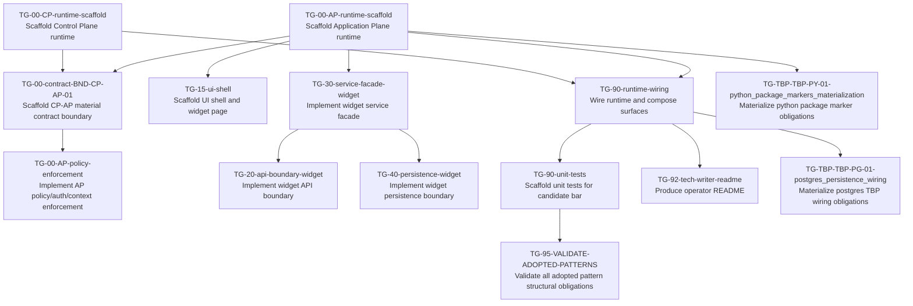

# Task Plan (v1)

Derived mechanically from `task_graph_v1.yaml`.

## Dependency graph

## Edge list (fallback / machine-friendly)

- TG-00-AP-runtime-scaffold — Scaffold Application Plane runtime -> TG-00-contract-BND-CP-AP-01 — Scaffold CP-AP material contract boundary
- TG-00-AP-runtime-scaffold — Scaffold Application Plane runtime -> TG-15-ui-shell — Scaffold UI shell and widget page
- TG-00-AP-runtime-scaffold — Scaffold Application Plane runtime -> TG-30-service-facade-widget — Implement widget service facade
- TG-00-AP-runtime-scaffold — Scaffold Application Plane runtime -> TG-90-runtime-wiring — Wire runtime and compose surfaces
- TG-00-AP-runtime-scaffold — Scaffold Application Plane runtime -> TG-TBP-TBP-PY-01-python_package_markers_materialization — Materialize python package marker obligations
- TG-00-contract-BND-CP-AP-01 — Scaffold CP-AP material contract boundary -> TG-00-AP-policy-enforcement — Implement AP policy/auth/context enforcement
- TG-00-CP-runtime-scaffold — Scaffold Control Plane runtime -> TG-00-contract-BND-CP-AP-01 — Scaffold CP-AP material contract boundary
- TG-00-CP-runtime-scaffold — Scaffold Control Plane runtime -> TG-90-runtime-wiring — Wire runtime and compose surfaces
- TG-30-service-facade-widget — Implement widget service facade -> TG-20-api-boundary-widget — Implement widget API boundary
- TG-30-service-facade-widget — Implement widget service facade -> TG-40-persistence-widget — Implement widget persistence boundary
- TG-90-runtime-wiring — Wire runtime and compose surfaces -> TG-90-unit-tests — Scaffold unit tests for candidate bar
- TG-90-runtime-wiring — Wire runtime and compose surfaces -> TG-92-tech-writer-readme — Produce operator README
- TG-90-runtime-wiring — Wire runtime and compose surfaces -> TG-TBP-TBP-PG-01-postgres_persistence_wiring — Materialize postgres TBP wiring obligations
- TG-90-unit-tests — Scaffold unit tests for candidate bar -> TG-95-VALIDATE-ADOPTED-PATTERNS — Validate all adopted pattern structural obligations

## Project plan (topological waves)

Rules: execute tasks wave-by-wave. Within a wave, any order is valid; prefer lexicographic `task_id` for stability.

### Wave 0
- TG-00-AP-runtime-scaffold — Scaffold Application Plane runtime
- TG-00-CP-runtime-scaffold — Scaffold Control Plane runtime

### Wave 1
- TG-00-contract-BND-CP-AP-01 — Scaffold CP-AP material contract boundary
- TG-15-ui-shell — Scaffold UI shell and widget page
- TG-30-service-facade-widget — Implement widget service facade
- TG-90-runtime-wiring — Wire runtime and compose surfaces
- TG-TBP-TBP-PY-01-python_package_markers_materialization — Materialize python package marker obligations

### Wave 2
- TG-00-AP-policy-enforcement — Implement AP policy/auth/context enforcement
- TG-20-api-boundary-widget — Implement widget API boundary
- TG-40-persistence-widget — Implement widget persistence boundary
- TG-90-unit-tests — Scaffold unit tests for candidate bar
- TG-92-tech-writer-readme — Produce operator README
- TG-TBP-TBP-PG-01-postgres_persistence_wiring — Materialize postgres TBP wiring obligations

### Wave 3
- TG-95-VALIDATE-ADOPTED-PATTERNS — Validate all adopted pattern structural obligations
