# Task Plan (v1)

Derived mechanically from `task_graph_v1.yaml`.

## Dependency graph

```mermaid
flowchart TD
  TG_00_AP_runtime_scaffold["TG-00-AP-runtime-scaffold<br/>Scaffold AP runtime (python api_service_http)"]
  TG_00_CONTRACT_BND_CP_AP_01_AP["TG-00-CONTRACT-BND-CP-AP-01-AP<br/>Scaffold AP contract endpoint for BND-CP-AP-01"]
  TG_00_CONTRACT_BND_CP_AP_01_CP["TG-00-CONTRACT-BND-CP-AP-01-CP<br/>Scaffold CP contract endpoint for BND-CP-AP-01"]
  TG_00_CP_runtime_scaffold["TG-00-CP-runtime-scaffold<br/>Scaffold CP runtime (python api_service_http)"]
  TG_10_OPTIONS_api_boundary_implementation["TG-10-OPTIONS-api_boundary_implementation<br/>Decision option implementation aggregator"]
  TG_10_OPTIONS_postgres_persistence_wiring["TG-10-OPTIONS-postgres_persistence_wiring<br/>Postgres persistence wiring execution anchor"]
  TG_15_ui_shell["TG-15-ui-shell<br/>Scaffold UI shell (web SPA)"]
  TG_18_ui_policy_admin["TG-18-ui-policy-admin<br/>Implement UI page for policy administration"]
  TG_20_api_boundary_activity_events["TG-20-api-boundary-activity_events<br/>Implement API boundary for activity_events"]
  TG_20_api_boundary_collection_memberships["TG-20-api-boundary-collection_memberships<br/>Implement API boundary for collection_memberships"]
  TG_20_api_boundary_collection_permissions["TG-20-api-boundary-collection_permissions<br/>Implement API boundary for collection_permissions"]
  TG_20_api_boundary_collections["TG-20-api-boundary-collections<br/>Implement API boundary for collections"]
  TG_20_api_boundary_tenant_role_assignments["TG-20-api-boundary-tenant_role_assignments<br/>Implement API boundary for tenant_role_assignments"]
  TG_20_api_boundary_widget_versions["TG-20-api-boundary-widget_versions<br/>Implement API boundary for widget_versions"]
  TG_20_api_boundary_widgets["TG-20-api-boundary-widgets<br/>Implement API boundary for widgets"]
  TG_25_ui_page_activity_events["TG-25-ui-page-activity_events<br/>Implement UI page for activity_events resource"]
  TG_25_ui_page_collection_memberships["TG-25-ui-page-collection_memberships<br/>Implement UI page for collection_memberships resource"]
  TG_25_ui_page_collection_permissions["TG-25-ui-page-collection_permissions<br/>Implement UI page for collection_permissions resource"]
  TG_25_ui_page_collections["TG-25-ui-page-collections<br/>Implement UI page for collections resource"]
  TG_25_ui_page_tenant_role_assignments["TG-25-ui-page-tenant_role_assignments<br/>Implement UI page for tenant_role_assignments resource"]
  TG_25_ui_page_widget_versions["TG-25-ui-page-widget_versions<br/>Implement UI page for widget_versions resource"]
  TG_25_ui_page_widgets["TG-25-ui-page-widgets<br/>Implement UI page for widgets resource"]
  TG_30_service_facade_activity_events["TG-30-service-facade-activity_events<br/>Implement service facade for activity_events"]
  TG_30_service_facade_collection_memberships["TG-30-service-facade-collection_memberships<br/>Implement service facade for collection_memberships"]
  TG_30_service_facade_collection_permissions["TG-30-service-facade-collection_permissions<br/>Implement service facade for collection_permissions"]
  TG_30_service_facade_collections["TG-30-service-facade-collections<br/>Implement service facade for collections"]
  TG_30_service_facade_tenant_role_assignments["TG-30-service-facade-tenant_role_assignments<br/>Implement service facade for tenant_role_assignments"]
  TG_30_service_facade_widget_versions["TG-30-service-facade-widget_versions<br/>Implement service facade for widget_versions"]
  TG_30_service_facade_widgets["TG-30-service-facade-widgets<br/>Implement service facade for widgets"]
  TG_35_policy_enforcement_core["TG-35-policy-enforcement-core<br/>Implement policy enforcement core for mock auth and tenant context"]
  TG_40_persistence_activity_events["TG-40-persistence-activity_events<br/>Implement persistence for activity_events (sqlalchemy_orm code_bootstrap)"]
  TG_40_persistence_collection_memberships["TG-40-persistence-collection_memberships<br/>Implement persistence for collection_memberships (sqlalchemy_orm code_bootstrap)"]
  TG_40_persistence_collection_permissions["TG-40-persistence-collection_permissions<br/>Implement persistence for collection_permissions (sqlalchemy_orm code_bootstrap)"]
  TG_40_persistence_collections["TG-40-persistence-collections<br/>Implement persistence for collections (sqlalchemy_orm code_bootstrap)"]
  TG_40_persistence_cp_approval_decision["TG-40-persistence-cp-approval-decision<br/>Implement CP persistence for approval-decision (sqlalchemy_orm code_bootstrap)"]
  TG_40_persistence_cp_deletion_request["TG-40-persistence-cp-deletion-request<br/>Implement CP persistence for deletion-request (sqlalchemy_orm code_bootstrap)"]
  TG_40_persistence_cp_execution_record["TG-40-persistence-cp-execution-record<br/>Implement CP persistence for execution-record (sqlalchemy_orm code_bootstrap)"]
  TG_40_persistence_cp_policy["TG-40-persistence-cp-policy<br/>Implement CP persistence for policy (sqlalchemy_orm code_bootstrap)"]
  TG_40_persistence_cp_retention_rule["TG-40-persistence-cp-retention-rule<br/>Implement CP persistence for retention-rule (sqlalchemy_orm code_bootstrap)"]
  TG_40_persistence_tenant_role_assignments["TG-40-persistence-tenant_role_assignments<br/>Implement persistence for tenant_role_assignments (sqlalchemy_orm code_bootstrap)"]
  TG_40_persistence_widget_versions["TG-40-persistence-widget_versions<br/>Implement persistence for widget_versions (sqlalchemy_orm code_bootstrap)"]
  TG_40_persistence_widgets["TG-40-persistence-widgets<br/>Implement persistence for widgets (sqlalchemy_orm code_bootstrap)"]
  TG_85_observability_and_config["TG-85-observability-and-config<br/>Materialize observability and config contracts for python runtime"]
  TG_88_ux_frontend_realization["TG-88-ux-frontend-realization<br/>Materialize separate UX lane scaffolding contracts"]
  TG_90_runtime_wiring["TG-90-runtime-wiring<br/>Wire cross-plane runtime assembly (python mock auth sqlalchemy_orm code_bootstrap)"]
  TG_90_unit_tests["TG-90-unit-tests<br/>Implement unit test scaffolding for generated runtime surfaces"]
  TG_92_tech_writer_readme["TG-92-tech-writer-readme<br/>Author operator README for compose-based candidate stack"]
  TG_TBP_PG_01_postgres_persistence_wiring["TG-TBP-PG-01-postgres_persistence_wiring<br/>TBP PG obligations for postgres persistence wiring"]
  TG_00_AP_runtime_scaffold --> TG_00_CONTRACT_BND_CP_AP_01_AP
  TG_00_AP_runtime_scaffold --> TG_15_ui_shell
  TG_00_AP_runtime_scaffold --> TG_20_api_boundary_activity_events
  TG_00_AP_runtime_scaffold --> TG_20_api_boundary_collection_memberships
  TG_00_AP_runtime_scaffold --> TG_20_api_boundary_collection_permissions
  TG_00_AP_runtime_scaffold --> TG_20_api_boundary_collections
  TG_00_AP_runtime_scaffold --> TG_20_api_boundary_tenant_role_assignments
  TG_00_AP_runtime_scaffold --> TG_20_api_boundary_widget_versions
  TG_00_AP_runtime_scaffold --> TG_20_api_boundary_widgets
  TG_00_AP_runtime_scaffold --> TG_35_policy_enforcement_core
  TG_00_AP_runtime_scaffold --> TG_40_persistence_activity_events
  TG_00_AP_runtime_scaffold --> TG_40_persistence_collection_memberships
  TG_00_AP_runtime_scaffold --> TG_40_persistence_collection_permissions
  TG_00_AP_runtime_scaffold --> TG_40_persistence_collections
  TG_00_AP_runtime_scaffold --> TG_40_persistence_tenant_role_assignments
  TG_00_AP_runtime_scaffold --> TG_40_persistence_widget_versions
  TG_00_AP_runtime_scaffold --> TG_40_persistence_widgets
  TG_00_AP_runtime_scaffold --> TG_85_observability_and_config
  TG_00_AP_runtime_scaffold --> TG_90_runtime_wiring
  TG_00_CONTRACT_BND_CP_AP_01_AP --> TG_00_CONTRACT_BND_CP_AP_01_CP
  TG_00_CP_runtime_scaffold --> TG_00_CONTRACT_BND_CP_AP_01_CP
  TG_00_CP_runtime_scaffold --> TG_35_policy_enforcement_core
  TG_00_CP_runtime_scaffold --> TG_40_persistence_cp_approval_decision
  TG_00_CP_runtime_scaffold --> TG_40_persistence_cp_deletion_request
  TG_00_CP_runtime_scaffold --> TG_40_persistence_cp_execution_record
  TG_00_CP_runtime_scaffold --> TG_40_persistence_cp_policy
  TG_00_CP_runtime_scaffold --> TG_40_persistence_cp_retention_rule
  TG_00_CP_runtime_scaffold --> TG_85_observability_and_config
  TG_00_CP_runtime_scaffold --> TG_90_runtime_wiring
  TG_15_ui_shell --> TG_18_ui_policy_admin
  TG_15_ui_shell --> TG_25_ui_page_activity_events
  TG_15_ui_shell --> TG_25_ui_page_collection_memberships
  TG_15_ui_shell --> TG_25_ui_page_collection_permissions
  TG_15_ui_shell --> TG_25_ui_page_collections
  TG_15_ui_shell --> TG_25_ui_page_tenant_role_assignments
  TG_15_ui_shell --> TG_25_ui_page_widget_versions
  TG_15_ui_shell --> TG_25_ui_page_widgets
  TG_15_ui_shell --> TG_88_ux_frontend_realization
  TG_20_api_boundary_activity_events --> TG_25_ui_page_activity_events
  TG_20_api_boundary_activity_events --> TG_30_service_facade_activity_events
  TG_20_api_boundary_collection_memberships --> TG_25_ui_page_collection_memberships
  TG_20_api_boundary_collection_memberships --> TG_30_service_facade_collection_memberships
  TG_20_api_boundary_collection_permissions --> TG_25_ui_page_collection_permissions
  TG_20_api_boundary_collection_permissions --> TG_30_service_facade_collection_permissions
  TG_20_api_boundary_collections --> TG_25_ui_page_collections
  TG_20_api_boundary_collections --> TG_30_service_facade_collections
  TG_20_api_boundary_tenant_role_assignments --> TG_25_ui_page_tenant_role_assignments
  TG_20_api_boundary_tenant_role_assignments --> TG_30_service_facade_tenant_role_assignments
  TG_20_api_boundary_widget_versions --> TG_25_ui_page_widget_versions
  TG_20_api_boundary_widget_versions --> TG_30_service_facade_widget_versions
  TG_20_api_boundary_widgets --> TG_25_ui_page_widgets
  TG_20_api_boundary_widgets --> TG_30_service_facade_widgets
  TG_30_service_facade_activity_events --> TG_40_persistence_activity_events
  TG_30_service_facade_collection_memberships --> TG_40_persistence_collection_memberships
  TG_30_service_facade_collection_permissions --> TG_40_persistence_collection_permissions
  TG_30_service_facade_collections --> TG_40_persistence_collections
  TG_30_service_facade_tenant_role_assignments --> TG_40_persistence_tenant_role_assignments
  TG_30_service_facade_widget_versions --> TG_40_persistence_widget_versions
  TG_30_service_facade_widgets --> TG_40_persistence_widgets
  TG_35_policy_enforcement_core --> TG_10_OPTIONS_api_boundary_implementation
  TG_35_policy_enforcement_core --> TG_18_ui_policy_admin
  TG_35_policy_enforcement_core --> TG_20_api_boundary_activity_events
  TG_35_policy_enforcement_core --> TG_20_api_boundary_collection_memberships
  TG_35_policy_enforcement_core --> TG_20_api_boundary_collection_permissions
  TG_35_policy_enforcement_core --> TG_20_api_boundary_collections
  TG_35_policy_enforcement_core --> TG_20_api_boundary_tenant_role_assignments
  TG_35_policy_enforcement_core --> TG_20_api_boundary_widget_versions
  TG_35_policy_enforcement_core --> TG_20_api_boundary_widgets
  TG_35_policy_enforcement_core --> TG_40_persistence_cp_approval_decision
  TG_35_policy_enforcement_core --> TG_40_persistence_cp_deletion_request
  TG_35_policy_enforcement_core --> TG_40_persistence_cp_execution_record
  TG_35_policy_enforcement_core --> TG_40_persistence_cp_policy
  TG_35_policy_enforcement_core --> TG_40_persistence_cp_retention_rule
  TG_40_persistence_activity_events --> TG_90_runtime_wiring
  TG_40_persistence_collection_memberships --> TG_90_runtime_wiring
  TG_40_persistence_collection_permissions --> TG_90_runtime_wiring
  TG_40_persistence_collections --> TG_90_runtime_wiring
  TG_40_persistence_cp_approval_decision --> TG_90_runtime_wiring
  TG_40_persistence_cp_deletion_request --> TG_90_runtime_wiring
  TG_40_persistence_cp_execution_record --> TG_90_runtime_wiring
  TG_40_persistence_cp_policy --> TG_90_runtime_wiring
  TG_40_persistence_cp_retention_rule --> TG_90_runtime_wiring
  TG_40_persistence_tenant_role_assignments --> TG_90_runtime_wiring
  TG_40_persistence_widget_versions --> TG_90_runtime_wiring
  TG_40_persistence_widgets --> TG_90_runtime_wiring
  TG_90_runtime_wiring --> TG_10_OPTIONS_postgres_persistence_wiring
  TG_90_runtime_wiring --> TG_88_ux_frontend_realization
  TG_90_runtime_wiring --> TG_90_unit_tests
  TG_90_runtime_wiring --> TG_92_tech_writer_readme
  TG_90_runtime_wiring --> TG_TBP_PG_01_postgres_persistence_wiring
```

## Edge list (fallback / machine-friendly)

- TG-00-AP-runtime-scaffold — Scaffold AP runtime (python api_service_http) -> TG-00-CONTRACT-BND-CP-AP-01-AP — Scaffold AP contract endpoint for BND-CP-AP-01
- TG-00-AP-runtime-scaffold — Scaffold AP runtime (python api_service_http) -> TG-15-ui-shell — Scaffold UI shell (web SPA)
- TG-00-AP-runtime-scaffold — Scaffold AP runtime (python api_service_http) -> TG-20-api-boundary-activity_events — Implement API boundary for activity_events
- TG-00-AP-runtime-scaffold — Scaffold AP runtime (python api_service_http) -> TG-20-api-boundary-collection_memberships — Implement API boundary for collection_memberships
- TG-00-AP-runtime-scaffold — Scaffold AP runtime (python api_service_http) -> TG-20-api-boundary-collection_permissions — Implement API boundary for collection_permissions
- TG-00-AP-runtime-scaffold — Scaffold AP runtime (python api_service_http) -> TG-20-api-boundary-collections — Implement API boundary for collections
- TG-00-AP-runtime-scaffold — Scaffold AP runtime (python api_service_http) -> TG-20-api-boundary-tenant_role_assignments — Implement API boundary for tenant_role_assignments
- TG-00-AP-runtime-scaffold — Scaffold AP runtime (python api_service_http) -> TG-20-api-boundary-widget_versions — Implement API boundary for widget_versions
- TG-00-AP-runtime-scaffold — Scaffold AP runtime (python api_service_http) -> TG-20-api-boundary-widgets — Implement API boundary for widgets
- TG-00-AP-runtime-scaffold — Scaffold AP runtime (python api_service_http) -> TG-35-policy-enforcement-core — Implement policy enforcement core for mock auth and tenant context
- TG-00-AP-runtime-scaffold — Scaffold AP runtime (python api_service_http) -> TG-40-persistence-activity_events — Implement persistence for activity_events (sqlalchemy_orm code_bootstrap)
- TG-00-AP-runtime-scaffold — Scaffold AP runtime (python api_service_http) -> TG-40-persistence-collection_memberships — Implement persistence for collection_memberships (sqlalchemy_orm code_bootstrap)
- TG-00-AP-runtime-scaffold — Scaffold AP runtime (python api_service_http) -> TG-40-persistence-collection_permissions — Implement persistence for collection_permissions (sqlalchemy_orm code_bootstrap)
- TG-00-AP-runtime-scaffold — Scaffold AP runtime (python api_service_http) -> TG-40-persistence-collections — Implement persistence for collections (sqlalchemy_orm code_bootstrap)
- TG-00-AP-runtime-scaffold — Scaffold AP runtime (python api_service_http) -> TG-40-persistence-tenant_role_assignments — Implement persistence for tenant_role_assignments (sqlalchemy_orm code_bootstrap)
- TG-00-AP-runtime-scaffold — Scaffold AP runtime (python api_service_http) -> TG-40-persistence-widget_versions — Implement persistence for widget_versions (sqlalchemy_orm code_bootstrap)
- TG-00-AP-runtime-scaffold — Scaffold AP runtime (python api_service_http) -> TG-40-persistence-widgets — Implement persistence for widgets (sqlalchemy_orm code_bootstrap)
- TG-00-AP-runtime-scaffold — Scaffold AP runtime (python api_service_http) -> TG-85-observability-and-config — Materialize observability and config contracts for python runtime
- TG-00-AP-runtime-scaffold — Scaffold AP runtime (python api_service_http) -> TG-90-runtime-wiring — Wire cross-plane runtime assembly (python mock auth sqlalchemy_orm code_bootstrap)
- TG-00-CONTRACT-BND-CP-AP-01-AP — Scaffold AP contract endpoint for BND-CP-AP-01 -> TG-00-CONTRACT-BND-CP-AP-01-CP — Scaffold CP contract endpoint for BND-CP-AP-01
- TG-00-CP-runtime-scaffold — Scaffold CP runtime (python api_service_http) -> TG-00-CONTRACT-BND-CP-AP-01-CP — Scaffold CP contract endpoint for BND-CP-AP-01
- TG-00-CP-runtime-scaffold — Scaffold CP runtime (python api_service_http) -> TG-35-policy-enforcement-core — Implement policy enforcement core for mock auth and tenant context
- TG-00-CP-runtime-scaffold — Scaffold CP runtime (python api_service_http) -> TG-40-persistence-cp-approval-decision — Implement CP persistence for approval-decision (sqlalchemy_orm code_bootstrap)
- TG-00-CP-runtime-scaffold — Scaffold CP runtime (python api_service_http) -> TG-40-persistence-cp-deletion-request — Implement CP persistence for deletion-request (sqlalchemy_orm code_bootstrap)
- TG-00-CP-runtime-scaffold — Scaffold CP runtime (python api_service_http) -> TG-40-persistence-cp-execution-record — Implement CP persistence for execution-record (sqlalchemy_orm code_bootstrap)
- TG-00-CP-runtime-scaffold — Scaffold CP runtime (python api_service_http) -> TG-40-persistence-cp-policy — Implement CP persistence for policy (sqlalchemy_orm code_bootstrap)
- TG-00-CP-runtime-scaffold — Scaffold CP runtime (python api_service_http) -> TG-40-persistence-cp-retention-rule — Implement CP persistence for retention-rule (sqlalchemy_orm code_bootstrap)
- TG-00-CP-runtime-scaffold — Scaffold CP runtime (python api_service_http) -> TG-85-observability-and-config — Materialize observability and config contracts for python runtime
- TG-00-CP-runtime-scaffold — Scaffold CP runtime (python api_service_http) -> TG-90-runtime-wiring — Wire cross-plane runtime assembly (python mock auth sqlalchemy_orm code_bootstrap)
- TG-15-ui-shell — Scaffold UI shell (web SPA) -> TG-18-ui-policy-admin — Implement UI page for policy administration
- TG-15-ui-shell — Scaffold UI shell (web SPA) -> TG-25-ui-page-activity_events — Implement UI page for activity_events resource
- TG-15-ui-shell — Scaffold UI shell (web SPA) -> TG-25-ui-page-collection_memberships — Implement UI page for collection_memberships resource
- TG-15-ui-shell — Scaffold UI shell (web SPA) -> TG-25-ui-page-collection_permissions — Implement UI page for collection_permissions resource
- TG-15-ui-shell — Scaffold UI shell (web SPA) -> TG-25-ui-page-collections — Implement UI page for collections resource
- TG-15-ui-shell — Scaffold UI shell (web SPA) -> TG-25-ui-page-tenant_role_assignments — Implement UI page for tenant_role_assignments resource
- TG-15-ui-shell — Scaffold UI shell (web SPA) -> TG-25-ui-page-widget_versions — Implement UI page for widget_versions resource
- TG-15-ui-shell — Scaffold UI shell (web SPA) -> TG-25-ui-page-widgets — Implement UI page for widgets resource
- TG-15-ui-shell — Scaffold UI shell (web SPA) -> TG-88-ux-frontend-realization — Materialize separate UX lane scaffolding contracts
- TG-20-api-boundary-activity_events — Implement API boundary for activity_events -> TG-25-ui-page-activity_events — Implement UI page for activity_events resource
- TG-20-api-boundary-activity_events — Implement API boundary for activity_events -> TG-30-service-facade-activity_events — Implement service facade for activity_events
- TG-20-api-boundary-collection_memberships — Implement API boundary for collection_memberships -> TG-25-ui-page-collection_memberships — Implement UI page for collection_memberships resource
- TG-20-api-boundary-collection_memberships — Implement API boundary for collection_memberships -> TG-30-service-facade-collection_memberships — Implement service facade for collection_memberships
- TG-20-api-boundary-collection_permissions — Implement API boundary for collection_permissions -> TG-25-ui-page-collection_permissions — Implement UI page for collection_permissions resource
- TG-20-api-boundary-collection_permissions — Implement API boundary for collection_permissions -> TG-30-service-facade-collection_permissions — Implement service facade for collection_permissions
- TG-20-api-boundary-collections — Implement API boundary for collections -> TG-25-ui-page-collections — Implement UI page for collections resource
- TG-20-api-boundary-collections — Implement API boundary for collections -> TG-30-service-facade-collections — Implement service facade for collections
- TG-20-api-boundary-tenant_role_assignments — Implement API boundary for tenant_role_assignments -> TG-25-ui-page-tenant_role_assignments — Implement UI page for tenant_role_assignments resource
- TG-20-api-boundary-tenant_role_assignments — Implement API boundary for tenant_role_assignments -> TG-30-service-facade-tenant_role_assignments — Implement service facade for tenant_role_assignments
- TG-20-api-boundary-widget_versions — Implement API boundary for widget_versions -> TG-25-ui-page-widget_versions — Implement UI page for widget_versions resource
- TG-20-api-boundary-widget_versions — Implement API boundary for widget_versions -> TG-30-service-facade-widget_versions — Implement service facade for widget_versions
- TG-20-api-boundary-widgets — Implement API boundary for widgets -> TG-25-ui-page-widgets — Implement UI page for widgets resource
- TG-20-api-boundary-widgets — Implement API boundary for widgets -> TG-30-service-facade-widgets — Implement service facade for widgets
- TG-30-service-facade-activity_events — Implement service facade for activity_events -> TG-40-persistence-activity_events — Implement persistence for activity_events (sqlalchemy_orm code_bootstrap)
- TG-30-service-facade-collection_memberships — Implement service facade for collection_memberships -> TG-40-persistence-collection_memberships — Implement persistence for collection_memberships (sqlalchemy_orm code_bootstrap)
- TG-30-service-facade-collection_permissions — Implement service facade for collection_permissions -> TG-40-persistence-collection_permissions — Implement persistence for collection_permissions (sqlalchemy_orm code_bootstrap)
- TG-30-service-facade-collections — Implement service facade for collections -> TG-40-persistence-collections — Implement persistence for collections (sqlalchemy_orm code_bootstrap)
- TG-30-service-facade-tenant_role_assignments — Implement service facade for tenant_role_assignments -> TG-40-persistence-tenant_role_assignments — Implement persistence for tenant_role_assignments (sqlalchemy_orm code_bootstrap)
- TG-30-service-facade-widget_versions — Implement service facade for widget_versions -> TG-40-persistence-widget_versions — Implement persistence for widget_versions (sqlalchemy_orm code_bootstrap)
- TG-30-service-facade-widgets — Implement service facade for widgets -> TG-40-persistence-widgets — Implement persistence for widgets (sqlalchemy_orm code_bootstrap)
- TG-35-policy-enforcement-core — Implement policy enforcement core for mock auth and tenant context -> TG-10-OPTIONS-api_boundary_implementation — Decision option implementation aggregator
- TG-35-policy-enforcement-core — Implement policy enforcement core for mock auth and tenant context -> TG-18-ui-policy-admin — Implement UI page for policy administration
- TG-35-policy-enforcement-core — Implement policy enforcement core for mock auth and tenant context -> TG-20-api-boundary-activity_events — Implement API boundary for activity_events
- TG-35-policy-enforcement-core — Implement policy enforcement core for mock auth and tenant context -> TG-20-api-boundary-collection_memberships — Implement API boundary for collection_memberships
- TG-35-policy-enforcement-core — Implement policy enforcement core for mock auth and tenant context -> TG-20-api-boundary-collection_permissions — Implement API boundary for collection_permissions
- TG-35-policy-enforcement-core — Implement policy enforcement core for mock auth and tenant context -> TG-20-api-boundary-collections — Implement API boundary for collections
- TG-35-policy-enforcement-core — Implement policy enforcement core for mock auth and tenant context -> TG-20-api-boundary-tenant_role_assignments — Implement API boundary for tenant_role_assignments
- TG-35-policy-enforcement-core — Implement policy enforcement core for mock auth and tenant context -> TG-20-api-boundary-widget_versions — Implement API boundary for widget_versions
- TG-35-policy-enforcement-core — Implement policy enforcement core for mock auth and tenant context -> TG-20-api-boundary-widgets — Implement API boundary for widgets
- TG-35-policy-enforcement-core — Implement policy enforcement core for mock auth and tenant context -> TG-40-persistence-cp-approval-decision — Implement CP persistence for approval-decision (sqlalchemy_orm code_bootstrap)
- TG-35-policy-enforcement-core — Implement policy enforcement core for mock auth and tenant context -> TG-40-persistence-cp-deletion-request — Implement CP persistence for deletion-request (sqlalchemy_orm code_bootstrap)
- TG-35-policy-enforcement-core — Implement policy enforcement core for mock auth and tenant context -> TG-40-persistence-cp-execution-record — Implement CP persistence for execution-record (sqlalchemy_orm code_bootstrap)
- TG-35-policy-enforcement-core — Implement policy enforcement core for mock auth and tenant context -> TG-40-persistence-cp-policy — Implement CP persistence for policy (sqlalchemy_orm code_bootstrap)
- TG-35-policy-enforcement-core — Implement policy enforcement core for mock auth and tenant context -> TG-40-persistence-cp-retention-rule — Implement CP persistence for retention-rule (sqlalchemy_orm code_bootstrap)
- TG-40-persistence-activity_events — Implement persistence for activity_events (sqlalchemy_orm code_bootstrap) -> TG-90-runtime-wiring — Wire cross-plane runtime assembly (python mock auth sqlalchemy_orm code_bootstrap)
- TG-40-persistence-collection_memberships — Implement persistence for collection_memberships (sqlalchemy_orm code_bootstrap) -> TG-90-runtime-wiring — Wire cross-plane runtime assembly (python mock auth sqlalchemy_orm code_bootstrap)
- TG-40-persistence-collection_permissions — Implement persistence for collection_permissions (sqlalchemy_orm code_bootstrap) -> TG-90-runtime-wiring — Wire cross-plane runtime assembly (python mock auth sqlalchemy_orm code_bootstrap)
- TG-40-persistence-collections — Implement persistence for collections (sqlalchemy_orm code_bootstrap) -> TG-90-runtime-wiring — Wire cross-plane runtime assembly (python mock auth sqlalchemy_orm code_bootstrap)
- TG-40-persistence-cp-approval-decision — Implement CP persistence for approval-decision (sqlalchemy_orm code_bootstrap) -> TG-90-runtime-wiring — Wire cross-plane runtime assembly (python mock auth sqlalchemy_orm code_bootstrap)
- TG-40-persistence-cp-deletion-request — Implement CP persistence for deletion-request (sqlalchemy_orm code_bootstrap) -> TG-90-runtime-wiring — Wire cross-plane runtime assembly (python mock auth sqlalchemy_orm code_bootstrap)
- TG-40-persistence-cp-execution-record — Implement CP persistence for execution-record (sqlalchemy_orm code_bootstrap) -> TG-90-runtime-wiring — Wire cross-plane runtime assembly (python mock auth sqlalchemy_orm code_bootstrap)
- TG-40-persistence-cp-policy — Implement CP persistence for policy (sqlalchemy_orm code_bootstrap) -> TG-90-runtime-wiring — Wire cross-plane runtime assembly (python mock auth sqlalchemy_orm code_bootstrap)
- TG-40-persistence-cp-retention-rule — Implement CP persistence for retention-rule (sqlalchemy_orm code_bootstrap) -> TG-90-runtime-wiring — Wire cross-plane runtime assembly (python mock auth sqlalchemy_orm code_bootstrap)
- TG-40-persistence-tenant_role_assignments — Implement persistence for tenant_role_assignments (sqlalchemy_orm code_bootstrap) -> TG-90-runtime-wiring — Wire cross-plane runtime assembly (python mock auth sqlalchemy_orm code_bootstrap)
- TG-40-persistence-widget_versions — Implement persistence for widget_versions (sqlalchemy_orm code_bootstrap) -> TG-90-runtime-wiring — Wire cross-plane runtime assembly (python mock auth sqlalchemy_orm code_bootstrap)
- TG-40-persistence-widgets — Implement persistence for widgets (sqlalchemy_orm code_bootstrap) -> TG-90-runtime-wiring — Wire cross-plane runtime assembly (python mock auth sqlalchemy_orm code_bootstrap)
- TG-90-runtime-wiring — Wire cross-plane runtime assembly (python mock auth sqlalchemy_orm code_bootstrap) -> TG-10-OPTIONS-postgres_persistence_wiring — Postgres persistence wiring execution anchor
- TG-90-runtime-wiring — Wire cross-plane runtime assembly (python mock auth sqlalchemy_orm code_bootstrap) -> TG-88-ux-frontend-realization — Materialize separate UX lane scaffolding contracts
- TG-90-runtime-wiring — Wire cross-plane runtime assembly (python mock auth sqlalchemy_orm code_bootstrap) -> TG-90-unit-tests — Implement unit test scaffolding for generated runtime surfaces
- TG-90-runtime-wiring — Wire cross-plane runtime assembly (python mock auth sqlalchemy_orm code_bootstrap) -> TG-92-tech-writer-readme — Author operator README for compose-based candidate stack
- TG-90-runtime-wiring — Wire cross-plane runtime assembly (python mock auth sqlalchemy_orm code_bootstrap) -> TG-TBP-PG-01-postgres_persistence_wiring — TBP PG obligations for postgres persistence wiring

## Project plan (topological waves)

Rules: execute tasks wave-by-wave. Within a wave, any order is valid; prefer lexicographic `task_id` for stability.

### Wave 0
- TG-00-AP-runtime-scaffold — Scaffold AP runtime (python api_service_http)
- TG-00-CP-runtime-scaffold — Scaffold CP runtime (python api_service_http)

### Wave 1
- TG-00-CONTRACT-BND-CP-AP-01-AP — Scaffold AP contract endpoint for BND-CP-AP-01
- TG-15-ui-shell — Scaffold UI shell (web SPA)
- TG-35-policy-enforcement-core — Implement policy enforcement core for mock auth and tenant context
- TG-85-observability-and-config — Materialize observability and config contracts for python runtime

### Wave 2
- TG-00-CONTRACT-BND-CP-AP-01-CP — Scaffold CP contract endpoint for BND-CP-AP-01
- TG-10-OPTIONS-api_boundary_implementation — Decision option implementation aggregator
- TG-18-ui-policy-admin — Implement UI page for policy administration
- TG-20-api-boundary-activity_events — Implement API boundary for activity_events
- TG-20-api-boundary-collection_memberships — Implement API boundary for collection_memberships
- TG-20-api-boundary-collection_permissions — Implement API boundary for collection_permissions
- TG-20-api-boundary-collections — Implement API boundary for collections
- TG-20-api-boundary-tenant_role_assignments — Implement API boundary for tenant_role_assignments
- TG-20-api-boundary-widget_versions — Implement API boundary for widget_versions
- TG-20-api-boundary-widgets — Implement API boundary for widgets
- TG-40-persistence-cp-approval-decision — Implement CP persistence for approval-decision (sqlalchemy_orm code_bootstrap)
- TG-40-persistence-cp-deletion-request — Implement CP persistence for deletion-request (sqlalchemy_orm code_bootstrap)
- TG-40-persistence-cp-execution-record — Implement CP persistence for execution-record (sqlalchemy_orm code_bootstrap)
- TG-40-persistence-cp-policy — Implement CP persistence for policy (sqlalchemy_orm code_bootstrap)
- TG-40-persistence-cp-retention-rule — Implement CP persistence for retention-rule (sqlalchemy_orm code_bootstrap)

### Wave 3
- TG-25-ui-page-activity_events — Implement UI page for activity_events resource
- TG-25-ui-page-collection_memberships — Implement UI page for collection_memberships resource
- TG-25-ui-page-collection_permissions — Implement UI page for collection_permissions resource
- TG-25-ui-page-collections — Implement UI page for collections resource
- TG-25-ui-page-tenant_role_assignments — Implement UI page for tenant_role_assignments resource
- TG-25-ui-page-widget_versions — Implement UI page for widget_versions resource
- TG-25-ui-page-widgets — Implement UI page for widgets resource
- TG-30-service-facade-activity_events — Implement service facade for activity_events
- TG-30-service-facade-collection_memberships — Implement service facade for collection_memberships
- TG-30-service-facade-collection_permissions — Implement service facade for collection_permissions
- TG-30-service-facade-collections — Implement service facade for collections
- TG-30-service-facade-tenant_role_assignments — Implement service facade for tenant_role_assignments
- TG-30-service-facade-widget_versions — Implement service facade for widget_versions
- TG-30-service-facade-widgets — Implement service facade for widgets

### Wave 4
- TG-40-persistence-activity_events — Implement persistence for activity_events (sqlalchemy_orm code_bootstrap)
- TG-40-persistence-collection_memberships — Implement persistence for collection_memberships (sqlalchemy_orm code_bootstrap)
- TG-40-persistence-collection_permissions — Implement persistence for collection_permissions (sqlalchemy_orm code_bootstrap)
- TG-40-persistence-collections — Implement persistence for collections (sqlalchemy_orm code_bootstrap)
- TG-40-persistence-tenant_role_assignments — Implement persistence for tenant_role_assignments (sqlalchemy_orm code_bootstrap)
- TG-40-persistence-widget_versions — Implement persistence for widget_versions (sqlalchemy_orm code_bootstrap)
- TG-40-persistence-widgets — Implement persistence for widgets (sqlalchemy_orm code_bootstrap)

### Wave 5
- TG-90-runtime-wiring — Wire cross-plane runtime assembly (python mock auth sqlalchemy_orm code_bootstrap)

### Wave 6
- TG-10-OPTIONS-postgres_persistence_wiring — Postgres persistence wiring execution anchor
- TG-88-ux-frontend-realization — Materialize separate UX lane scaffolding contracts
- TG-90-unit-tests — Implement unit test scaffolding for generated runtime surfaces
- TG-92-tech-writer-readme — Author operator README for compose-based candidate stack
- TG-TBP-PG-01-postgres_persistence_wiring — TBP PG obligations for postgres persistence wiring
