# Task Plan (v1)

Derived mechanically from `task_graph_v1.yaml`.

## Dependency graph

```mermaid
flowchart TD
  TG_00_AP_runtime_scaffold["TG-00-AP-runtime-scaffold<br/>Scaffold Application Plane runtime"]
  TG_00_CONTRACT_BND_CP_AP_01_AP["TG-00-CONTRACT-BND-CP-AP-01-AP<br/>Scaffold AP side of CP/AP contract boundary"]
  TG_00_CONTRACT_BND_CP_AP_01_CP["TG-00-CONTRACT-BND-CP-AP-01-CP<br/>Scaffold CP side of CP/AP contract boundary"]
  TG_00_CP_runtime_scaffold["TG-00-CP-runtime-scaffold<br/>Scaffold Control Plane runtime"]
  TG_15_ui_shell["TG-15-ui-shell<br/>Scaffold UI shell (web SPA)"]
  TG_18_ui_policy_admin["TG-18-ui-policy-admin<br/>Implement UI page for policy authoring"]
  TG_20_api_boundary_reports["TG-20-api-boundary-reports<br/>Implement API boundary for reports"]
  TG_20_api_boundary_submissions["TG-20-api-boundary-submissions<br/>Implement API boundary for submissions"]
  TG_20_api_boundary_workspaces["TG-20-api-boundary-workspaces<br/>Implement API boundary for workspaces"]
  TG_25_ui_page_reports["TG-25-ui-page-reports<br/>Implement UI page for reports resource"]
  TG_25_ui_page_submissions["TG-25-ui-page-submissions<br/>Implement UI page for submissions resource"]
  TG_25_ui_page_workspaces["TG-25-ui-page-workspaces<br/>Implement UI page for workspaces resource"]
  TG_30_service_facade_reports["TG-30-service-facade-reports<br/>Implement service facade for reports"]
  TG_30_service_facade_submissions["TG-30-service-facade-submissions<br/>Implement service facade for submissions"]
  TG_30_service_facade_workspaces["TG-30-service-facade-workspaces<br/>Implement service facade for workspaces"]
  TG_35_policy_enforcement_core["TG-35-policy-enforcement-core<br/>Implement cross-plane policy enforcement core"]
  TG_40_persistence_cp_policy["TG-40-persistence-cp-policy<br/>Implement CP persistence boundary for policy aggregate"]
  TG_40_persistence_reports["TG-40-persistence-reports<br/>Implement persistence boundary for reports"]
  TG_40_persistence_submissions["TG-40-persistence-submissions<br/>Implement persistence boundary for submissions"]
  TG_40_persistence_workspaces["TG-40-persistence-workspaces<br/>Implement persistence boundary for workspaces"]
  TG_90_runtime_wiring["TG-90-runtime-wiring<br/>Wire candidate runtime and compose integration"]
  TG_90_unit_tests["TG-90-unit-tests<br/>Scaffold unit tests for candidate implementation"]
  TG_92_tech_writer_readme["TG-92-tech-writer-readme<br/>Produce companion operator README"]
  TG_TBP_TBP_PG_01_postgres_persistence_wiring["TG-TBP-TBP-PG-01-postgres_persistence_wiring<br/>Materialize PostgreSQL wiring obligations"]
  TG_TBP_TBP_PY_01_python_package_markers["TG-TBP-TBP-PY-01-python-package-markers<br/>Materialize Python package marker obligations"]
  TG_00_AP_runtime_scaffold --> TG_00_CONTRACT_BND_CP_AP_01_AP
  TG_00_AP_runtime_scaffold --> TG_00_CONTRACT_BND_CP_AP_01_CP
  TG_00_AP_runtime_scaffold --> TG_15_ui_shell
  TG_00_AP_runtime_scaffold --> TG_20_api_boundary_reports
  TG_00_AP_runtime_scaffold --> TG_20_api_boundary_submissions
  TG_00_AP_runtime_scaffold --> TG_20_api_boundary_workspaces
  TG_00_AP_runtime_scaffold --> TG_90_runtime_wiring
  TG_00_AP_runtime_scaffold --> TG_TBP_TBP_PY_01_python_package_markers
  TG_00_CONTRACT_BND_CP_AP_01_AP --> TG_20_api_boundary_reports
  TG_00_CONTRACT_BND_CP_AP_01_AP --> TG_20_api_boundary_submissions
  TG_00_CONTRACT_BND_CP_AP_01_AP --> TG_20_api_boundary_workspaces
  TG_00_CONTRACT_BND_CP_AP_01_AP --> TG_35_policy_enforcement_core
  TG_00_CONTRACT_BND_CP_AP_01_AP --> TG_90_runtime_wiring
  TG_00_CONTRACT_BND_CP_AP_01_CP --> TG_35_policy_enforcement_core
  TG_00_CONTRACT_BND_CP_AP_01_CP --> TG_40_persistence_cp_policy
  TG_00_CONTRACT_BND_CP_AP_01_CP --> TG_90_runtime_wiring
  TG_00_CP_runtime_scaffold --> TG_00_CONTRACT_BND_CP_AP_01_AP
  TG_00_CP_runtime_scaffold --> TG_00_CONTRACT_BND_CP_AP_01_CP
  TG_00_CP_runtime_scaffold --> TG_40_persistence_cp_policy
  TG_00_CP_runtime_scaffold --> TG_90_runtime_wiring
  TG_00_CP_runtime_scaffold --> TG_TBP_TBP_PY_01_python_package_markers
  TG_15_ui_shell --> TG_18_ui_policy_admin
  TG_15_ui_shell --> TG_25_ui_page_reports
  TG_15_ui_shell --> TG_25_ui_page_submissions
  TG_15_ui_shell --> TG_25_ui_page_workspaces
  TG_15_ui_shell --> TG_90_runtime_wiring
  TG_18_ui_policy_admin --> TG_90_runtime_wiring
  TG_20_api_boundary_reports --> TG_25_ui_page_reports
  TG_20_api_boundary_reports --> TG_30_service_facade_reports
  TG_20_api_boundary_submissions --> TG_25_ui_page_submissions
  TG_20_api_boundary_submissions --> TG_30_service_facade_submissions
  TG_20_api_boundary_workspaces --> TG_25_ui_page_workspaces
  TG_20_api_boundary_workspaces --> TG_30_service_facade_workspaces
  TG_25_ui_page_reports --> TG_90_runtime_wiring
  TG_25_ui_page_submissions --> TG_90_runtime_wiring
  TG_25_ui_page_workspaces --> TG_90_runtime_wiring
  TG_30_service_facade_reports --> TG_40_persistence_reports
  TG_30_service_facade_submissions --> TG_40_persistence_submissions
  TG_30_service_facade_workspaces --> TG_40_persistence_workspaces
  TG_35_policy_enforcement_core --> TG_18_ui_policy_admin
  TG_35_policy_enforcement_core --> TG_30_service_facade_reports
  TG_35_policy_enforcement_core --> TG_30_service_facade_submissions
  TG_35_policy_enforcement_core --> TG_30_service_facade_workspaces
  TG_35_policy_enforcement_core --> TG_40_persistence_cp_policy
  TG_40_persistence_cp_policy --> TG_90_runtime_wiring
  TG_40_persistence_cp_policy --> TG_TBP_TBP_PG_01_postgres_persistence_wiring
  TG_40_persistence_reports --> TG_90_runtime_wiring
  TG_40_persistence_reports --> TG_TBP_TBP_PG_01_postgres_persistence_wiring
  TG_40_persistence_submissions --> TG_90_runtime_wiring
  TG_40_persistence_submissions --> TG_TBP_TBP_PG_01_postgres_persistence_wiring
  TG_40_persistence_workspaces --> TG_90_runtime_wiring
  TG_40_persistence_workspaces --> TG_TBP_TBP_PG_01_postgres_persistence_wiring
  TG_90_runtime_wiring --> TG_90_unit_tests
  TG_90_runtime_wiring --> TG_92_tech_writer_readme
  TG_90_unit_tests --> TG_92_tech_writer_readme
  TG_TBP_TBP_PG_01_postgres_persistence_wiring --> TG_90_runtime_wiring
```

## Edge list (fallback / machine-friendly)

- TG-00-AP-runtime-scaffold — Scaffold Application Plane runtime -> TG-00-CONTRACT-BND-CP-AP-01-AP — Scaffold AP side of CP/AP contract boundary
- TG-00-AP-runtime-scaffold — Scaffold Application Plane runtime -> TG-00-CONTRACT-BND-CP-AP-01-CP — Scaffold CP side of CP/AP contract boundary
- TG-00-AP-runtime-scaffold — Scaffold Application Plane runtime -> TG-15-ui-shell — Scaffold UI shell (web SPA)
- TG-00-AP-runtime-scaffold — Scaffold Application Plane runtime -> TG-20-api-boundary-reports — Implement API boundary for reports
- TG-00-AP-runtime-scaffold — Scaffold Application Plane runtime -> TG-20-api-boundary-submissions — Implement API boundary for submissions
- TG-00-AP-runtime-scaffold — Scaffold Application Plane runtime -> TG-20-api-boundary-workspaces — Implement API boundary for workspaces
- TG-00-AP-runtime-scaffold — Scaffold Application Plane runtime -> TG-90-runtime-wiring — Wire candidate runtime and compose integration
- TG-00-AP-runtime-scaffold — Scaffold Application Plane runtime -> TG-TBP-TBP-PY-01-python-package-markers — Materialize Python package marker obligations
- TG-00-CONTRACT-BND-CP-AP-01-AP — Scaffold AP side of CP/AP contract boundary -> TG-20-api-boundary-reports — Implement API boundary for reports
- TG-00-CONTRACT-BND-CP-AP-01-AP — Scaffold AP side of CP/AP contract boundary -> TG-20-api-boundary-submissions — Implement API boundary for submissions
- TG-00-CONTRACT-BND-CP-AP-01-AP — Scaffold AP side of CP/AP contract boundary -> TG-20-api-boundary-workspaces — Implement API boundary for workspaces
- TG-00-CONTRACT-BND-CP-AP-01-AP — Scaffold AP side of CP/AP contract boundary -> TG-35-policy-enforcement-core — Implement cross-plane policy enforcement core
- TG-00-CONTRACT-BND-CP-AP-01-AP — Scaffold AP side of CP/AP contract boundary -> TG-90-runtime-wiring — Wire candidate runtime and compose integration
- TG-00-CONTRACT-BND-CP-AP-01-CP — Scaffold CP side of CP/AP contract boundary -> TG-35-policy-enforcement-core — Implement cross-plane policy enforcement core
- TG-00-CONTRACT-BND-CP-AP-01-CP — Scaffold CP side of CP/AP contract boundary -> TG-40-persistence-cp-policy — Implement CP persistence boundary for policy aggregate
- TG-00-CONTRACT-BND-CP-AP-01-CP — Scaffold CP side of CP/AP contract boundary -> TG-90-runtime-wiring — Wire candidate runtime and compose integration
- TG-00-CP-runtime-scaffold — Scaffold Control Plane runtime -> TG-00-CONTRACT-BND-CP-AP-01-AP — Scaffold AP side of CP/AP contract boundary
- TG-00-CP-runtime-scaffold — Scaffold Control Plane runtime -> TG-00-CONTRACT-BND-CP-AP-01-CP — Scaffold CP side of CP/AP contract boundary
- TG-00-CP-runtime-scaffold — Scaffold Control Plane runtime -> TG-40-persistence-cp-policy — Implement CP persistence boundary for policy aggregate
- TG-00-CP-runtime-scaffold — Scaffold Control Plane runtime -> TG-90-runtime-wiring — Wire candidate runtime and compose integration
- TG-00-CP-runtime-scaffold — Scaffold Control Plane runtime -> TG-TBP-TBP-PY-01-python-package-markers — Materialize Python package marker obligations
- TG-15-ui-shell — Scaffold UI shell (web SPA) -> TG-18-ui-policy-admin — Implement UI page for policy authoring
- TG-15-ui-shell — Scaffold UI shell (web SPA) -> TG-25-ui-page-reports — Implement UI page for reports resource
- TG-15-ui-shell — Scaffold UI shell (web SPA) -> TG-25-ui-page-submissions — Implement UI page for submissions resource
- TG-15-ui-shell — Scaffold UI shell (web SPA) -> TG-25-ui-page-workspaces — Implement UI page for workspaces resource
- TG-15-ui-shell — Scaffold UI shell (web SPA) -> TG-90-runtime-wiring — Wire candidate runtime and compose integration
- TG-18-ui-policy-admin — Implement UI page for policy authoring -> TG-90-runtime-wiring — Wire candidate runtime and compose integration
- TG-20-api-boundary-reports — Implement API boundary for reports -> TG-25-ui-page-reports — Implement UI page for reports resource
- TG-20-api-boundary-reports — Implement API boundary for reports -> TG-30-service-facade-reports — Implement service facade for reports
- TG-20-api-boundary-submissions — Implement API boundary for submissions -> TG-25-ui-page-submissions — Implement UI page for submissions resource
- TG-20-api-boundary-submissions — Implement API boundary for submissions -> TG-30-service-facade-submissions — Implement service facade for submissions
- TG-20-api-boundary-workspaces — Implement API boundary for workspaces -> TG-25-ui-page-workspaces — Implement UI page for workspaces resource
- TG-20-api-boundary-workspaces — Implement API boundary for workspaces -> TG-30-service-facade-workspaces — Implement service facade for workspaces
- TG-25-ui-page-reports — Implement UI page for reports resource -> TG-90-runtime-wiring — Wire candidate runtime and compose integration
- TG-25-ui-page-submissions — Implement UI page for submissions resource -> TG-90-runtime-wiring — Wire candidate runtime and compose integration
- TG-25-ui-page-workspaces — Implement UI page for workspaces resource -> TG-90-runtime-wiring — Wire candidate runtime and compose integration
- TG-30-service-facade-reports — Implement service facade for reports -> TG-40-persistence-reports — Implement persistence boundary for reports
- TG-30-service-facade-submissions — Implement service facade for submissions -> TG-40-persistence-submissions — Implement persistence boundary for submissions
- TG-30-service-facade-workspaces — Implement service facade for workspaces -> TG-40-persistence-workspaces — Implement persistence boundary for workspaces
- TG-35-policy-enforcement-core — Implement cross-plane policy enforcement core -> TG-18-ui-policy-admin — Implement UI page for policy authoring
- TG-35-policy-enforcement-core — Implement cross-plane policy enforcement core -> TG-30-service-facade-reports — Implement service facade for reports
- TG-35-policy-enforcement-core — Implement cross-plane policy enforcement core -> TG-30-service-facade-submissions — Implement service facade for submissions
- TG-35-policy-enforcement-core — Implement cross-plane policy enforcement core -> TG-30-service-facade-workspaces — Implement service facade for workspaces
- TG-35-policy-enforcement-core — Implement cross-plane policy enforcement core -> TG-40-persistence-cp-policy — Implement CP persistence boundary for policy aggregate
- TG-40-persistence-cp-policy — Implement CP persistence boundary for policy aggregate -> TG-90-runtime-wiring — Wire candidate runtime and compose integration
- TG-40-persistence-cp-policy — Implement CP persistence boundary for policy aggregate -> TG-TBP-TBP-PG-01-postgres_persistence_wiring — Materialize PostgreSQL wiring obligations
- TG-40-persistence-reports — Implement persistence boundary for reports -> TG-90-runtime-wiring — Wire candidate runtime and compose integration
- TG-40-persistence-reports — Implement persistence boundary for reports -> TG-TBP-TBP-PG-01-postgres_persistence_wiring — Materialize PostgreSQL wiring obligations
- TG-40-persistence-submissions — Implement persistence boundary for submissions -> TG-90-runtime-wiring — Wire candidate runtime and compose integration
- TG-40-persistence-submissions — Implement persistence boundary for submissions -> TG-TBP-TBP-PG-01-postgres_persistence_wiring — Materialize PostgreSQL wiring obligations
- TG-40-persistence-workspaces — Implement persistence boundary for workspaces -> TG-90-runtime-wiring — Wire candidate runtime and compose integration
- TG-40-persistence-workspaces — Implement persistence boundary for workspaces -> TG-TBP-TBP-PG-01-postgres_persistence_wiring — Materialize PostgreSQL wiring obligations
- TG-90-runtime-wiring — Wire candidate runtime and compose integration -> TG-90-unit-tests — Scaffold unit tests for candidate implementation
- TG-90-runtime-wiring — Wire candidate runtime and compose integration -> TG-92-tech-writer-readme — Produce companion operator README
- TG-90-unit-tests — Scaffold unit tests for candidate implementation -> TG-92-tech-writer-readme — Produce companion operator README
- TG-TBP-TBP-PG-01-postgres_persistence_wiring — Materialize PostgreSQL wiring obligations -> TG-90-runtime-wiring — Wire candidate runtime and compose integration

## Project plan (topological waves)

Rules: execute tasks wave-by-wave. Within a wave, any order is valid; prefer lexicographic `task_id` for stability.

### Wave 0
- TG-00-AP-runtime-scaffold — Scaffold Application Plane runtime
- TG-00-CP-runtime-scaffold — Scaffold Control Plane runtime

### Wave 1
- TG-00-CONTRACT-BND-CP-AP-01-AP — Scaffold AP side of CP/AP contract boundary
- TG-00-CONTRACT-BND-CP-AP-01-CP — Scaffold CP side of CP/AP contract boundary
- TG-15-ui-shell — Scaffold UI shell (web SPA)
- TG-TBP-TBP-PY-01-python-package-markers — Materialize Python package marker obligations

### Wave 2
- TG-20-api-boundary-reports — Implement API boundary for reports
- TG-20-api-boundary-submissions — Implement API boundary for submissions
- TG-20-api-boundary-workspaces — Implement API boundary for workspaces
- TG-35-policy-enforcement-core — Implement cross-plane policy enforcement core

### Wave 3
- TG-18-ui-policy-admin — Implement UI page for policy authoring
- TG-25-ui-page-reports — Implement UI page for reports resource
- TG-25-ui-page-submissions — Implement UI page for submissions resource
- TG-25-ui-page-workspaces — Implement UI page for workspaces resource
- TG-30-service-facade-reports — Implement service facade for reports
- TG-30-service-facade-submissions — Implement service facade for submissions
- TG-30-service-facade-workspaces — Implement service facade for workspaces
- TG-40-persistence-cp-policy — Implement CP persistence boundary for policy aggregate

### Wave 4
- TG-40-persistence-reports — Implement persistence boundary for reports
- TG-40-persistence-submissions — Implement persistence boundary for submissions
- TG-40-persistence-workspaces — Implement persistence boundary for workspaces

### Wave 5
- TG-TBP-TBP-PG-01-postgres_persistence_wiring — Materialize PostgreSQL wiring obligations

### Wave 6
- TG-90-runtime-wiring — Wire candidate runtime and compose integration

### Wave 7
- TG-90-unit-tests — Scaffold unit tests for candidate implementation

### Wave 8
- TG-92-tech-writer-readme — Produce companion operator README
