# Task Plan (v1)

Derived mechanically from `task_graph_v1.yaml`.

## Dependency graph

```mermaid
flowchart TD
  TG_00_AP_runtime_scaffold["TG-00-AP-runtime-scaffold<br/>Scaffold application plane runtime shell"]
  TG_00_CONTRACT_BND_CP_AP_01_AP["TG-00-CONTRACT-BND-CP-AP-01-AP<br/>Scaffold AP contract surface for BND-CP-AP-01"]
  TG_00_CONTRACT_BND_CP_AP_01_CP["TG-00-CONTRACT-BND-CP-AP-01-CP<br/>Scaffold CP contract surface for BND-CP-AP-01"]
  TG_00_CP_runtime_scaffold["TG-00-CP-runtime-scaffold<br/>Scaffold control plane runtime shell"]
  TG_10_OPTIONS_policy_enforcement["TG-10-OPTIONS-policy_enforcement<br/>Decision option implementation (policy_enforcement)"]
  TG_10_OPTIONS_runtime_wiring["TG-10-OPTIONS-runtime_wiring<br/>Decision option implementation (runtime_wiring)"]
  TG_15_ui_shell["TG-15-ui-shell<br/>Scaffold UI shell (web SPA)"]
  TG_18_ui_policy_admin["TG-18-ui-policy-admin<br/>Implement UI page for policy administration"]
  TG_20_api_boundary_reports["TG-20-api-boundary-reports<br/>Implement API boundary for reports resource"]
  TG_20_api_boundary_reviews["TG-20-api-boundary-reviews<br/>Implement API boundary for reviews resource"]
  TG_20_api_boundary_submissions["TG-20-api-boundary-submissions<br/>Implement API boundary for submissions resource"]
  TG_20_api_boundary_workspaces["TG-20-api-boundary-workspaces<br/>Implement API boundary for workspaces resource"]
  TG_25_ui_page_reports["TG-25-ui-page-reports<br/>Implement UI page for reports resource"]
  TG_25_ui_page_reviews["TG-25-ui-page-reviews<br/>Implement UI page for reviews resource"]
  TG_25_ui_page_submissions["TG-25-ui-page-submissions<br/>Implement UI page for submissions resource"]
  TG_25_ui_page_workspaces["TG-25-ui-page-workspaces<br/>Implement UI page for workspaces resource"]
  TG_30_service_facade_reports["TG-30-service-facade-reports<br/>Implement service facade for reports resource"]
  TG_30_service_facade_reviews["TG-30-service-facade-reviews<br/>Implement service facade for reviews resource"]
  TG_30_service_facade_submissions["TG-30-service-facade-submissions<br/>Implement service facade for submissions resource"]
  TG_30_service_facade_workspaces["TG-30-service-facade-workspaces<br/>Implement service facade for workspaces resource"]
  TG_35_policy_enforcement_core["TG-35-policy-enforcement-core<br/>Implement core policy enforcement and tenant context controls"]
  TG_40_persistence_cp_data_lifecycle["TG-40-persistence-cp-data-lifecycle<br/>Implement control-plane persistence for data-lifecycle aggregate"]
  TG_40_persistence_cp_execution_record["TG-40-persistence-cp-execution-record<br/>Implement control-plane persistence for execution-record aggregate"]
  TG_40_persistence_cp_policy["TG-40-persistence-cp-policy<br/>Implement control-plane persistence for policy aggregate"]
  TG_40_persistence_reports["TG-40-persistence-reports<br/>Implement persistence for reports resource"]
  TG_40_persistence_reviews["TG-40-persistence-reviews<br/>Implement persistence for reviews resource"]
  TG_40_persistence_submissions["TG-40-persistence-submissions<br/>Implement persistence for submissions resource"]
  TG_40_persistence_workspaces["TG-40-persistence-workspaces<br/>Implement persistence for workspaces resource"]
  TG_90_runtime_wiring["TG-90-runtime-wiring<br/>Assemble runtime wiring for CP, AP, UI, and compose stack"]
  TG_90_unit_tests["TG-90-unit-tests<br/>Implement unit-test scaffolding for candidate surfaces"]
  TG_92_tech_writer_readme["TG-92-tech-writer-readme<br/>Author companion operator README for local stack usage"]
  TG_TBP_TBP_PG_01_postgres_persistence_wiring["TG-TBP-TBP-PG-01-postgres_persistence_wiring<br/>Materialize postgres runtime wiring contracts"]
  TG_TBP_TBP_PY_01_python_package_markers_materialization["TG-TBP-TBP-PY-01-python_package_markers_materialization<br/>Materialize python package markers for candidate packages"]
  TG_TBP_TBP_PY_PACKAGING_01_observability_and_config["TG-TBP-TBP-PY-PACKAGING-01-observability_and_config<br/>Materialize observability/config dependency contracts"]
  TG_00_AP_runtime_scaffold --> TG_00_CONTRACT_BND_CP_AP_01_AP
  TG_00_AP_runtime_scaffold --> TG_00_CONTRACT_BND_CP_AP_01_CP
  TG_00_AP_runtime_scaffold --> TG_10_OPTIONS_runtime_wiring
  TG_00_AP_runtime_scaffold --> TG_15_ui_shell
  TG_00_AP_runtime_scaffold --> TG_20_api_boundary_reports
  TG_00_AP_runtime_scaffold --> TG_20_api_boundary_reviews
  TG_00_AP_runtime_scaffold --> TG_20_api_boundary_submissions
  TG_00_AP_runtime_scaffold --> TG_20_api_boundary_workspaces
  TG_00_AP_runtime_scaffold --> TG_35_policy_enforcement_core
  TG_00_AP_runtime_scaffold --> TG_TBP_TBP_PY_01_python_package_markers_materialization
  TG_00_AP_runtime_scaffold --> TG_TBP_TBP_PY_PACKAGING_01_observability_and_config
  TG_00_CONTRACT_BND_CP_AP_01_AP --> TG_35_policy_enforcement_core
  TG_00_CONTRACT_BND_CP_AP_01_CP --> TG_35_policy_enforcement_core
  TG_00_CP_runtime_scaffold --> TG_00_CONTRACT_BND_CP_AP_01_AP
  TG_00_CP_runtime_scaffold --> TG_00_CONTRACT_BND_CP_AP_01_CP
  TG_00_CP_runtime_scaffold --> TG_10_OPTIONS_runtime_wiring
  TG_00_CP_runtime_scaffold --> TG_35_policy_enforcement_core
  TG_00_CP_runtime_scaffold --> TG_40_persistence_cp_data_lifecycle
  TG_00_CP_runtime_scaffold --> TG_40_persistence_cp_execution_record
  TG_00_CP_runtime_scaffold --> TG_40_persistence_cp_policy
  TG_00_CP_runtime_scaffold --> TG_TBP_TBP_PY_01_python_package_markers_materialization
  TG_00_CP_runtime_scaffold --> TG_TBP_TBP_PY_PACKAGING_01_observability_and_config
  TG_15_ui_shell --> TG_18_ui_policy_admin
  TG_15_ui_shell --> TG_25_ui_page_reports
  TG_15_ui_shell --> TG_25_ui_page_reviews
  TG_15_ui_shell --> TG_25_ui_page_submissions
  TG_15_ui_shell --> TG_25_ui_page_workspaces
  TG_15_ui_shell --> TG_90_runtime_wiring
  TG_18_ui_policy_admin --> TG_90_runtime_wiring
  TG_20_api_boundary_reports --> TG_30_service_facade_reports
  TG_20_api_boundary_reviews --> TG_30_service_facade_reviews
  TG_20_api_boundary_submissions --> TG_30_service_facade_submissions
  TG_20_api_boundary_workspaces --> TG_30_service_facade_workspaces
  TG_25_ui_page_reports --> TG_90_runtime_wiring
  TG_25_ui_page_reviews --> TG_25_ui_page_reports
  TG_25_ui_page_reviews --> TG_90_runtime_wiring
  TG_25_ui_page_submissions --> TG_25_ui_page_reviews
  TG_25_ui_page_submissions --> TG_90_runtime_wiring
  TG_25_ui_page_workspaces --> TG_25_ui_page_submissions
  TG_25_ui_page_workspaces --> TG_90_runtime_wiring
  TG_30_service_facade_reports --> TG_40_persistence_reports
  TG_30_service_facade_reviews --> TG_40_persistence_reviews
  TG_30_service_facade_submissions --> TG_40_persistence_submissions
  TG_30_service_facade_workspaces --> TG_40_persistence_workspaces
  TG_35_policy_enforcement_core --> TG_10_OPTIONS_policy_enforcement
  TG_35_policy_enforcement_core --> TG_10_OPTIONS_runtime_wiring
  TG_35_policy_enforcement_core --> TG_18_ui_policy_admin
  TG_35_policy_enforcement_core --> TG_20_api_boundary_reports
  TG_35_policy_enforcement_core --> TG_20_api_boundary_reviews
  TG_35_policy_enforcement_core --> TG_20_api_boundary_submissions
  TG_35_policy_enforcement_core --> TG_20_api_boundary_workspaces
  TG_35_policy_enforcement_core --> TG_40_persistence_cp_data_lifecycle
  TG_35_policy_enforcement_core --> TG_40_persistence_cp_execution_record
  TG_35_policy_enforcement_core --> TG_40_persistence_cp_policy
  TG_40_persistence_cp_data_lifecycle --> TG_90_runtime_wiring
  TG_40_persistence_cp_execution_record --> TG_90_runtime_wiring
  TG_40_persistence_cp_policy --> TG_90_runtime_wiring
  TG_40_persistence_cp_policy --> TG_TBP_TBP_PG_01_postgres_persistence_wiring
  TG_40_persistence_reports --> TG_90_runtime_wiring
  TG_40_persistence_reviews --> TG_90_runtime_wiring
  TG_40_persistence_submissions --> TG_90_runtime_wiring
  TG_40_persistence_workspaces --> TG_90_runtime_wiring
  TG_40_persistence_workspaces --> TG_TBP_TBP_PG_01_postgres_persistence_wiring
  TG_90_runtime_wiring --> TG_90_unit_tests
  TG_90_runtime_wiring --> TG_92_tech_writer_readme
```

## Edge list (fallback / machine-friendly)

- TG-00-AP-runtime-scaffold — Scaffold application plane runtime shell -> TG-00-CONTRACT-BND-CP-AP-01-AP — Scaffold AP contract surface for BND-CP-AP-01
- TG-00-AP-runtime-scaffold — Scaffold application plane runtime shell -> TG-00-CONTRACT-BND-CP-AP-01-CP — Scaffold CP contract surface for BND-CP-AP-01
- TG-00-AP-runtime-scaffold — Scaffold application plane runtime shell -> TG-10-OPTIONS-runtime_wiring — Decision option implementation (runtime_wiring)
- TG-00-AP-runtime-scaffold — Scaffold application plane runtime shell -> TG-15-ui-shell — Scaffold UI shell (web SPA)
- TG-00-AP-runtime-scaffold — Scaffold application plane runtime shell -> TG-20-api-boundary-reports — Implement API boundary for reports resource
- TG-00-AP-runtime-scaffold — Scaffold application plane runtime shell -> TG-20-api-boundary-reviews — Implement API boundary for reviews resource
- TG-00-AP-runtime-scaffold — Scaffold application plane runtime shell -> TG-20-api-boundary-submissions — Implement API boundary for submissions resource
- TG-00-AP-runtime-scaffold — Scaffold application plane runtime shell -> TG-20-api-boundary-workspaces — Implement API boundary for workspaces resource
- TG-00-AP-runtime-scaffold — Scaffold application plane runtime shell -> TG-35-policy-enforcement-core — Implement core policy enforcement and tenant context controls
- TG-00-AP-runtime-scaffold — Scaffold application plane runtime shell -> TG-TBP-TBP-PY-01-python_package_markers_materialization — Materialize python package markers for candidate packages
- TG-00-AP-runtime-scaffold — Scaffold application plane runtime shell -> TG-TBP-TBP-PY-PACKAGING-01-observability_and_config — Materialize observability/config dependency contracts
- TG-00-CONTRACT-BND-CP-AP-01-AP — Scaffold AP contract surface for BND-CP-AP-01 -> TG-35-policy-enforcement-core — Implement core policy enforcement and tenant context controls
- TG-00-CONTRACT-BND-CP-AP-01-CP — Scaffold CP contract surface for BND-CP-AP-01 -> TG-35-policy-enforcement-core — Implement core policy enforcement and tenant context controls
- TG-00-CP-runtime-scaffold — Scaffold control plane runtime shell -> TG-00-CONTRACT-BND-CP-AP-01-AP — Scaffold AP contract surface for BND-CP-AP-01
- TG-00-CP-runtime-scaffold — Scaffold control plane runtime shell -> TG-00-CONTRACT-BND-CP-AP-01-CP — Scaffold CP contract surface for BND-CP-AP-01
- TG-00-CP-runtime-scaffold — Scaffold control plane runtime shell -> TG-10-OPTIONS-runtime_wiring — Decision option implementation (runtime_wiring)
- TG-00-CP-runtime-scaffold — Scaffold control plane runtime shell -> TG-35-policy-enforcement-core — Implement core policy enforcement and tenant context controls
- TG-00-CP-runtime-scaffold — Scaffold control plane runtime shell -> TG-40-persistence-cp-data-lifecycle — Implement control-plane persistence for data-lifecycle aggregate
- TG-00-CP-runtime-scaffold — Scaffold control plane runtime shell -> TG-40-persistence-cp-execution-record — Implement control-plane persistence for execution-record aggregate
- TG-00-CP-runtime-scaffold — Scaffold control plane runtime shell -> TG-40-persistence-cp-policy — Implement control-plane persistence for policy aggregate
- TG-00-CP-runtime-scaffold — Scaffold control plane runtime shell -> TG-TBP-TBP-PY-01-python_package_markers_materialization — Materialize python package markers for candidate packages
- TG-00-CP-runtime-scaffold — Scaffold control plane runtime shell -> TG-TBP-TBP-PY-PACKAGING-01-observability_and_config — Materialize observability/config dependency contracts
- TG-15-ui-shell — Scaffold UI shell (web SPA) -> TG-18-ui-policy-admin — Implement UI page for policy administration
- TG-15-ui-shell — Scaffold UI shell (web SPA) -> TG-25-ui-page-reports — Implement UI page for reports resource
- TG-15-ui-shell — Scaffold UI shell (web SPA) -> TG-25-ui-page-reviews — Implement UI page for reviews resource
- TG-15-ui-shell — Scaffold UI shell (web SPA) -> TG-25-ui-page-submissions — Implement UI page for submissions resource
- TG-15-ui-shell — Scaffold UI shell (web SPA) -> TG-25-ui-page-workspaces — Implement UI page for workspaces resource
- TG-15-ui-shell — Scaffold UI shell (web SPA) -> TG-90-runtime-wiring — Assemble runtime wiring for CP, AP, UI, and compose stack
- TG-18-ui-policy-admin — Implement UI page for policy administration -> TG-90-runtime-wiring — Assemble runtime wiring for CP, AP, UI, and compose stack
- TG-20-api-boundary-reports — Implement API boundary for reports resource -> TG-30-service-facade-reports — Implement service facade for reports resource
- TG-20-api-boundary-reviews — Implement API boundary for reviews resource -> TG-30-service-facade-reviews — Implement service facade for reviews resource
- TG-20-api-boundary-submissions — Implement API boundary for submissions resource -> TG-30-service-facade-submissions — Implement service facade for submissions resource
- TG-20-api-boundary-workspaces — Implement API boundary for workspaces resource -> TG-30-service-facade-workspaces — Implement service facade for workspaces resource
- TG-25-ui-page-reports — Implement UI page for reports resource -> TG-90-runtime-wiring — Assemble runtime wiring for CP, AP, UI, and compose stack
- TG-25-ui-page-reviews — Implement UI page for reviews resource -> TG-25-ui-page-reports — Implement UI page for reports resource
- TG-25-ui-page-reviews — Implement UI page for reviews resource -> TG-90-runtime-wiring — Assemble runtime wiring for CP, AP, UI, and compose stack
- TG-25-ui-page-submissions — Implement UI page for submissions resource -> TG-25-ui-page-reviews — Implement UI page for reviews resource
- TG-25-ui-page-submissions — Implement UI page for submissions resource -> TG-90-runtime-wiring — Assemble runtime wiring for CP, AP, UI, and compose stack
- TG-25-ui-page-workspaces — Implement UI page for workspaces resource -> TG-25-ui-page-submissions — Implement UI page for submissions resource
- TG-25-ui-page-workspaces — Implement UI page for workspaces resource -> TG-90-runtime-wiring — Assemble runtime wiring for CP, AP, UI, and compose stack
- TG-30-service-facade-reports — Implement service facade for reports resource -> TG-40-persistence-reports — Implement persistence for reports resource
- TG-30-service-facade-reviews — Implement service facade for reviews resource -> TG-40-persistence-reviews — Implement persistence for reviews resource
- TG-30-service-facade-submissions — Implement service facade for submissions resource -> TG-40-persistence-submissions — Implement persistence for submissions resource
- TG-30-service-facade-workspaces — Implement service facade for workspaces resource -> TG-40-persistence-workspaces — Implement persistence for workspaces resource
- TG-35-policy-enforcement-core — Implement core policy enforcement and tenant context controls -> TG-10-OPTIONS-policy_enforcement — Decision option implementation (policy_enforcement)
- TG-35-policy-enforcement-core — Implement core policy enforcement and tenant context controls -> TG-10-OPTIONS-runtime_wiring — Decision option implementation (runtime_wiring)
- TG-35-policy-enforcement-core — Implement core policy enforcement and tenant context controls -> TG-18-ui-policy-admin — Implement UI page for policy administration
- TG-35-policy-enforcement-core — Implement core policy enforcement and tenant context controls -> TG-20-api-boundary-reports — Implement API boundary for reports resource
- TG-35-policy-enforcement-core — Implement core policy enforcement and tenant context controls -> TG-20-api-boundary-reviews — Implement API boundary for reviews resource
- TG-35-policy-enforcement-core — Implement core policy enforcement and tenant context controls -> TG-20-api-boundary-submissions — Implement API boundary for submissions resource
- TG-35-policy-enforcement-core — Implement core policy enforcement and tenant context controls -> TG-20-api-boundary-workspaces — Implement API boundary for workspaces resource
- TG-35-policy-enforcement-core — Implement core policy enforcement and tenant context controls -> TG-40-persistence-cp-data-lifecycle — Implement control-plane persistence for data-lifecycle aggregate
- TG-35-policy-enforcement-core — Implement core policy enforcement and tenant context controls -> TG-40-persistence-cp-execution-record — Implement control-plane persistence for execution-record aggregate
- TG-35-policy-enforcement-core — Implement core policy enforcement and tenant context controls -> TG-40-persistence-cp-policy — Implement control-plane persistence for policy aggregate
- TG-40-persistence-cp-data-lifecycle — Implement control-plane persistence for data-lifecycle aggregate -> TG-90-runtime-wiring — Assemble runtime wiring for CP, AP, UI, and compose stack
- TG-40-persistence-cp-execution-record — Implement control-plane persistence for execution-record aggregate -> TG-90-runtime-wiring — Assemble runtime wiring for CP, AP, UI, and compose stack
- TG-40-persistence-cp-policy — Implement control-plane persistence for policy aggregate -> TG-90-runtime-wiring — Assemble runtime wiring for CP, AP, UI, and compose stack
- TG-40-persistence-cp-policy — Implement control-plane persistence for policy aggregate -> TG-TBP-TBP-PG-01-postgres_persistence_wiring — Materialize postgres runtime wiring contracts
- TG-40-persistence-reports — Implement persistence for reports resource -> TG-90-runtime-wiring — Assemble runtime wiring for CP, AP, UI, and compose stack
- TG-40-persistence-reviews — Implement persistence for reviews resource -> TG-90-runtime-wiring — Assemble runtime wiring for CP, AP, UI, and compose stack
- TG-40-persistence-submissions — Implement persistence for submissions resource -> TG-90-runtime-wiring — Assemble runtime wiring for CP, AP, UI, and compose stack
- TG-40-persistence-workspaces — Implement persistence for workspaces resource -> TG-90-runtime-wiring — Assemble runtime wiring for CP, AP, UI, and compose stack
- TG-40-persistence-workspaces — Implement persistence for workspaces resource -> TG-TBP-TBP-PG-01-postgres_persistence_wiring — Materialize postgres runtime wiring contracts
- TG-90-runtime-wiring — Assemble runtime wiring for CP, AP, UI, and compose stack -> TG-90-unit-tests — Implement unit-test scaffolding for candidate surfaces
- TG-90-runtime-wiring — Assemble runtime wiring for CP, AP, UI, and compose stack -> TG-92-tech-writer-readme — Author companion operator README for local stack usage

## Project plan (topological waves)

Rules: execute tasks wave-by-wave. Within a wave, any order is valid; prefer lexicographic `task_id` for stability.

### Wave 0
- TG-00-AP-runtime-scaffold — Scaffold application plane runtime shell
- TG-00-CP-runtime-scaffold — Scaffold control plane runtime shell

### Wave 1
- TG-00-CONTRACT-BND-CP-AP-01-AP — Scaffold AP contract surface for BND-CP-AP-01
- TG-00-CONTRACT-BND-CP-AP-01-CP — Scaffold CP contract surface for BND-CP-AP-01
- TG-15-ui-shell — Scaffold UI shell (web SPA)
- TG-TBP-TBP-PY-01-python_package_markers_materialization — Materialize python package markers for candidate packages
- TG-TBP-TBP-PY-PACKAGING-01-observability_and_config — Materialize observability/config dependency contracts

### Wave 2
- TG-25-ui-page-workspaces — Implement UI page for workspaces resource
- TG-35-policy-enforcement-core — Implement core policy enforcement and tenant context controls

### Wave 3
- TG-10-OPTIONS-policy_enforcement — Decision option implementation (policy_enforcement)
- TG-10-OPTIONS-runtime_wiring — Decision option implementation (runtime_wiring)
- TG-18-ui-policy-admin — Implement UI page for policy administration
- TG-20-api-boundary-reports — Implement API boundary for reports resource
- TG-20-api-boundary-reviews — Implement API boundary for reviews resource
- TG-20-api-boundary-submissions — Implement API boundary for submissions resource
- TG-20-api-boundary-workspaces — Implement API boundary for workspaces resource
- TG-25-ui-page-submissions — Implement UI page for submissions resource
- TG-40-persistence-cp-data-lifecycle — Implement control-plane persistence for data-lifecycle aggregate
- TG-40-persistence-cp-execution-record — Implement control-plane persistence for execution-record aggregate
- TG-40-persistence-cp-policy — Implement control-plane persistence for policy aggregate

### Wave 4
- TG-25-ui-page-reviews — Implement UI page for reviews resource
- TG-30-service-facade-reports — Implement service facade for reports resource
- TG-30-service-facade-reviews — Implement service facade for reviews resource
- TG-30-service-facade-submissions — Implement service facade for submissions resource
- TG-30-service-facade-workspaces — Implement service facade for workspaces resource

### Wave 5
- TG-25-ui-page-reports — Implement UI page for reports resource
- TG-40-persistence-reports — Implement persistence for reports resource
- TG-40-persistence-reviews — Implement persistence for reviews resource
- TG-40-persistence-submissions — Implement persistence for submissions resource
- TG-40-persistence-workspaces — Implement persistence for workspaces resource

### Wave 6
- TG-90-runtime-wiring — Assemble runtime wiring for CP, AP, UI, and compose stack
- TG-TBP-TBP-PG-01-postgres_persistence_wiring — Materialize postgres runtime wiring contracts

### Wave 7
- TG-90-unit-tests — Implement unit-test scaffolding for candidate surfaces
- TG-92-tech-writer-readme — Author companion operator README for local stack usage
