# Task Plan (v1)

Derived mechanically from `task_graph_v1.yaml`.

## Dependency graph

```mermaid
flowchart TD
  TG_00_AP_runtime_scaffold["TG-00-AP-runtime-scaffold<br/>Scaffold application plane runtime"]
  TG_00_CONTRACT_BND_CP_AP_01_AP["TG-00-CONTRACT-BND-CP-AP-01-AP<br/>Scaffold AP contract surface for BND-CP-AP-01"]
  TG_00_CONTRACT_BND_CP_AP_01_CP["TG-00-CONTRACT-BND-CP-AP-01-CP<br/>Scaffold CP contract surface for BND-CP-AP-01"]
  TG_00_CP_runtime_scaffold["TG-00-CP-runtime-scaffold<br/>Scaffold control plane runtime"]
  TG_10_OPTIONS_api_boundary_implementation["TG-10-OPTIONS-api_boundary_implementation<br/>Decision option implementation bundle"]
  TG_15_ui_shell["TG-15-ui-shell<br/>Implement UI shell and baseline navigation"]
  TG_18_ui_policy_admin["TG-18-ui-policy-admin<br/>Implement UI policy and governance admin surface"]
  TG_20_api_boundary_activity_events["TG-20-api-boundary-activity_events<br/>Implement API boundary for activity_events"]
  TG_20_api_boundary_collection_permissions["TG-20-api-boundary-collection_permissions<br/>Implement API boundary for collection_permissions"]
  TG_20_api_boundary_collections["TG-20-api-boundary-collections<br/>Implement API boundary for collections"]
  TG_20_api_boundary_tags["TG-20-api-boundary-tags<br/>Implement API boundary for tags"]
  TG_20_api_boundary_tenant_settings["TG-20-api-boundary-tenant_settings<br/>Implement API boundary for tenant_settings"]
  TG_20_api_boundary_tenant_users_roles["TG-20-api-boundary-tenant_users_roles<br/>Implement API boundary for tenant_users_roles"]
  TG_20_api_boundary_widget_versions["TG-20-api-boundary-widget_versions<br/>Implement API boundary for widget_versions"]
  TG_20_api_boundary_widgets["TG-20-api-boundary-widgets<br/>Implement API boundary for widgets"]
  TG_25_ui_page_activity_events["TG-25-ui-page-activity_events<br/>Implement UI page for activity_events"]
  TG_25_ui_page_collection_permissions["TG-25-ui-page-collection_permissions<br/>Implement UI page for collection_permissions"]
  TG_25_ui_page_collections["TG-25-ui-page-collections<br/>Implement UI page for collections"]
  TG_25_ui_page_tags["TG-25-ui-page-tags<br/>Implement UI page for tags"]
  TG_25_ui_page_tenant_settings["TG-25-ui-page-tenant_settings<br/>Implement UI page for tenant_settings"]
  TG_25_ui_page_tenant_users_roles["TG-25-ui-page-tenant_users_roles<br/>Implement UI page for tenant_users_roles"]
  TG_25_ui_page_widget_versions["TG-25-ui-page-widget_versions<br/>Implement UI page for widget_versions"]
  TG_25_ui_page_widgets["TG-25-ui-page-widgets<br/>Implement UI page for widgets"]
  TG_30_service_facade_activity_events["TG-30-service-facade-activity_events<br/>Implement service facade for activity_events"]
  TG_30_service_facade_collection_permissions["TG-30-service-facade-collection_permissions<br/>Implement service facade for collection_permissions"]
  TG_30_service_facade_collections["TG-30-service-facade-collections<br/>Implement service facade for collections"]
  TG_30_service_facade_tags["TG-30-service-facade-tags<br/>Implement service facade for tags"]
  TG_30_service_facade_tenant_settings["TG-30-service-facade-tenant_settings<br/>Implement service facade for tenant_settings"]
  TG_30_service_facade_tenant_users_roles["TG-30-service-facade-tenant_users_roles<br/>Implement service facade for tenant_users_roles"]
  TG_30_service_facade_widget_versions["TG-30-service-facade-widget_versions<br/>Implement service facade for widget_versions"]
  TG_30_service_facade_widgets["TG-30-service-facade-widgets<br/>Implement service facade for widgets"]
  TG_35_policy_enforcement_core["TG-35-policy-enforcement-core<br/>Implement policy enforcement core across CP and AP"]
  TG_40_persistence_activity_events["TG-40-persistence-activity_events<br/>Implement persistence for activity_events"]
  TG_40_persistence_collection_permissions["TG-40-persistence-collection_permissions<br/>Implement persistence for collection_permissions"]
  TG_40_persistence_collections["TG-40-persistence-collections<br/>Implement persistence for collections"]
  TG_40_persistence_cp_execution_record["TG-40-persistence-cp-execution-record<br/>Implement control-plane persistence for Execution Record aggregate"]
  TG_40_persistence_cp_policy["TG-40-persistence-cp-policy<br/>Implement control-plane persistence for Policy aggregate"]
  TG_40_persistence_cp_retention_lifecycle["TG-40-persistence-cp-retention-lifecycle<br/>Implement control-plane persistence for Retention Lifecycle aggregate"]
  TG_40_persistence_tags["TG-40-persistence-tags<br/>Implement persistence for tags"]
  TG_40_persistence_tenant_settings["TG-40-persistence-tenant_settings<br/>Implement persistence for tenant_settings"]
  TG_40_persistence_tenant_users_roles["TG-40-persistence-tenant_users_roles<br/>Implement persistence for tenant_users_roles"]
  TG_40_persistence_widget_versions["TG-40-persistence-widget_versions<br/>Implement persistence for widget_versions"]
  TG_40_persistence_widgets["TG-40-persistence-widgets<br/>Implement persistence for widgets"]
  TG_90_runtime_wiring["TG-90-runtime-wiring<br/>Wire runtime surfaces into a runnable local stack"]
  TG_90_unit_tests["TG-90-unit-tests<br/>Scaffold unit-test coverage for candidate runtime surfaces"]
  TG_92_tech_writer_readme["TG-92-tech-writer-readme<br/>Produce operator README for local stack execution"]
  TG_TBP_TBP_PG_01_postgres_persistence_wiring["TG-TBP-TBP-PG-01-postgres_persistence_wiring<br/>Materialize PostgreSQL wiring contracts"]
  TG_TBP_TBP_PY_01_python_package_markers["TG-TBP-TBP-PY-01-python-package-markers<br/>Materialize Python package markers for candidate code packages"]
  TG_TBP_TBP_PY_PACKAGING_01_observability_and_config["TG-TBP-TBP-PY-PACKAGING-01-observability_and_config<br/>Materialize dependency and configuration observability surfaces"]
  TG_TBP_TBP_UI_REACT_VITE_01_ux_frontend_realization["TG-TBP-TBP-UI-REACT-VITE-01-ux_frontend_realization<br/>Realize UX-lane frontend scaffolding surfaces"]
  TG_00_AP_runtime_scaffold --> TG_00_CONTRACT_BND_CP_AP_01_AP
  TG_00_AP_runtime_scaffold --> TG_00_CONTRACT_BND_CP_AP_01_CP
  TG_00_AP_runtime_scaffold --> TG_10_OPTIONS_api_boundary_implementation
  TG_00_AP_runtime_scaffold --> TG_20_api_boundary_activity_events
  TG_00_AP_runtime_scaffold --> TG_20_api_boundary_collection_permissions
  TG_00_AP_runtime_scaffold --> TG_20_api_boundary_collections
  TG_00_AP_runtime_scaffold --> TG_20_api_boundary_tags
  TG_00_AP_runtime_scaffold --> TG_20_api_boundary_tenant_settings
  TG_00_AP_runtime_scaffold --> TG_20_api_boundary_tenant_users_roles
  TG_00_AP_runtime_scaffold --> TG_20_api_boundary_widget_versions
  TG_00_AP_runtime_scaffold --> TG_20_api_boundary_widgets
  TG_00_AP_runtime_scaffold --> TG_35_policy_enforcement_core
  TG_00_AP_runtime_scaffold --> TG_40_persistence_activity_events
  TG_00_AP_runtime_scaffold --> TG_40_persistence_collection_permissions
  TG_00_AP_runtime_scaffold --> TG_40_persistence_collections
  TG_00_AP_runtime_scaffold --> TG_40_persistence_tags
  TG_00_AP_runtime_scaffold --> TG_40_persistence_tenant_settings
  TG_00_AP_runtime_scaffold --> TG_40_persistence_tenant_users_roles
  TG_00_AP_runtime_scaffold --> TG_40_persistence_widget_versions
  TG_00_AP_runtime_scaffold --> TG_40_persistence_widgets
  TG_00_AP_runtime_scaffold --> TG_90_runtime_wiring
  TG_00_AP_runtime_scaffold --> TG_TBP_TBP_PY_01_python_package_markers
  TG_00_AP_runtime_scaffold --> TG_TBP_TBP_PY_PACKAGING_01_observability_and_config
  TG_00_CONTRACT_BND_CP_AP_01_AP --> TG_35_policy_enforcement_core
  TG_00_CONTRACT_BND_CP_AP_01_CP --> TG_35_policy_enforcement_core
  TG_00_CP_runtime_scaffold --> TG_00_CONTRACT_BND_CP_AP_01_AP
  TG_00_CP_runtime_scaffold --> TG_00_CONTRACT_BND_CP_AP_01_CP
  TG_00_CP_runtime_scaffold --> TG_10_OPTIONS_api_boundary_implementation
  TG_00_CP_runtime_scaffold --> TG_35_policy_enforcement_core
  TG_00_CP_runtime_scaffold --> TG_40_persistence_cp_execution_record
  TG_00_CP_runtime_scaffold --> TG_40_persistence_cp_policy
  TG_00_CP_runtime_scaffold --> TG_40_persistence_cp_retention_lifecycle
  TG_00_CP_runtime_scaffold --> TG_90_runtime_wiring
  TG_00_CP_runtime_scaffold --> TG_TBP_TBP_PY_01_python_package_markers
  TG_00_CP_runtime_scaffold --> TG_TBP_TBP_PY_PACKAGING_01_observability_and_config
  TG_15_ui_shell --> TG_18_ui_policy_admin
  TG_15_ui_shell --> TG_25_ui_page_activity_events
  TG_15_ui_shell --> TG_25_ui_page_collection_permissions
  TG_15_ui_shell --> TG_25_ui_page_collections
  TG_15_ui_shell --> TG_25_ui_page_tags
  TG_15_ui_shell --> TG_25_ui_page_tenant_settings
  TG_15_ui_shell --> TG_25_ui_page_tenant_users_roles
  TG_15_ui_shell --> TG_25_ui_page_widget_versions
  TG_15_ui_shell --> TG_25_ui_page_widgets
  TG_20_api_boundary_activity_events --> TG_25_ui_page_activity_events
  TG_20_api_boundary_activity_events --> TG_30_service_facade_activity_events
  TG_20_api_boundary_collection_permissions --> TG_25_ui_page_collection_permissions
  TG_20_api_boundary_collection_permissions --> TG_30_service_facade_collection_permissions
  TG_20_api_boundary_collections --> TG_25_ui_page_collections
  TG_20_api_boundary_collections --> TG_30_service_facade_collections
  TG_20_api_boundary_tags --> TG_25_ui_page_tags
  TG_20_api_boundary_tags --> TG_30_service_facade_tags
  TG_20_api_boundary_tenant_settings --> TG_25_ui_page_tenant_settings
  TG_20_api_boundary_tenant_settings --> TG_30_service_facade_tenant_settings
  TG_20_api_boundary_tenant_users_roles --> TG_25_ui_page_tenant_users_roles
  TG_20_api_boundary_tenant_users_roles --> TG_30_service_facade_tenant_users_roles
  TG_20_api_boundary_widget_versions --> TG_25_ui_page_widget_versions
  TG_20_api_boundary_widget_versions --> TG_30_service_facade_widget_versions
  TG_20_api_boundary_widgets --> TG_25_ui_page_widgets
  TG_20_api_boundary_widgets --> TG_30_service_facade_widgets
  TG_30_service_facade_activity_events --> TG_40_persistence_activity_events
  TG_30_service_facade_collection_permissions --> TG_40_persistence_collection_permissions
  TG_30_service_facade_collections --> TG_40_persistence_collections
  TG_30_service_facade_tags --> TG_40_persistence_tags
  TG_30_service_facade_tenant_settings --> TG_40_persistence_tenant_settings
  TG_30_service_facade_tenant_users_roles --> TG_40_persistence_tenant_users_roles
  TG_30_service_facade_widget_versions --> TG_40_persistence_widget_versions
  TG_30_service_facade_widgets --> TG_40_persistence_widgets
  TG_35_policy_enforcement_core --> TG_18_ui_policy_admin
  TG_35_policy_enforcement_core --> TG_20_api_boundary_activity_events
  TG_35_policy_enforcement_core --> TG_20_api_boundary_collection_permissions
  TG_35_policy_enforcement_core --> TG_20_api_boundary_collections
  TG_35_policy_enforcement_core --> TG_20_api_boundary_tags
  TG_35_policy_enforcement_core --> TG_20_api_boundary_tenant_settings
  TG_35_policy_enforcement_core --> TG_20_api_boundary_tenant_users_roles
  TG_35_policy_enforcement_core --> TG_20_api_boundary_widget_versions
  TG_35_policy_enforcement_core --> TG_20_api_boundary_widgets
  TG_35_policy_enforcement_core --> TG_30_service_facade_activity_events
  TG_35_policy_enforcement_core --> TG_30_service_facade_collection_permissions
  TG_35_policy_enforcement_core --> TG_30_service_facade_collections
  TG_35_policy_enforcement_core --> TG_30_service_facade_tags
  TG_35_policy_enforcement_core --> TG_30_service_facade_tenant_settings
  TG_35_policy_enforcement_core --> TG_30_service_facade_tenant_users_roles
  TG_35_policy_enforcement_core --> TG_30_service_facade_widget_versions
  TG_35_policy_enforcement_core --> TG_30_service_facade_widgets
  TG_40_persistence_activity_events --> TG_90_runtime_wiring
  TG_40_persistence_collection_permissions --> TG_90_runtime_wiring
  TG_40_persistence_collections --> TG_90_runtime_wiring
  TG_40_persistence_cp_execution_record --> TG_90_runtime_wiring
  TG_40_persistence_cp_policy --> TG_90_runtime_wiring
  TG_40_persistence_cp_retention_lifecycle --> TG_90_runtime_wiring
  TG_40_persistence_tags --> TG_90_runtime_wiring
  TG_40_persistence_tenant_settings --> TG_90_runtime_wiring
  TG_40_persistence_tenant_users_roles --> TG_90_runtime_wiring
  TG_40_persistence_widget_versions --> TG_90_runtime_wiring
  TG_40_persistence_widgets --> TG_90_runtime_wiring
  TG_90_runtime_wiring --> TG_15_ui_shell
  TG_90_runtime_wiring --> TG_90_unit_tests
  TG_90_runtime_wiring --> TG_92_tech_writer_readme
  TG_90_runtime_wiring --> TG_TBP_TBP_PG_01_postgres_persistence_wiring
  TG_90_runtime_wiring --> TG_TBP_TBP_UI_REACT_VITE_01_ux_frontend_realization
```

## Edge list (fallback / machine-friendly)

- TG-00-AP-runtime-scaffold — Scaffold application plane runtime -> TG-00-CONTRACT-BND-CP-AP-01-AP — Scaffold AP contract surface for BND-CP-AP-01
- TG-00-AP-runtime-scaffold — Scaffold application plane runtime -> TG-00-CONTRACT-BND-CP-AP-01-CP — Scaffold CP contract surface for BND-CP-AP-01
- TG-00-AP-runtime-scaffold — Scaffold application plane runtime -> TG-10-OPTIONS-api_boundary_implementation — Decision option implementation bundle
- TG-00-AP-runtime-scaffold — Scaffold application plane runtime -> TG-20-api-boundary-activity_events — Implement API boundary for activity_events
- TG-00-AP-runtime-scaffold — Scaffold application plane runtime -> TG-20-api-boundary-collection_permissions — Implement API boundary for collection_permissions
- TG-00-AP-runtime-scaffold — Scaffold application plane runtime -> TG-20-api-boundary-collections — Implement API boundary for collections
- TG-00-AP-runtime-scaffold — Scaffold application plane runtime -> TG-20-api-boundary-tags — Implement API boundary for tags
- TG-00-AP-runtime-scaffold — Scaffold application plane runtime -> TG-20-api-boundary-tenant_settings — Implement API boundary for tenant_settings
- TG-00-AP-runtime-scaffold — Scaffold application plane runtime -> TG-20-api-boundary-tenant_users_roles — Implement API boundary for tenant_users_roles
- TG-00-AP-runtime-scaffold — Scaffold application plane runtime -> TG-20-api-boundary-widget_versions — Implement API boundary for widget_versions
- TG-00-AP-runtime-scaffold — Scaffold application plane runtime -> TG-20-api-boundary-widgets — Implement API boundary for widgets
- TG-00-AP-runtime-scaffold — Scaffold application plane runtime -> TG-35-policy-enforcement-core — Implement policy enforcement core across CP and AP
- TG-00-AP-runtime-scaffold — Scaffold application plane runtime -> TG-40-persistence-activity_events — Implement persistence for activity_events
- TG-00-AP-runtime-scaffold — Scaffold application plane runtime -> TG-40-persistence-collection_permissions — Implement persistence for collection_permissions
- TG-00-AP-runtime-scaffold — Scaffold application plane runtime -> TG-40-persistence-collections — Implement persistence for collections
- TG-00-AP-runtime-scaffold — Scaffold application plane runtime -> TG-40-persistence-tags — Implement persistence for tags
- TG-00-AP-runtime-scaffold — Scaffold application plane runtime -> TG-40-persistence-tenant_settings — Implement persistence for tenant_settings
- TG-00-AP-runtime-scaffold — Scaffold application plane runtime -> TG-40-persistence-tenant_users_roles — Implement persistence for tenant_users_roles
- TG-00-AP-runtime-scaffold — Scaffold application plane runtime -> TG-40-persistence-widget_versions — Implement persistence for widget_versions
- TG-00-AP-runtime-scaffold — Scaffold application plane runtime -> TG-40-persistence-widgets — Implement persistence for widgets
- TG-00-AP-runtime-scaffold — Scaffold application plane runtime -> TG-90-runtime-wiring — Wire runtime surfaces into a runnable local stack
- TG-00-AP-runtime-scaffold — Scaffold application plane runtime -> TG-TBP-TBP-PY-01-python-package-markers — Materialize Python package markers for candidate code packages
- TG-00-AP-runtime-scaffold — Scaffold application plane runtime -> TG-TBP-TBP-PY-PACKAGING-01-observability_and_config — Materialize dependency and configuration observability surfaces
- TG-00-CONTRACT-BND-CP-AP-01-AP — Scaffold AP contract surface for BND-CP-AP-01 -> TG-35-policy-enforcement-core — Implement policy enforcement core across CP and AP
- TG-00-CONTRACT-BND-CP-AP-01-CP — Scaffold CP contract surface for BND-CP-AP-01 -> TG-35-policy-enforcement-core — Implement policy enforcement core across CP and AP
- TG-00-CP-runtime-scaffold — Scaffold control plane runtime -> TG-00-CONTRACT-BND-CP-AP-01-AP — Scaffold AP contract surface for BND-CP-AP-01
- TG-00-CP-runtime-scaffold — Scaffold control plane runtime -> TG-00-CONTRACT-BND-CP-AP-01-CP — Scaffold CP contract surface for BND-CP-AP-01
- TG-00-CP-runtime-scaffold — Scaffold control plane runtime -> TG-10-OPTIONS-api_boundary_implementation — Decision option implementation bundle
- TG-00-CP-runtime-scaffold — Scaffold control plane runtime -> TG-35-policy-enforcement-core — Implement policy enforcement core across CP and AP
- TG-00-CP-runtime-scaffold — Scaffold control plane runtime -> TG-40-persistence-cp-execution-record — Implement control-plane persistence for Execution Record aggregate
- TG-00-CP-runtime-scaffold — Scaffold control plane runtime -> TG-40-persistence-cp-policy — Implement control-plane persistence for Policy aggregate
- TG-00-CP-runtime-scaffold — Scaffold control plane runtime -> TG-40-persistence-cp-retention-lifecycle — Implement control-plane persistence for Retention Lifecycle aggregate
- TG-00-CP-runtime-scaffold — Scaffold control plane runtime -> TG-90-runtime-wiring — Wire runtime surfaces into a runnable local stack
- TG-00-CP-runtime-scaffold — Scaffold control plane runtime -> TG-TBP-TBP-PY-01-python-package-markers — Materialize Python package markers for candidate code packages
- TG-00-CP-runtime-scaffold — Scaffold control plane runtime -> TG-TBP-TBP-PY-PACKAGING-01-observability_and_config — Materialize dependency and configuration observability surfaces
- TG-15-ui-shell — Implement UI shell and baseline navigation -> TG-18-ui-policy-admin — Implement UI policy and governance admin surface
- TG-15-ui-shell — Implement UI shell and baseline navigation -> TG-25-ui-page-activity_events — Implement UI page for activity_events
- TG-15-ui-shell — Implement UI shell and baseline navigation -> TG-25-ui-page-collection_permissions — Implement UI page for collection_permissions
- TG-15-ui-shell — Implement UI shell and baseline navigation -> TG-25-ui-page-collections — Implement UI page for collections
- TG-15-ui-shell — Implement UI shell and baseline navigation -> TG-25-ui-page-tags — Implement UI page for tags
- TG-15-ui-shell — Implement UI shell and baseline navigation -> TG-25-ui-page-tenant_settings — Implement UI page for tenant_settings
- TG-15-ui-shell — Implement UI shell and baseline navigation -> TG-25-ui-page-tenant_users_roles — Implement UI page for tenant_users_roles
- TG-15-ui-shell — Implement UI shell and baseline navigation -> TG-25-ui-page-widget_versions — Implement UI page for widget_versions
- TG-15-ui-shell — Implement UI shell and baseline navigation -> TG-25-ui-page-widgets — Implement UI page for widgets
- TG-20-api-boundary-activity_events — Implement API boundary for activity_events -> TG-25-ui-page-activity_events — Implement UI page for activity_events
- TG-20-api-boundary-activity_events — Implement API boundary for activity_events -> TG-30-service-facade-activity_events — Implement service facade for activity_events
- TG-20-api-boundary-collection_permissions — Implement API boundary for collection_permissions -> TG-25-ui-page-collection_permissions — Implement UI page for collection_permissions
- TG-20-api-boundary-collection_permissions — Implement API boundary for collection_permissions -> TG-30-service-facade-collection_permissions — Implement service facade for collection_permissions
- TG-20-api-boundary-collections — Implement API boundary for collections -> TG-25-ui-page-collections — Implement UI page for collections
- TG-20-api-boundary-collections — Implement API boundary for collections -> TG-30-service-facade-collections — Implement service facade for collections
- TG-20-api-boundary-tags — Implement API boundary for tags -> TG-25-ui-page-tags — Implement UI page for tags
- TG-20-api-boundary-tags — Implement API boundary for tags -> TG-30-service-facade-tags — Implement service facade for tags
- TG-20-api-boundary-tenant_settings — Implement API boundary for tenant_settings -> TG-25-ui-page-tenant_settings — Implement UI page for tenant_settings
- TG-20-api-boundary-tenant_settings — Implement API boundary for tenant_settings -> TG-30-service-facade-tenant_settings — Implement service facade for tenant_settings
- TG-20-api-boundary-tenant_users_roles — Implement API boundary for tenant_users_roles -> TG-25-ui-page-tenant_users_roles — Implement UI page for tenant_users_roles
- TG-20-api-boundary-tenant_users_roles — Implement API boundary for tenant_users_roles -> TG-30-service-facade-tenant_users_roles — Implement service facade for tenant_users_roles
- TG-20-api-boundary-widget_versions — Implement API boundary for widget_versions -> TG-25-ui-page-widget_versions — Implement UI page for widget_versions
- TG-20-api-boundary-widget_versions — Implement API boundary for widget_versions -> TG-30-service-facade-widget_versions — Implement service facade for widget_versions
- TG-20-api-boundary-widgets — Implement API boundary for widgets -> TG-25-ui-page-widgets — Implement UI page for widgets
- TG-20-api-boundary-widgets — Implement API boundary for widgets -> TG-30-service-facade-widgets — Implement service facade for widgets
- TG-30-service-facade-activity_events — Implement service facade for activity_events -> TG-40-persistence-activity_events — Implement persistence for activity_events
- TG-30-service-facade-collection_permissions — Implement service facade for collection_permissions -> TG-40-persistence-collection_permissions — Implement persistence for collection_permissions
- TG-30-service-facade-collections — Implement service facade for collections -> TG-40-persistence-collections — Implement persistence for collections
- TG-30-service-facade-tags — Implement service facade for tags -> TG-40-persistence-tags — Implement persistence for tags
- TG-30-service-facade-tenant_settings — Implement service facade for tenant_settings -> TG-40-persistence-tenant_settings — Implement persistence for tenant_settings
- TG-30-service-facade-tenant_users_roles — Implement service facade for tenant_users_roles -> TG-40-persistence-tenant_users_roles — Implement persistence for tenant_users_roles
- TG-30-service-facade-widget_versions — Implement service facade for widget_versions -> TG-40-persistence-widget_versions — Implement persistence for widget_versions
- TG-30-service-facade-widgets — Implement service facade for widgets -> TG-40-persistence-widgets — Implement persistence for widgets
- TG-35-policy-enforcement-core — Implement policy enforcement core across CP and AP -> TG-18-ui-policy-admin — Implement UI policy and governance admin surface
- TG-35-policy-enforcement-core — Implement policy enforcement core across CP and AP -> TG-20-api-boundary-activity_events — Implement API boundary for activity_events
- TG-35-policy-enforcement-core — Implement policy enforcement core across CP and AP -> TG-20-api-boundary-collection_permissions — Implement API boundary for collection_permissions
- TG-35-policy-enforcement-core — Implement policy enforcement core across CP and AP -> TG-20-api-boundary-collections — Implement API boundary for collections
- TG-35-policy-enforcement-core — Implement policy enforcement core across CP and AP -> TG-20-api-boundary-tags — Implement API boundary for tags
- TG-35-policy-enforcement-core — Implement policy enforcement core across CP and AP -> TG-20-api-boundary-tenant_settings — Implement API boundary for tenant_settings
- TG-35-policy-enforcement-core — Implement policy enforcement core across CP and AP -> TG-20-api-boundary-tenant_users_roles — Implement API boundary for tenant_users_roles
- TG-35-policy-enforcement-core — Implement policy enforcement core across CP and AP -> TG-20-api-boundary-widget_versions — Implement API boundary for widget_versions
- TG-35-policy-enforcement-core — Implement policy enforcement core across CP and AP -> TG-20-api-boundary-widgets — Implement API boundary for widgets
- TG-35-policy-enforcement-core — Implement policy enforcement core across CP and AP -> TG-30-service-facade-activity_events — Implement service facade for activity_events
- TG-35-policy-enforcement-core — Implement policy enforcement core across CP and AP -> TG-30-service-facade-collection_permissions — Implement service facade for collection_permissions
- TG-35-policy-enforcement-core — Implement policy enforcement core across CP and AP -> TG-30-service-facade-collections — Implement service facade for collections
- TG-35-policy-enforcement-core — Implement policy enforcement core across CP and AP -> TG-30-service-facade-tags — Implement service facade for tags
- TG-35-policy-enforcement-core — Implement policy enforcement core across CP and AP -> TG-30-service-facade-tenant_settings — Implement service facade for tenant_settings
- TG-35-policy-enforcement-core — Implement policy enforcement core across CP and AP -> TG-30-service-facade-tenant_users_roles — Implement service facade for tenant_users_roles
- TG-35-policy-enforcement-core — Implement policy enforcement core across CP and AP -> TG-30-service-facade-widget_versions — Implement service facade for widget_versions
- TG-35-policy-enforcement-core — Implement policy enforcement core across CP and AP -> TG-30-service-facade-widgets — Implement service facade for widgets
- TG-40-persistence-activity_events — Implement persistence for activity_events -> TG-90-runtime-wiring — Wire runtime surfaces into a runnable local stack
- TG-40-persistence-collection_permissions — Implement persistence for collection_permissions -> TG-90-runtime-wiring — Wire runtime surfaces into a runnable local stack
- TG-40-persistence-collections — Implement persistence for collections -> TG-90-runtime-wiring — Wire runtime surfaces into a runnable local stack
- TG-40-persistence-cp-execution-record — Implement control-plane persistence for Execution Record aggregate -> TG-90-runtime-wiring — Wire runtime surfaces into a runnable local stack
- TG-40-persistence-cp-policy — Implement control-plane persistence for Policy aggregate -> TG-90-runtime-wiring — Wire runtime surfaces into a runnable local stack
- TG-40-persistence-cp-retention-lifecycle — Implement control-plane persistence for Retention Lifecycle aggregate -> TG-90-runtime-wiring — Wire runtime surfaces into a runnable local stack
- TG-40-persistence-tags — Implement persistence for tags -> TG-90-runtime-wiring — Wire runtime surfaces into a runnable local stack
- TG-40-persistence-tenant_settings — Implement persistence for tenant_settings -> TG-90-runtime-wiring — Wire runtime surfaces into a runnable local stack
- TG-40-persistence-tenant_users_roles — Implement persistence for tenant_users_roles -> TG-90-runtime-wiring — Wire runtime surfaces into a runnable local stack
- TG-40-persistence-widget_versions — Implement persistence for widget_versions -> TG-90-runtime-wiring — Wire runtime surfaces into a runnable local stack
- TG-40-persistence-widgets — Implement persistence for widgets -> TG-90-runtime-wiring — Wire runtime surfaces into a runnable local stack
- TG-90-runtime-wiring — Wire runtime surfaces into a runnable local stack -> TG-15-ui-shell — Implement UI shell and baseline navigation
- TG-90-runtime-wiring — Wire runtime surfaces into a runnable local stack -> TG-90-unit-tests — Scaffold unit-test coverage for candidate runtime surfaces
- TG-90-runtime-wiring — Wire runtime surfaces into a runnable local stack -> TG-92-tech-writer-readme — Produce operator README for local stack execution
- TG-90-runtime-wiring — Wire runtime surfaces into a runnable local stack -> TG-TBP-TBP-PG-01-postgres_persistence_wiring — Materialize PostgreSQL wiring contracts
- TG-90-runtime-wiring — Wire runtime surfaces into a runnable local stack -> TG-TBP-TBP-UI-REACT-VITE-01-ux_frontend_realization — Realize UX-lane frontend scaffolding surfaces

## Project plan (topological waves)

Rules: execute tasks wave-by-wave. Within a wave, any order is valid; prefer lexicographic `task_id` for stability.

### Wave 0
- TG-00-AP-runtime-scaffold — Scaffold application plane runtime
- TG-00-CP-runtime-scaffold — Scaffold control plane runtime

### Wave 1
- TG-00-CONTRACT-BND-CP-AP-01-AP — Scaffold AP contract surface for BND-CP-AP-01
- TG-00-CONTRACT-BND-CP-AP-01-CP — Scaffold CP contract surface for BND-CP-AP-01
- TG-10-OPTIONS-api_boundary_implementation — Decision option implementation bundle
- TG-40-persistence-cp-execution-record — Implement control-plane persistence for Execution Record aggregate
- TG-40-persistence-cp-policy — Implement control-plane persistence for Policy aggregate
- TG-40-persistence-cp-retention-lifecycle — Implement control-plane persistence for Retention Lifecycle aggregate
- TG-TBP-TBP-PY-01-python-package-markers — Materialize Python package markers for candidate code packages
- TG-TBP-TBP-PY-PACKAGING-01-observability_and_config — Materialize dependency and configuration observability surfaces

### Wave 2
- TG-35-policy-enforcement-core — Implement policy enforcement core across CP and AP

### Wave 3
- TG-20-api-boundary-activity_events — Implement API boundary for activity_events
- TG-20-api-boundary-collection_permissions — Implement API boundary for collection_permissions
- TG-20-api-boundary-collections — Implement API boundary for collections
- TG-20-api-boundary-tags — Implement API boundary for tags
- TG-20-api-boundary-tenant_settings — Implement API boundary for tenant_settings
- TG-20-api-boundary-tenant_users_roles — Implement API boundary for tenant_users_roles
- TG-20-api-boundary-widget_versions — Implement API boundary for widget_versions
- TG-20-api-boundary-widgets — Implement API boundary for widgets

### Wave 4
- TG-30-service-facade-activity_events — Implement service facade for activity_events
- TG-30-service-facade-collection_permissions — Implement service facade for collection_permissions
- TG-30-service-facade-collections — Implement service facade for collections
- TG-30-service-facade-tags — Implement service facade for tags
- TG-30-service-facade-tenant_settings — Implement service facade for tenant_settings
- TG-30-service-facade-tenant_users_roles — Implement service facade for tenant_users_roles
- TG-30-service-facade-widget_versions — Implement service facade for widget_versions
- TG-30-service-facade-widgets — Implement service facade for widgets

### Wave 5
- TG-40-persistence-activity_events — Implement persistence for activity_events
- TG-40-persistence-collection_permissions — Implement persistence for collection_permissions
- TG-40-persistence-collections — Implement persistence for collections
- TG-40-persistence-tags — Implement persistence for tags
- TG-40-persistence-tenant_settings — Implement persistence for tenant_settings
- TG-40-persistence-tenant_users_roles — Implement persistence for tenant_users_roles
- TG-40-persistence-widget_versions — Implement persistence for widget_versions
- TG-40-persistence-widgets — Implement persistence for widgets

### Wave 6
- TG-90-runtime-wiring — Wire runtime surfaces into a runnable local stack

### Wave 7
- TG-15-ui-shell — Implement UI shell and baseline navigation
- TG-90-unit-tests — Scaffold unit-test coverage for candidate runtime surfaces
- TG-92-tech-writer-readme — Produce operator README for local stack execution
- TG-TBP-TBP-PG-01-postgres_persistence_wiring — Materialize PostgreSQL wiring contracts
- TG-TBP-TBP-UI-REACT-VITE-01-ux_frontend_realization — Realize UX-lane frontend scaffolding surfaces

### Wave 8
- TG-18-ui-policy-admin — Implement UI policy and governance admin surface
- TG-25-ui-page-activity_events — Implement UI page for activity_events
- TG-25-ui-page-collection_permissions — Implement UI page for collection_permissions
- TG-25-ui-page-collections — Implement UI page for collections
- TG-25-ui-page-tags — Implement UI page for tags
- TG-25-ui-page-tenant_settings — Implement UI page for tenant_settings
- TG-25-ui-page-tenant_users_roles — Implement UI page for tenant_users_roles
- TG-25-ui-page-widget_versions — Implement UI page for widget_versions
- TG-25-ui-page-widgets — Implement UI page for widgets
