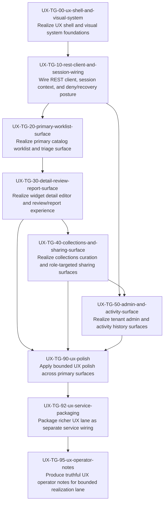

# UX Task Plan (v1)

Derived mechanically from `reference_architectures/codex-saas/design/playbook/ux_task_graph_v1.yaml`.

## Dependency graph

## Edge list (fallback / machine-friendly)

- UX-TG-00-ux-shell-and-visual-system — Realize UX shell and visual system foundations -> UX-TG-10-rest-client-and-session-wiring — Wire REST client, session context, and deny/recovery posture
- UX-TG-10-rest-client-and-session-wiring — Wire REST client, session context, and deny/recovery posture -> UX-TG-20-primary-worklist-surface — Realize primary catalog worklist and triage surface
- UX-TG-10-rest-client-and-session-wiring — Wire REST client, session context, and deny/recovery posture -> UX-TG-50-admin-and-activity-surface — Realize tenant admin and activity history surfaces
- UX-TG-20-primary-worklist-surface — Realize primary catalog worklist and triage surface -> UX-TG-30-detail-review-report-surface — Realize widget detail editor and review/report experience
- UX-TG-30-detail-review-report-surface — Realize widget detail editor and review/report experience -> UX-TG-40-collections-and-sharing-surface — Realize collections curation and role-targeted sharing surfaces
- UX-TG-30-detail-review-report-surface — Realize widget detail editor and review/report experience -> UX-TG-90-ux-polish — Apply bounded UX polish across primary surfaces
- UX-TG-40-collections-and-sharing-surface — Realize collections curation and role-targeted sharing surfaces -> UX-TG-50-admin-and-activity-surface — Realize tenant admin and activity history surfaces
- UX-TG-40-collections-and-sharing-surface — Realize collections curation and role-targeted sharing surfaces -> UX-TG-90-ux-polish — Apply bounded UX polish across primary surfaces
- UX-TG-50-admin-and-activity-surface — Realize tenant admin and activity history surfaces -> UX-TG-90-ux-polish — Apply bounded UX polish across primary surfaces
- UX-TG-90-ux-polish — Apply bounded UX polish across primary surfaces -> UX-TG-92-ux-service-packaging — Package richer UX lane as separate service wiring
- UX-TG-92-ux-service-packaging — Package richer UX lane as separate service wiring -> UX-TG-95-ux-operator-notes — Produce truthful UX operator notes for bounded realization lane

## Project plan (topological waves)

### Wave 0
- UX-TG-00-ux-shell-and-visual-system — Realize UX shell and visual system foundations

### Wave 1
- UX-TG-10-rest-client-and-session-wiring — Wire REST client, session context, and deny/recovery posture

### Wave 2
- UX-TG-20-primary-worklist-surface — Realize primary catalog worklist and triage surface

### Wave 3
- UX-TG-30-detail-review-report-surface — Realize widget detail editor and review/report experience

### Wave 4
- UX-TG-40-collections-and-sharing-surface — Realize collections curation and role-targeted sharing surfaces

### Wave 5
- UX-TG-50-admin-and-activity-surface — Realize tenant admin and activity history surfaces

### Wave 6
- UX-TG-90-ux-polish — Apply bounded UX polish across primary surfaces

### Wave 7
- UX-TG-92-ux-service-packaging — Package richer UX lane as separate service wiring

### Wave 8
- UX-TG-95-ux-operator-notes — Produce truthful UX operator notes for bounded realization lane
