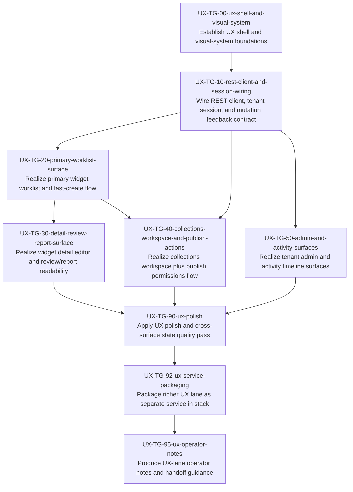

# UX Task Plan (v1)

Derived mechanically from `reference_architectures/codex-saas/design/playbook/ux_task_graph_v1.yaml`.

## Dependency graph

## Edge list (fallback / machine-friendly)

- UX-TG-00-ux-shell-and-visual-system — Establish UX shell and visual-system foundations -> UX-TG-10-rest-client-and-session-wiring — Wire REST client, tenant session, and mutation feedback contract
- UX-TG-10-rest-client-and-session-wiring — Wire REST client, tenant session, and mutation feedback contract -> UX-TG-20-primary-worklist-surface — Realize primary widget worklist and fast-create flow
- UX-TG-10-rest-client-and-session-wiring — Wire REST client, tenant session, and mutation feedback contract -> UX-TG-40-collections-workspace-and-publish-actions — Realize collections workspace plus publish permissions flow
- UX-TG-10-rest-client-and-session-wiring — Wire REST client, tenant session, and mutation feedback contract -> UX-TG-50-admin-and-activity-surfaces — Realize tenant admin and activity timeline surfaces
- UX-TG-20-primary-worklist-surface — Realize primary widget worklist and fast-create flow -> UX-TG-30-detail-review-report-surface — Realize widget detail editor and review/report readability
- UX-TG-20-primary-worklist-surface — Realize primary widget worklist and fast-create flow -> UX-TG-40-collections-workspace-and-publish-actions — Realize collections workspace plus publish permissions flow
- UX-TG-30-detail-review-report-surface — Realize widget detail editor and review/report readability -> UX-TG-90-ux-polish — Apply UX polish and cross-surface state quality pass
- UX-TG-40-collections-workspace-and-publish-actions — Realize collections workspace plus publish permissions flow -> UX-TG-90-ux-polish — Apply UX polish and cross-surface state quality pass
- UX-TG-50-admin-and-activity-surfaces — Realize tenant admin and activity timeline surfaces -> UX-TG-90-ux-polish — Apply UX polish and cross-surface state quality pass
- UX-TG-90-ux-polish — Apply UX polish and cross-surface state quality pass -> UX-TG-92-ux-service-packaging — Package richer UX lane as separate service in stack
- UX-TG-92-ux-service-packaging — Package richer UX lane as separate service in stack -> UX-TG-95-ux-operator-notes — Produce UX-lane operator notes and handoff guidance

## Project plan (topological waves)

### Wave 0
- UX-TG-00-ux-shell-and-visual-system — Establish UX shell and visual-system foundations

### Wave 1
- UX-TG-10-rest-client-and-session-wiring — Wire REST client, tenant session, and mutation feedback contract

### Wave 2
- UX-TG-20-primary-worklist-surface — Realize primary widget worklist and fast-create flow
- UX-TG-50-admin-and-activity-surfaces — Realize tenant admin and activity timeline surfaces

### Wave 3
- UX-TG-30-detail-review-report-surface — Realize widget detail editor and review/report readability
- UX-TG-40-collections-workspace-and-publish-actions — Realize collections workspace plus publish permissions flow

### Wave 4
- UX-TG-90-ux-polish — Apply UX polish and cross-surface state quality pass

### Wave 5
- UX-TG-92-ux-service-packaging — Package richer UX lane as separate service in stack

### Wave 6
- UX-TG-95-ux-operator-notes — Produce UX-lane operator notes and handoff guidance
