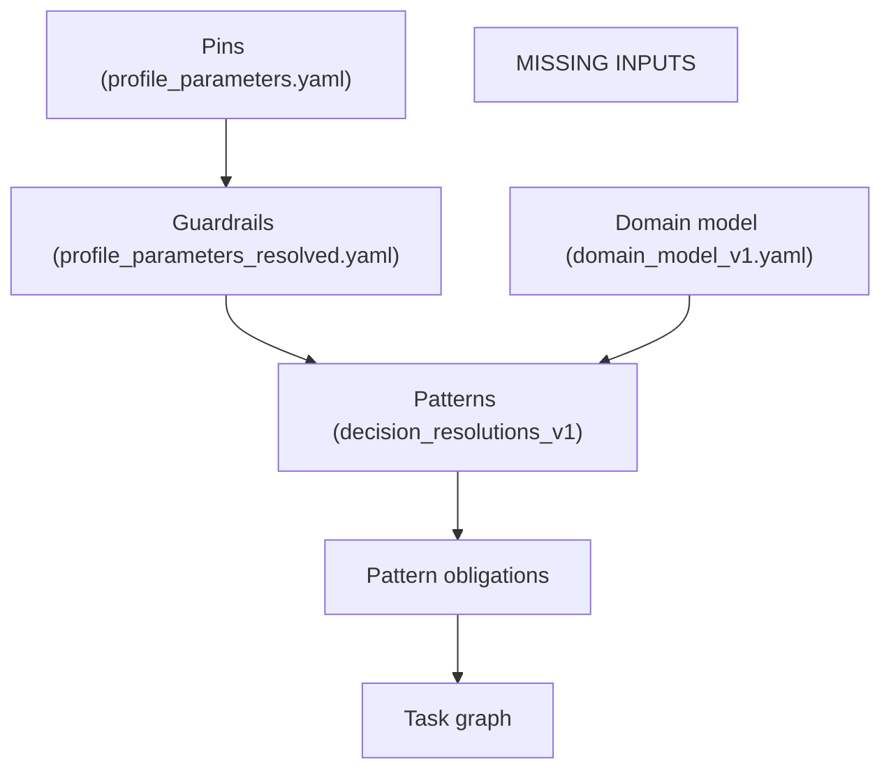

> **Contract compliance:** governed by `architecture_library/__meta/caf_operating_contract_v1.md`.
> If this SKILL conflicts with the contract, the contract wins.

# worker-traceability-mindmap

## Purpose

Provide a debugging artifact that makes the current derivation cascade inspectable without adding bespoke logic.

The mindmap must reflect the **actual current state** of the instance artifacts:
- If an artifact is missing, represent it as a missing node and note which skill step guards it.
- If an obligation has no selected pattern IDs, represent that gap explicitly.

This worker is **non-authoritative**: it does not change derivations and should not block them.
If key artifacts are missing, it still emits a mindmap that shows what is missing.

## Inputs
- instance_name: `<name>`

## Reads (best-effort)
- Specs / decisions:
  - `reference_architectures/<name>/spec/playbook/system_spec_v1.md` (decision_resolutions + candidates)
  - `reference_architectures/<name>/spec/playbook/application_spec_v1.md` (decision_resolutions + candidates)
- Guardrails / pins:
  - `reference_architectures/<name>/spec/guardrails/profile_parameters.yaml` (pinned)
  - `reference_architectures/<name>/spec/guardrails/profile_parameters_resolved.yaml` (resolved atoms; if present)
- Domain:
  - `reference_architectures/<name>/spec/playbook/domain_model_v1.yaml` (if present)
- Patterns / obligations / planning:
  - `reference_architectures/<name>/design/playbook/pattern_obligations_v1.yaml` (if present)
  - `reference_architectures/<name>/design/playbook/task_graph_v1.yaml` (if present)

## Output

Ship blocker: this worker MUST always write the output file. If some inputs are missing, the diagram must still render a "missing" node.

Write (phase-owned; overwrite=true):
- `reference_architectures/<name>/spec/caf_meta/spec_traceability_mindmap_v3.md` (when `generation_phase == architecture_scaffolding`)
- `reference_architectures/<name>/design/caf_meta/design_traceability_mindmap_v3.md` (when design outputs exist but planning outputs do not)
- `reference_architectures/<name>/design/caf_meta/plan_traceability_mindmap_v3.md` (when planning outputs exist)

## Execution note

This portable skillpack is **instruction-only** and MUST NOT invoke scripts.

If a CAF runtime provides a deterministic helper for this worker, it may be used by the orchestrator.
Regardless of implementation, this SKILL defines the required **output contract** and **diagram rules**.

## Rendering (Mermaid)
## Output template (required)

Always emit this skeleton even when some inputs are missing. Replace bracketed placeholders when data is available.

Then expand the diagram (still within 25–60 nodes) using real IDs when available:
- atoms: `runtime.language=...`, `database.engine=...`, `deployment.mode=...`, `tenancy.mode=...`
- obligations: `OBL:<obligation_id>` with `selected_pattern_ids`
- tasks: `TASK:<task_id>`

Emit a Mermaid diagram using `flowchart TD` (always). Do NOT use Mermaid `mindmap` (renderer support is inconsistent).

Required structure (even if nodes are missing):
- Pins / Atoms
- Patterns (from `decision_resolutions_v1` in system_spec/application_spec)
- Obligations (if present)
- Tasks (if present)

### What to show

- From decision_resolutions (preferred pattern source; always attempt):
  - Parse `decision_resolutions_v1` blocks from BOTH `system_spec_v1.md` and `application_spec_v1.md`.
  - Group patterns by `status`:
    - `adopt` → show as `PATTERN: <pattern_id>` nodes under an `ADOPTED` group node
    - `defer` → show under a `DEFERRED` group node
    - `reject` → show under a `REJECTED` group node
  - If candidates exist (`CAF_MANAGED_BLOCK: caf_decision_pattern_candidates_v1`), optionally add a `CANDIDATES` group node with up to 10 pattern_ids.

- From resolved guardrails:
  - Show a concise list of canonical atoms (e.g., `runtime.language`, `database.engine`, `deployment.mode`, `tenancy.mode` if present).
- From pattern obligations (if present):
  - For each obligation, show:
    - `obligation_id`
    - any bound pattern ids (field name may vary; show `NONE` if missing)
  - If obligations exist but no adopted patterns are present, link to `GAP: patterns not adopted`.

- From task graph (if present):
  - Show each task_id and its mapped obligation_ids if present (or reference by text if the schema differs).
- Gaps:
  - If an obligation has no selected patterns: link it to a `GAP: missing pattern binding` node.
  - If a task graph exists but does not reference obligations: link to `GAP: obligation->task mapping not encoded`.

### Keep it small
Target: ~25–60 nodes. Collapse long lists with grouping nodes.

## Notes section

After the diagram, include a short “Observed derivation state” section listing:
- which artifacts were present vs missing
- which skill(s) produce each artifact (as declared in `skills/caf-arch/SKILL.md` and related orchestrators)
- the first gap that would explain a minimal / non-executable candidate
